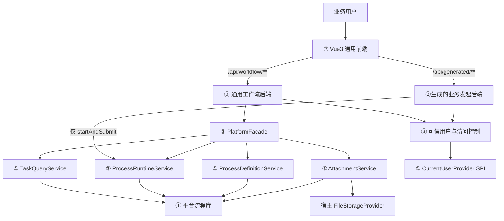

# ③ 业务流程代码开发技术设计（business-base）

## 1. 文档说明

### 1.1 目标

本文档用于指导 `business-base/` 的开发，使其成为 ③ 业务流程代码的可运行基础底座，并能与已经实现的 ① `platform/`、② `agent-web/` 稳定衔接。

本设计解决以下问题：

- 固化③通用基座与 Agent 生成业务代码的边界。
- 给出通用业务后端、通用 Vue3 前端、可信身份、平台 Starter 适配、附件与审批动作的可落地设计。
- 复用①已经实现的公共 Service、DTO、SPI、幂等与乐观锁能力，不在③复制流程引擎逻辑。
- 遵守②已经实现的 `GenerationTargetContract 1.1`、生成白名单和质量门禁，保证基础底座不会与后续生成代码冲突。
- 明确当前实现缺口、实施顺序、测试范围和端到端验收方法。

### 1.2 设计依据与优先级

设计依据如下：

1. `doc/rebuild-functional-requirements-optimized.md`：功能范围和验收目标。
2. `doc/三阶段业务系统文件结构设计.md`：三块产物边界、最终目录和生成白名单。
3. `platform/` 当前源码：③实际可调用的平台 API、DTO、SPI、错误码、事务和并发语义。
4. `agent-web/` 当前源码及 `doc/agent-web-tech-design.md`：生成目标契约、唯一允许的生成调用、路径规则和验证 profile。
5. `business-base/` 当前骨架与已生成的入金申请样例：目标工程的真实现状。

当早期需求描述与当前已冻结实现发生冲突时，采用以下优先级：

```text
已实现并受测试保护的契约
    > 三阶段文件结构决策
    > 需求文档中的一般性示例
```

因此，本设计冻结一个重要结论：**Agent 生成的业务模块只负责业务发起并调用一次 `ProcessRuntimeService.startAndSubmit()`；待办、已办、我发起、已阅、详情、审批动作、附件和轨迹全部由③通用基座提供。** 需求文档 6.4、8.3 中“业务 Controller 生成详情和审批接口”的早期表述不再作为③的实现依据。

### 1.3 当前基线与缺口

当前 `business-base/` 已具备：

- Java 8、Spring Boot 2.7.18 后端 `pom.xml`，依赖 `platform-starter:0.1.0-SNAPSHOT`。
- Vue 3、TypeScript、Vite、Pinia、Vue Router、Element Plus 前端依赖。
- `.flowmind/generation-target.json` 1.1、平台生成 API 参考文件和受保护文件哈希。
- `CurrentBusinessUserProvider` 可信身份访问器接口。
- Agent 已生成的入金申请 Controller、Service、DTO、录入页、API、路由和测试样例。

当前仍缺少：

- 后端启动类、可信身份实现、平台身份适配器、通用工作流 Controller/Service/DTO、统一异常处理和配置文件。
- 通用待办、已办、我发起、已阅、审批详情、流程图、意见、附件、轨迹和审批动作页面。
- 主路由和应用壳；当前 `generated-routes.ts` 尚未被主路由加载。
- 通用前后端测试和真实 Starter 联合测试。
- ①公共 API 中稳定的“标记已阅”Service 契约，及同进程调用场景下稳定的公共异常契约。

当前生成的入金申请代码只能证明②生成产物可编译，尚不能证明③基础底座或端到端业务系统已完成。

## 2. 范围与职责边界

### 2.1 本期包含

后端基础底座包含：

- Spring Boot 启动与 `platform-starter` 同进程装配。
- 当前业务用户可信身份获取，以及到平台 `CurrentUserProvider` 的适配。
- 待办、已办、我发起、已阅查询。
- 流程实例详情聚合：实例、定义、表单字段、流程图、活动任务、历史轨迹、审批意见和附件。
- 通用任务动作：审批、驳回、退回、撤回、直送、转办、委托、加签、认领、取消认领。
- 实例级与任务级附件的查询、上传、下载和删除。
- 服务端幂等号生成、乐观锁版本透传、访问控制和统一错误响应。
- 本地开发所需的可信用户 Mock 和平台 SPI Mock 装配方案。

前端基础底座包含：

- 应用壳、导航、主路由和生成路由静态合并。
- 待办、已办、我发起、已阅列表页。
- 通用审批详情页及流程图、表单变量、意见、附件、轨迹和动作区。
- 基于流程定义 `formFields` 的只读通用表单渲染。
- 通用 API 层、状态管理、错误处理、加载态与空态。

### 2.2 本期不包含

- 在③中重建流程引擎、审批人解析、条件网关、会签或并行推进算法。
- 业务实体、Mapper、Repository、DAO、业务建表 SQL 或业务数据库迁移。
- 前端直接调用①平台 HTTP API。
- 运行时动态加载远程业务模块；生成页面在构建时打包。
- 在③中提供流程定义设计、发布、激活和管理员修复控制台。
- 修改 Agent 已冻结的生成目录、命名规则或 `startAndSubmit()` 唯一调用约束。
- 生产级统一认证中心、对象存储、消息队列和容器化部署；这些通过宿主 SPI 接入。

### 2.3 三块最终边界

| 能力 | ① platform | ② agent-web | ③ business-base |
|---|---|---|---|
| 流程定义、实例、任务、轨迹 | 持有并执行 | 开发期创建定义 | 通过 Starter 使用 |
| 需求对话、代码生成 | 不负责 | 负责 | 不负责 |
| 业务录入页与发起接口 | 不负责 | 生成 | 构建并运行 |
| 待办、详情、审批动作 | 提供底层能力 | 不生成 | 通用基座封装 |
| 业务表单值 | 作为流程变量持久化 | 生成映射代码 | 不另建业务表 |
| 组织、用户、文件内容 | 通过 SPI 获取 | 不参与运行期 | 宿主适配并供平台使用 |

## 3. 总体架构



运行时只有一个 Spring Boot 进程。`platform-starter` 在③后端中自动装配平台 Service、平台 SQLite 数据源和平台表；③本身不再创建第二套业务数据源。

前端只面对③的同源 REST 接口。通用页面调用 `/api/workflow/**`，Agent 生成录入页调用 `/api/generated/**`，两者都不能直连①。

## 4. 核心设计决策

### 4.1 生成代码只负责发起

②当前目标契约把唯一允许的 Starter API 固定为：

```text
ProcessRuntimeService#startAndSubmit(StartProcessRequest)
```

生成 Service 负责：

1. 校验业务字段和用户定义附件。
2. 从 `CurrentBusinessUserProvider` 获取发起人和部门。
3. 将字段映射为流程变量，将文件映射为 `AttachmentUploadItem`。
4. 生成稳定 `operationId`。
5. 调用一次 `startAndSubmit()`，完成实例创建、附件保存、`apply` 归档和下一任务创建。

生成代码不得实现后续审批能力。审批动作在通用基座中按任务和平台动作类型处理，与具体业务名称无关。

### 4.2 详情页使用定义驱动的通用只读表单

当前②只生成业务录入页，不生成业务详情组件。③详情页通过：

- `ProcessRuntimeService.getInstance(instanceId)` 取得流程变量；
- `ProcessDefinitionService.getDefinition(definitionId)` 取得 `formFields`、节点和连线；
- 按 `sortOrder` 对字段排序，依据 `fieldType/controlType` 格式化只读值；

生成通用业务表单区。这样可支持任意 Agent 生成业务，而不要求修改生成契约或维护业务详情注册表。

未知字段类型按安全文本或 JSON 只读展示，不能执行定义中携带的脚本或 HTML。

### 4.3 身份只信任服务端上下文

- 浏览器请求不能提交可生效的 `userId`、`starterUserId`、`operatorUserId` 或部门字段。
- Controller 从 `CurrentBusinessUserProvider` 获取当前用户，Service 再把可信用户 ID 写入平台请求。
- ③提供一个 `CurrentUserProvider` 适配 Bean，保证平台内部权限校验看到与③相同的当前用户。
- 本地开发可使用显式 `local` profile 的 Mock 用户；共享环境和生产环境禁止信任任意请求头伪造身份。

### 4.4 修改请求统一使用幂等键和任务版本

- 所有会改变平台状态的通用接口要求 `Idempotency-Key`。
- `OperationIdFactory` 按 `业务域|动作|资源ID|可信用户ID|Idempotency-Key` 生成 SHA-256。
- 任务动作必须携带列表或详情中读取的 `expectedTaskVersion`。
- 遇到 `FLOW_TASK_CONCURRENT_MODIFIED` 时返回 HTTP 409，前端刷新详情，不自动用旧版本重试。
- 同一用户对同一资源、同一动作和同一幂等键的重试产生相同 `operationId`；不同动作不能碰撞。

### 4.5 ③不拥有业务持久化

③后端不新增业务表。允许出现的持久化只有 `platform-starter` 管理的平台流程表和文件存储 SPI 的外部实现。

前端状态、筛选条件和未提交表单可保存在内存；若未来增加草稿持久化，必须作为新需求评审，不能借机新增具体业务表。

### 4.6 受保护基础文件先冻结、后生成

`backend/pom.xml`、`frontend/package.json`、平台 API 参考和可信身份接口均受 `.flowmind/generation-target.json` 的 SHA-256 保护。

基础底座开发若必须修改受保护文件，应按以下顺序处理：

1. 完成并评审基础底座改动。
2. 运行后端、前端及联合测试。
3. 重新计算受保护文件哈希并更新目标契约。
4. 用②的 `TargetContractService` 契约测试确认可生成。
5. 再允许新的业务代码生成。

不得为了绕过哈希漂移而放宽白名单或取消受保护文件校验。

## 5. 目标文件结构

```text
business-base/
├── .flowmind/
│   ├── generation-target.json
│   └── references/
│       └── platform-starter-0.1.0.md
├── backend/
│   ├── pom.xml
│   └── src/
│       ├── main/
│       │   ├── java/com/flowmind/business/
│       │   │   ├── BusinessBaseApplication.java
│       │   │   ├── common/
│       │   │   │   ├── ApiErrorResponse.java
│       │   │   │   ├── BusinessExceptionHandler.java
│       │   │   │   └── OperationIdFactory.java
│       │   │   ├── config/
│       │   │   │   ├── BusinessPlatformConfiguration.java
│       │   │   │   └── WebConfiguration.java
│       │   │   ├── security/
│       │   │   │   ├── CurrentBusinessUserProvider.java
│       │   │   │   ├── BusinessAuthorizationProvider.java
│       │   │   │   ├── PlatformCurrentUserAdapter.java
│       │   │   │   ├── WorkflowAccessGuard.java
│       │   │   │   └── local/LocalBusinessUserProvider.java
│       │   │   ├── platform/
│       │   │   │   ├── PlatformFacade.java
│       │   │   │   └── PlatformDtoMapper.java
│       │   │   ├── workflow/
│       │   │   │   ├── WorkflowQueryController.java
│       │   │   │   ├── WorkflowActionController.java
│       │   │   │   ├── WorkflowAttachmentController.java
│       │   │   │   ├── WorkflowQueryService.java
│       │   │   │   ├── WorkflowActionService.java
│       │   │   │   ├── WorkflowAttachmentService.java
│       │   │   │   └── dto/**
│       │   │   └── generated/**               # ②唯一可写的后端生产目录
│       │   └── resources/
│       │       ├── application.yml
│       │       └── application-local.yml
│       └── test/java/com/flowmind/business/
│           ├── security/**
│           ├── platform/**
│           ├── workflow/**
│           ├── integration/**
│           └── generated/**                    # ②唯一可写的后端测试目录
└── frontend/
    ├── package.json
    └── src/
        ├── App.vue
        ├── main.ts
        ├── router/
        │   ├── index.ts
        │   └── generated-routes.ts             # ②可更新的稳定注册点
        ├── api/
        │   ├── http.ts
        │   ├── workflow.ts
        │   └── generated/**                    # ②可写
        ├── stores/
        │   └── workflow.ts
        ├── views/
        │   ├── TodoListView.vue
        │   ├── CompletedListView.vue
        │   ├── StartedListView.vue
        │   ├── ReadListView.vue
        │   └── WorkflowDetailView.vue
        ├── components/workflow/
        │   ├── ProcessGraph.vue
        │   ├── VariableFormReadonly.vue
        │   ├── TaskActionPanel.vue
        │   ├── AttachmentPanel.vue
        │   ├── CommentPanel.vue
        │   └── ProcessTimeline.vue
        ├── types/
        │   └── workflow.ts
        └── modules/generated/**                # ②可写
```

目录约束：

- `workflow/`、`platform/`、`security/`、`views/`、通用组件和 `router/index.ts` 由③维护，②禁止修改。
- `generated/**` 和 `generated-routes.ts` 由②按契约管理，③通用代码不得依赖某个固定生成业务。
- 基础底座测试与生成测试分目录，便于 Agent 验证 profile 同时执行。
- 不提交 `backend/target/`、`frontend/dist/`、`node_modules/`、SQLite 文件或附件文件内容。

## 6. 后端设计

### 6.1 启动与装配

`BusinessBaseApplication` 使用标准 `@SpringBootApplication`，扫描范围保持在 `com.flowmind.business`。平台能力由 `platform-starter` 自动配置，不扫描或直接实例化平台 `core` 包。

主要配置：

```yaml
server:
  address: 127.0.0.1
  port: 8081

flow-mind:
  platform:
    enabled: true
    sqlite:
      path: ./data/business-flow.db
    mock:
      enabled: true       # 仅 local/test；生产必须 false
    callback:
      async-enabled: true
    attachment:
      local-storage-dir: ./data/attachments
```

本地 SQLite 文件虽然位于③运行目录，但表结构和数据语义仍归属①平台。生产 profile 必须由宿主提供 `CurrentUserProvider`、`OrganizationProvider`、`FileStorageProvider`、`MessagePublisher`、`WorkflowCallbackHandler` 等必要 SPI 实现，或明确选择受控的替代实现。

### 6.2 可信身份设计

`CurrentBusinessUserProvider` 保持②已保护的最小接口不变。新增实现和适配器时不得修改其类型名、方法名和属性 getter，否则会触发目标契约漂移。

```text
HTTP 请求认证
  → CurrentBusinessUserProvider.currentUser()
  → PlatformCurrentUserAdapter.getCurrentUser()
  → 平台 RuntimeRequestValidator / TaskQueryService / AttachmentService
```

`PlatformCurrentUserAdapter` 实现 `com.flowmind.platform.api.spi.CurrentUserProvider`，将业务用户转换为平台 `UserContext`。用户名称和部门名称若在当前接口中不可得，应由生产认证主体或宿主用户目录补齐；不能接受浏览器传入的名称作为可信快照。

管理员能力通过独立的 `BusinessAuthorizationProvider` 判断，不能为此扩展②受保护的 `CurrentBusinessUserProvider.BusinessUser` 结构。默认实现不授予管理员权限，生产实现再对接宿主角色体系。

`LocalBusinessUserProvider` 仅在 `local` 或 `test` profile 启用。若通过请求头切换演示用户，必须同时满足：

- 服务仅监听 `127.0.0.1`；
- profile 明确为 local；
- 可选用户来自服务端固定白名单；
- 生产配置启动时检测并拒绝该 Bean。

### 6.3 PlatformFacade

`PlatformFacade` 是③通用基座调用①的唯一集中适配层，依赖以下已实现公共接口：

| 平台接口 | ③使用范围 |
|---|---|
| `TaskQueryService` | 待办、已办、我发起、已阅、活动任务、历史任务、意见 |
| `ProcessRuntimeService` | 实例详情和通用任务动作 |
| `ProcessDefinitionService` | 只读获取定义、节点、连线和表单字段；不做定义修改 |
| `AttachmentService` | 附件查询、上传、下载、删除 |
| `ProcessMonitorService` | 后续可选的催办和提醒查询，不作为首批验收阻塞项 |

Facade 的职责：

- 构造平台 Query/Request，填入可信身份、幂等号和任务版本。
- 把平台 DTO 映射为③稳定的 REST DTO，避免前端依赖平台 Java 对象结构。
- 聚合实例详情，统一排序和空值处理。
- 对平台异常做稳定错误映射。

Facade 不得：

- 直接访问平台 Repository、表或 `JdbcTemplate`。
- 导入 `com.flowmind.platform.persistence.*`。
- 复制平台流转算法或自行更新实例状态。
- 通过 HTTP 调平台独立服务。

### 6.4 查询与详情聚合

列表查询直接转调 `TaskQueryService`。当前平台对待办、已办和我发起查询会用 `CurrentUserProvider` 覆盖或校验 Query 中的用户 ID，因此③的 REST Query 不暴露用户 ID 字段。当前 `queryReadRecords()` 尚未自动限定当前用户，Facade 必须把可信用户 ID 写入 `ReadRecordQuery.userId`，不得透传客户端 userId；后续应在①补充同样的服务端身份约束。

详情聚合步骤：

1. 读取可信当前用户。
2. 调 `ProcessRuntimeService.getInstance(instanceId)` 取得实例、变量、活动任务和历史信息。
3. `WorkflowAccessGuard` 判断当前用户是否为发起人、活动任务候选人/办理人/委托代理人、历史办理人，或具有宿主授予的管理员权限。
4. 无权限立即返回 403，不能继续查询或返回附件内容。
5. 调 `ProcessDefinitionService.getDefinition(definitionId)` 取得图结构和表单字段。
6. 调 `TaskQueryService.queryComments(instanceId)` 和 `AttachmentService.queryAttachments(...)` 补齐意见及附件。
7. 组装 `WorkflowDetailResponse`，服务端给出当前用户可执行的 `allowedActions`。
8. 首次成功打开详情后调用公共“标记已阅”能力；失败不得影响详情读取，但需记录告警。

`WorkflowDetailResponse` 至少包含：

```text
instance          实例基础信息和流程变量
definition        定义编码、名称、版本
formFields        字段编码、名称、类型、控件、规则、顺序
nodes / edges     流程图结构
activeTasks       当前任务及 taskVersion
historyTasks      历史轨迹
comments          审批意见
attachments       附件元数据，不返回 storageKey 和二进制内容
allowedActions    当前用户、当前任务和状态下可显示的动作
```

### 6.5 任务动作

通用动作 Service 只做协议适配，随后调用平台：

| ③动作 | 平台调用 | 额外输入 |
|---|---|---|
| 提交/发送 | `submitTask` | variables、附件可选 |
| 审批通过 | `approve` | comment |
| 驳回 | `reject` | targetNodeCode、comment |
| 退回发起人 | `returnToStarter` | comment |
| 撤回 | `withdraw` | comment |
| 直送 | `directSend` | targetNodeCode、返工变量可选 |
| 转办 | `transfer` | targetUserId、comment |
| 委托 | `delegateTask` | targetUserId、targetUserName |
| 加签 | `addSign` | addSignUserIds、comment |
| 认领 | `claim` | 无 |
| 取消认领 | `unclaim` | 无 |

所有任务动作都必须填写：

- URL 中的 `taskId`；
- 请求体中的 `expectedTaskVersion`；
- 服务端可信 `operatorUserId`；
- 由 `Idempotency-Key` 派生的 `operationId`；
- 可选 `comment` 和动作特定参数。

Controller 不根据前端传来的 `allowedActions` 决定权限。平台仍是任务状态和办理权限的最终裁决者；③的 `allowedActions` 只用于用户体验和减少无效请求。

`submit`、`direct-send` 等接口若接收变量，只允许写入当前流程定义 `formFields` 中明确声明、且当前节点允许编辑的字段。`processCode`、身份字段、流程状态、审批人和其他系统控制字段永远不能通过通用变量 Map 覆盖。首期若尚未冻结节点级可编辑字段规则，则审批动作不开放变量编辑，只允许生成发起接口在 `apply` 阶段写入业务变量。

### 6.6 附件处理

附件元数据和约束由①持有，文件内容由 `FileStorageProvider` 保存。③只做 multipart 与平台 DTO 的转换。

- 实例级上传调用 `saveInstanceAttachment`，必须传 `instanceId`、可信操作人、来源任务和任务版本。
- 任务级上传调用 `saveTaskAttachment`，必须传 `taskId`、`instanceId`、任务版本和可信操作人。
- 下载调用 `downloadAttachment`，Controller 将内容作为字节流返回，并设置经过清理的文件名和 MIME 类型。
- 删除调用 `deleteAttachment`，使用幂等号和可信操作人。
- 列表响应不暴露 `storageKey`。
- ③设置请求体总大小上限；业务生成 Service 与平台附件模板仍需分别执行数量、扩展名和大小校验，形成纵深校验。

文件名必须移除 CR/LF 和路径字符；日志不得记录文件二进制内容或完整表单敏感值。

### 6.7 已阅能力的公共契约缺口

①当前 `TaskQueryService` 已提供 `queryReadRecords()`，但“标记已阅”只存在于平台 `core` 的 `ReadRecordManager` 和独立 REST Controller 中，没有位于 `com.flowmind.platform.api.service` 的 Starter 公共 Service。

③不得直接注入 `ReadRecordManager`，也不得为此通过 HTTP 调平台。开发③前应在①补充并冻结下列公共契约之一，推荐独立接口：

```java
public interface ReadRecordService {
    ReadRecordDTO markRead(String instanceId);
}
```

`platform-starter` 自动装配该接口后，③再通过 Facade 使用。若该前置项尚未完成，已阅列表可以先只读实现，但“打开详情自动标记已阅”和 11.3 完整验收不得标记为通过。

### 6.8 异常与响应

成功响应直接返回业务 DTO，不额外套多层无意义包装。错误响应统一为：

```json
{
  "status": 409,
  "code": "FLOW_TASK_CONCURRENT_MODIFIED",
  "message": "任务已被其他人处理，请刷新后重试",
  "requestId": "...",
  "details": {}
}
```

建议映射：

| 场景 | HTTP |
|---|---:|
| 参数、Bean Validation、附件格式错误 | 400 |
| 未认证 | 401 |
| 详情或附件访问被拒绝 | 403 |
| 实例、任务、附件不存在 | 404 |
| 幂等冲突、状态冲突、任务版本冲突 | 409 |
| SQLite busy | 503 |
| 文件存储失败 | 502 |
| 未分类内部错误 | 500 |

同进程调用不会经过①的 `PlatformExceptionHandler`。为避免③依赖 `platform.core` 异常类，①应把稳定错误接口或公共异常类型提升到 `platform.api`。在该契约完成前，③可对已知运行时异常做集中兼容映射，但不能把 `exception.toString()` 或堆栈直接返回前端。

### 6.9 事务边界

- 单个 `ProcessRuntimeService` 修改方法使用①内部事务，③不在外层开启跨资源事务。
- `startAndSubmit()` 已原子完成实例、变量、附件、申请任务归档和下一任务创建。
- 附件独立上传与任务动作是两个操作时，不承诺跨调用原子性；页面必须先确认上传成功再提交动作。
- 回调和消息由①异步处理，失败不回滚主流程。
- ③不实现补偿式状态回写；重试依赖平台幂等记录。

## 7. REST API 设计

### 7.1 通用约定

- 基础路径：`/api/workflow`。
- 分页从 1 开始，默认 `pageNo=1`、`pageSize=20`，最大值沿用①限制。
- 时间使用 ISO-8601。
- 修改接口必须带 `Idempotency-Key`；空值返回 400。
- 任务动作请求必须带 `expectedTaskVersion`。
- REST 请求不接受可生效的用户 ID。
- 生成接口保留 `/api/generated/{business-code}/submit`，不纳入通用 Controller。

### 7.2 查询接口

| 方法与路径 | 用途 | 主要参数/返回 |
|---|---|---|
| `GET /api/workflow/me` | 当前用户 | `userId`、显示名、部门；来自可信上下文 |
| `GET /api/workflow/tasks/todo` | 待办 | 分页、流程/标题/节点/来源筛选 |
| `GET /api/workflow/tasks/completed` | 已办 | 分页、流程/标题/节点/动作筛选 |
| `GET /api/workflow/instances/started` | 我发起 | 分页、流程/标题/状态筛选 |
| `GET /api/workflow/read-records` | 已阅 | 当前用户分页记录 |
| `GET /api/workflow/instances/{instanceId}` | 通用详情 | `WorkflowDetailResponse` |
| `POST /api/workflow/instances/{instanceId}/read` | 标记已阅 | 幂等 upsert 后的已阅记录 |

### 7.3 动作接口

| 方法与路径 | 请求体关键字段 |
|---|---|
| `POST /api/workflow/tasks/{taskId}/approve` | `expectedTaskVersion`、`comment` |
| `POST /api/workflow/tasks/{taskId}/submit` | `expectedTaskVersion`、`comment`、`variables` |
| `POST /api/workflow/tasks/{taskId}/reject` | `expectedTaskVersion`、`targetNodeCode`、`comment` |
| `POST /api/workflow/tasks/{taskId}/return` | `expectedTaskVersion`、`comment` |
| `POST /api/workflow/tasks/{taskId}/withdraw` | `expectedTaskVersion`、`comment` |
| `POST /api/workflow/tasks/{taskId}/direct-send` | `expectedTaskVersion`、`targetNodeCode`、`variables` |
| `POST /api/workflow/tasks/{taskId}/transfer` | `expectedTaskVersion`、`targetUserId`、`comment` |
| `POST /api/workflow/tasks/{taskId}/delegate` | `expectedTaskVersion`、`targetUserId`、`targetUserName` |
| `POST /api/workflow/tasks/{taskId}/add-sign` | `expectedTaskVersion`、`addSignUserIds`、`comment` |
| `POST /api/workflow/tasks/{taskId}/claim` | `expectedTaskVersion` |
| `POST /api/workflow/tasks/{taskId}/unclaim` | `expectedTaskVersion` |

动作成功统一返回平台 `TaskActionResult` 的稳定视图：实例摘要、归档任务、新建任务、更新任务和 `replayed`。前端完成动作后以返回结果刷新页面；若任务版本冲突则重新拉取详情。

### 7.4 附件接口

| 方法与路径 | 用途 |
|---|---|
| `GET /api/workflow/attachments?instanceId=...` | 查询实例/任务附件元数据 |
| `POST /api/workflow/instances/{instanceId}/attachments` | 上传实例级附件 |
| `POST /api/workflow/tasks/{taskId}/attachments` | 上传任务级附件 |
| `GET /api/workflow/attachments/{attachmentId}/content` | 下载附件 |
| `DELETE /api/workflow/attachments/{attachmentId}` | 软删除附件 |

上传接口使用 `multipart/form-data`，业务字段编码和附件模板编码使用单独文本 part，文件内容使用 `file` part。不得让前端传入存储键或上传人。

## 8. 前端设计

### 8.1 应用壳与路由

`router/index.ts` 定义通用路由并静态合并 `generatedRoutes`：

```ts
const router = createRouter({
  history: createWebHistory(),
  routes: [...baseRoutes, ...generatedRoutes],
});
```

`main.ts` 注册 Router、Pinia 和 Element Plus。`App.vue` 提供统一导航和 `<router-view />`，不能硬编码入金申请组件。

通用路由建议：

```text
/workflow/todo
/workflow/completed
/workflow/started
/workflow/read
/workflow/instances/:instanceId
```

生成路由继续使用 `/generated/{business-code}/apply`。构建一次得到包含通用页面与全部生成业务页的完整前端。

### 8.2 列表页面

四个列表共用分页表格、筛选条、加载/空/错误状态和详情跳转组件：

- 待办：显示任务来源 `OWN/DELEGATED`、节点、发起人、创建时间、到期时间和认领状态。
- 已办：显示节点、动作、意见摘要和完成时间。
- 我发起：显示实例状态、当前节点、发起时间和结束时间。
- 已阅：显示实例和阅读时间，并提供详情入口。

筛选切换或页码变化时取消旧请求或忽略过期响应，防止慢响应覆盖最新结果。

### 8.3 审批详情页面

详情页按稳定区域拆分：

1. 实例摘要：流程名、标题、发起人、状态、当前节点和版本。
2. `ProcessGraph`：使用节点坐标和连线绘制只读流程图，突出当前节点；无坐标时按 `sortOrder` 线性降级展示。
3. `VariableFormReadonly`：按定义字段展示流程变量，空值显示 `--`。
4. `AttachmentPanel`：实例附件和当前任务附件分区，按权限显示上传/删除/下载。
5. `CommentPanel` 与 `ProcessTimeline`：按完成时间展示意见和历史动作。
6. `TaskActionPanel`：只渲染后端给出的允许动作，提交时携带当前 `taskVersion` 和新幂等键。

详情页不导入任何 `modules/generated/{business}` 组件。这样新增业务后不需要修改通用详情代码。

### 8.4 通用字段渲染

| `fieldType/controlType` | 只读展示 |
|---|---|
| `string/input/textarea` | 转义后的文本 |
| `number` | 数字格式化，保留原始精度 |
| `date/datePicker` | 本地化日期，保留原始 ISO 值用于复制 |
| `boolean` | 是/否 |
| `select` | 优先使用校验规则中的标签映射，否则显示原值 |
| 未知类型 | 安全 JSON 文本，不使用 `v-html` |

`validationRule` 必须按受限 JSON Schema 解析。解析失败只影响显示增强，不允许执行表达式或动态代码。

### 8.5 API 与状态管理

- `api/http.ts` 统一处理 JSON、multipart、文件下载、请求 ID 和错误对象。
- `api/workflow.ts` 只描述通用工作流 API，不引用生成业务类型。
- `stores/workflow.ts` 缓存当前列表筛选、详情和动作进行中状态；不长期缓存附件二进制内容。
- 生成 API 继续位于 `api/generated/**`，不经过通用 Store 强行抽象。
- 每次新建修改操作时生成一个幂等键；网络失败重试复用原键，用户明确重新发起动作时使用新键。

## 9. 与 Agent 生成产物的集成

### 9.1 契约保持

③必须持续满足当前 `GenerationTargetContract 1.1`：

- Java 8、Spring Boot 2.7.18。
- 基础包 `com.flowmind.business`。
- 生成后端路径、测试路径、前端模块/API/测试路径和路由注册点不变。
- `CurrentBusinessUserProvider.currentUser()` 及 `BusinessUser.userId/departmentId` 不变。
- 生成代码仅允许 `ProcessRuntimeService.startAndSubmit(StartProcessRequest)`。
- 后端验证命令在 `business-base/backend` 执行；前端验证命令在 `business-base/frontend` 执行。

### 9.2 生成模块接入流程

```text
Agent 确认需求和流程
  → 暂存生成 Controller/Service/DTO/Vue/API/测试/路由
  → 静态边界检查
  → 在基础底座副本上执行 Maven 与 npm 验证
  → Reviewer 审核
  → 人工确认写入白名单
  → 重新构建③前后端
  → 新业务录入路由可用
```

通用基座不得假设生成目录为空，也不得覆盖已有生成业务。主路由只消费 `generatedRoutes` 导出的数组。

### 9.3 当前入金申请样例

当前样例可用于验证以下链路：

- `/generated/entry-application/apply` 打开录入页。
- `/api/generated/entry-application/submit` 接收业务字段、银行回单和幂等键。
- 生成 Service 将字段写入流程变量，调用一次 `startAndSubmit()`。
- 返回实例 ID 和下一节点任务摘要。
- 后续经理审批、财务确认、附件查看和轨迹展示全部切换到 `/api/workflow/**` 与通用页面。

不得把当前样例中的 `applicationNo`、`amount`、`currency`、`bankReceipt` 固化进通用基座。

## 10. 安全、可观测性与性能

### 10.1 安全

- 所有身份来自服务端认证上下文。
- 详情、意见、轨迹和附件必须经过 `WorkflowAccessGuard`。
- 平台是任务办理权限和状态的最终校验者。
- 生产禁用 Mock SPI 和本地用户切换。
- DTO 采用字段白名单，不原样序列化平台对象；附件响应移除 `storageKey`。
- 文件名、错误信息和日志内容需防止 CRLF、路径穿越和敏感信息泄露。
- 前端不使用 `v-html` 渲染流程变量或意见。
- CORS 默认关闭；开发期由 Vite 代理到同一台本地后端。

### 10.2 可观测性

每个 HTTP 请求生成或透传 `X-Request-Id`。修改操作日志至少记录：

```text
requestId、action、instanceId/taskId、可信userId、operationId、结果状态、耗时
```

不得记录附件内容、完整流程变量、认证凭据和完整堆栈到普通访问日志。平台错误码应保留到③错误响应和结构化日志中，便于跨层追踪。

### 10.3 性能

- 列表必须分页，禁止一次拉取全部记录。
- 详情聚合默认串行执行。只有在能够显式传播认证/请求上下文并证明线程安全后，定义、意见和附件查询才可并行；任何一步失败均返回可诊断错误，不返回半真半假的成功对象。
- 流程定义详情可按 `definitionId` 做有界本地缓存；定义版本固定后实例绑定的定义不会变化。缓存需限制大小并支持测试关闭。
- 附件下载使用流式响应；当前平台 API 返回 `byte[]`，在平台升级为流式 API 前设置严格文件大小上限。
- 前端对筛选输入做短防抖，动作按钮在请求完成前禁用。

## 11. 测试设计

### 11.1 后端单元测试

使用 Mock 平台 Service，覆盖：

- Controller 不接受或不透传客户端用户 ID。
- PlatformFacade 正确映射分页、详情、图、字段、意见和附件。
- `WorkflowAccessGuard` 覆盖发起人、候选人、办理人、委托代理人、历史参与人、无权限用户。
- 每个任务动作只调用一次对应平台方法。
- `operationId` 稳定性、动作隔离和幂等键空值校验。
- `expectedTaskVersion` 缺失和冲突映射。
- 附件 multipart 映射、文件名清理、下载头和 `storageKey` 脱敏。
- 平台错误码到 HTTP 状态及统一错误对象的映射。
- local Mock 用户不能在非 local profile 装配。

### 11.2 后端集成测试

使用真实 `platform-starter` 和临时 SQLite，至少覆盖：

1. 已发布激活定义可由生成 Service 发起。
2. `startAndSubmit()` 后 `apply` 进入历史，下一任务存在。
3. 当前经理在待办中可见任务，其他用户不可见。
4. 带正确 `taskVersion` 审批成功，旧版本返回冲突。
5. 变量、附件、意见和轨迹可从通用详情完整读取。
6. 经理审批后财务任务创建，财务审批后实例办结。
7. 同一幂等键重试返回平台首次结果，不重复推进。
8. 无权限用户不能读取详情或附件。

测试必须使用临时目录和临时数据库，结束后释放连接和文件句柄。

### 11.3 前端测试

- 主路由同时包含通用路由和 `generatedRoutes`。
- 四类列表的分页、筛选、空态和错误态。
- 详情区域按聚合 DTO 正确展示。
- 通用字段渲染覆盖五类字段和未知类型降级。
- `allowedActions` 控制按钮展示，但请求仍携带版本和幂等键。
- 任务冲突提示刷新，网络失败重试复用原幂等键。
- 附件上传、下载和删除交互。
- 生成入金页面仍能独立通过现有组件/API 测试。

### 11.4 构建与端到端测试

基础命令：

```powershell
# 先安装①到本地 Maven 仓库
mvn -q install -DskipTests

# ③后端
Set-Location business-base/backend
mvn -q test

# ③前端
Set-Location ../frontend
npm run typecheck
npm test
npm run build
```

端到端使用不同 Mock 用户完成：业务员发起入金申请 → 经理待办审批 → 财务确认 → 办结 → 查询完整轨迹。浏览器不得直接调用①独立服务端口。

## 12. 实施计划

为避免与②的 M0-M6 混淆，③采用 B0-B6 编号。

### B0：公共契约与基线冻结

- 盘点并冻结①公开 Service/DTO/错误码。
- 在①补充公共 `ReadRecordService`，明确同进程公共异常契约。
- 冻结可信身份适配和实例访问规则。
- 完成③受保护文件调整，更新 SHA-256 并通过②目标契约测试。

退出条件：目标契约可验证，③不需要导入平台 `persistence` 或通过 HTTP 调平台。

### B1：可启动后端与身份

- 实现启动类、配置、`CurrentBusinessUserProvider` 实现和 `PlatformCurrentUserAdapter`。
- 接入 local/test Mock 用户和生产 profile 防误启用检查。
- 实现统一错误响应、请求 ID 和 `OperationIdFactory`。

退出条件：③后端能以 Starter 方式启动，可信身份能同时被③和①读取。

### B2：通用查询与详情

- 实现待办、已办、我发起、已阅查询。
- 实现 `WorkflowAccessGuard`、定义驱动详情聚合和标记已阅。
- 实现 DTO 脱敏和分页映射。

退出条件：不同用户只能看到自己的列表和有权访问的实例详情。

### B3：通用审批动作

- 实现审批、驳回、退回、撤回、直送、转办、委托、加签、认领和取消认领。
- 实现幂等键、任务版本和冲突处理。

退出条件：每个接口准确调用①对应动作，③不含流转算法。

### B4：附件与通用前端

- 实现附件查询、上传、下载、删除。
- 实现应用壳、主路由、四类列表、通用详情和动作组件。
- 静态合并 `generatedRoutes`。

退出条件：通用前端可完整办理任意已定义业务，不依赖入金申请硬编码。

### B5：联合测试与生成兼容

- 跑通真实 Starter + 临时 SQLite 集成测试。
- 保证现有生成入金申请测试和 Agent 目标契约测试不回归。
- 用至少两个字段/附件/节点不同的生成业务验证通用详情和审批。

退出条件：后端测试、前端 typecheck/test/build、Agent 目标验证全部通过。

### B6：端到端验收

- 启动③单体后端和完整前端。
- 由生成录入页发起，随后全部使用通用页面办理。
- 验证流程变量、附件、权限、幂等、任务版本和完整历史。

退出条件：满足第 13 节验收矩阵。

## 13. 验收矩阵

| 需求验收点 | ③实现 | 验证方式 |
|---|---|---|
| 基础底座只开发一次 | 通用 `/api/workflow/**` 与通用页面 | 第二个业务无需新增通用页面 |
| 前端不直连平台 | 所有请求发往③同源 API | 网络请求与静态扫描 |
| 后端通过 Starter 同进程调用 | PlatformFacade 注入平台 Service | 集成测试无平台 HTTP 服务 |
| 不建业务表 | 仅平台 SQLite 表 | 源码/迁移目录静态扫描 |
| 待办、已办、我发起、已阅 | 四类通用列表 | 分用户分页测试 |
| 审批详情可复用 | 定义驱动只读表单与通用详情 | 两个不同业务联合测试 |
| 生成页面可构建集成 | `router/index.ts` 合并 `generatedRoutes` | 前端 build 与路由测试 |
| 可信身份 | 业务身份与平台 SPI 同源 | 伪造用户字段测试 |
| 审批动作可用 | 通用动作接口转调平台 | 正常、异常、并发测试 |
| 附件按模板上传和查看 | 通用附件 API + 平台校验 | 必填、格式、大小、权限测试 |
| 入金申请端到端 | 生成发起 + 通用审批 | 业务员→经理→财务→办结 |
| 历史轨迹完整 | 聚合平台历史和意见 | 办结后断言动作与时间线 |

## 14. 风险与前置条件

### 14.1 必须先解决的阻塞项

1. ①将“标记已阅”提升为 `platform.api.service` 公共契约并由 Starter 装配。
2. 明确①同进程调用的公共异常/错误码接口，避免③长期依赖 `platform.core` 实现类。
3. 明确宿主生产认证和管理员权限来源；`CurrentBusinessUserProvider` 当前最小对象只含用户与部门，不足以表达角色。
4. 基础底座调整受保护文件后必须刷新目标契约哈希，否则②会以 `AGENT_TARGET_CONTRACT_DRIFT` 拒绝生成。

### 14.2 可在③内部控制的风险

- **详情越权**：实例级平台查询接口不是面向最终用户的完整授权边界；由 `WorkflowAccessGuard` 统一拦截，并以越权测试保护。
- **重复提交**：前端生成幂等键，服务端生成稳定 `operationId`，平台负责结果重放。
- **并发审批**：严格透传 `taskVersion`，冲突后重新加载，不做盲目重试。
- **业务耦合进入基座**：以第二个差异化业务作为强制验收，禁止通用代码出现入金字段常量。
- **生成契约漂移**：受保护文件改动集中评审，契约测试作为合入门禁。
- **附件内存压力**：首期限额，后续推动①提供流式存储接口。

## 15. 最终冻结结论

- ③是一个“通用基座 + 构建时生成业务模块”的最终业务系统，不是每个业务各建一套系统。
- ②生成代码的运行时边界止于业务发起和完成 `apply`；所有后续能力归③通用基座。
- ③后端仅通过 `platform-starter` 同进程调用①，前端仅调用③后端。
- ③不创建业务实体和业务表，业务表单值始终存于①流程变量。
- 可信身份、幂等号、任务版本和实例访问控制是③所有通用接口的强制门禁。
- 通用详情采用流程定义驱动的只读表单，因此新增业务无需重复生成详情页面。
- `.flowmind/generation-target.json` 及其受保护文件是②与③之间的正式生产契约，基础底座实现必须持续兼容。
