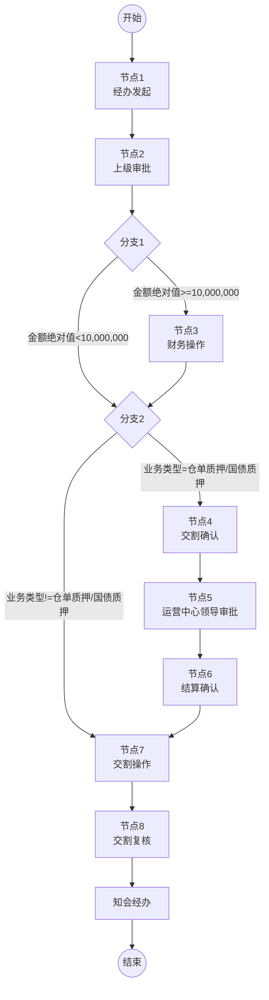

# 1 背景说明

业务流程为 **仓单、国债（解）质押申请** 交割流程。

# 2 具体需求

## 2.1 流程设计

上述流程涉及到的流程节点（部门、角色）及各流程的操作内容、处理结果如下

| 编号  | 节点名称                                                     | 部门         | 角色                              | 操作内容                                                     | 处理结果（通过后）                              |
| :---- | :----------------------------------------------------------- | :----------- | :-------------------------------- | :----------------------------------------------------------- | :---------------------------------------------- |
| 节点1 | 经办发起 0199-submit                                     | -            | -                                 | 1.查看客户资金详情； 2.录入本次质押/解质押信息； 3.核查是否可质押/解质押； 4.上传档案； | 1、流转到节点2                                  |
| 节点2 | 上级审批 0199-check@fast                                 | 经办所属部门 | 经办所属部门的部门领导            | 1.审批经办提交的信息； 2.支持在企业微信快速审批；        | 1. 进入分支1                                    |
| 分支1 | 节点1中，金额的绝对值>=10,000,000，则流转到节点3 节点1中，金额的绝对值<10,000,000，则流转到分支2 |              |                                   |                                                              |                                                 |
| 分支2 | 节点1中【业务类型】=仓单质押/国债质押，则流转到节点4 节点1中【业务类型】不等于仓单质押/国债质押，则流转到节点7 |              |                                   |                                                              |                                                 |
| 节点3 | 财务操作 0199-finance-op                                 | 财务部       | 出纳                              | 1、在财务系统中进行操作                                      | 1. 进入分支2                                    |
| 节点4 | 交割确认 0199-delivery-confirm                           | 交割部       | 全体                              | 1.上传盖章版附件                                             | 1、流转到节点5                                  |
| 节点5 | 运营中心分管领导审批 0199-operation-center-branch-leader@fast | 运营中心     | 分管领导                          | 1.审批经办提交的信息； 2.支持在企业微信快速审批；        | 1、流转到节点6                                  |
| 节点6 | 结算确认 0199-settle-confirm                             | 结算部       | 全体                              | 1、确认经办提交的信息；                                      | 1、流转到节点7                                  |
| 节点7 | 交割操作 0199-delivery-op                                | 交割部       | 全体                              | 1.进行交割操作                                               | 1、流转到节点8                                  |
| 节点8 | 交割复核 0199-delivery-check                             | 交割部       | 全体 删除交割操作节点的办结人 | 1.复核交割操作                                               | 1. 知会经办； 2.更新档案； 3.流程结束。 |

**说明：**

1. 节点3、4、7、8，支持**打回到指定节点，节点2、5支持打回到上一节点，节点6不支持打回**；

## 2.2 表单设计

见html文件

### 2.2.1 业务信息

【期货账号】：必填，下拉框，单选，可选项：调用统一账户接口获取，期货账号-客户名称；
【业务类型】：必填，下拉框，单选，可选项：仓单质押 ，仓单解质押，国债质押，国债解质押；
【交易所】：必填，下拉框，单选，可选项：中金所、郑商所、大商所、广期所；
【交易编码】：文本框，根据期货账号+交易所自动展示状态=休眠/正常的交易编码，不可编辑，调用统一账户接口，获取交易编码；
【品种】：必填，下拉框，多选，支持按照品种代码或品种名称模糊搜索，可选项：调用统一账户接口，获取品种列表，根据【交易所】做过滤，只保留【产品类型】=期货的；
【数量（张）】：必填，文本框，支持输入正整数；
【合约乘数】：必填，文本框，，支持输入正整数。输入了【品种】，带出逻辑见下方表格，可修改；
【质押品单位数量】：必填，文本框，支持输入正整数。输入了【品种】自动带出，带出逻辑见下方表格，可修改；
【昨结算价】：必填，文本框，支持输入正数，支持4位小数。输入了【品种】自动带出，带出逻辑见下方表格，可修改；
【金额】：必填，文本框，支持4位小数，自动带出、联动，带千分位符。计算公式：【昨结算价】**【数量（张）】**【每张仓单对应手数】*【合约乘数】*0.8，如果【业务类型】=仓单解质押、国债解质押，加负号。

注：输入【品种】后调用统一账户接口，获取到【合约乘数】【质押品单位数量】【昨结算价】

### 2.2.2 业务核查

核查项和核查内容为固定字样。
在节点1-节点7，进入界面时，系统自动进行核查并将【核查结果】展示在表格中，点击【刷新】按钮可刷新；
在节点8，进入界面时，系统数据不更新，点击【刷新】按钮不可刷新。
核查逻辑如下：

> 如果业务类型=仓单质押、国债质押，需核查第一项-满足质押要求；
> 如果业务类型=仓单解质押、国债解质押，需核查第二项-满足解质押要求；
> 如果业务类型=仓单质押、国债质押，且交易所=大商所，在核查第一项的同时，需核查第三项-满足大商所特定要求；
> 如果业务类型=仓单质押、国债质押，且交易所=郑商所，在核查第一项的同时，需核查第四项-满足郑商所特定要求；

根据核查情况，在【核查结果】中展示{通过}（绿色）；{不通过}（红色）；{不需核查}（灰色）；{缺少数据，无法核查}（黑色）字样。

| **核查项**         | **核查逻辑（通过的逻辑）**                                   |
| ------------------ | ------------------------------------------------------------ |
| 满足质押要求       | 选取【币种】=人民币的 客户资金.当前权益+业务信息.金额>=1.25（客户资金.质押金额+业务信息.金额） **或** 客户资金.实有货币资金>=1/4（客户资金.质押金额+业务信息.金额） |
| 满足解质押要求     | 选取【币种】=人民币的 客户资金.可用资金+业务信息.金额>=0     |
| 满足大商所特定要求 | 客户资金.大商所质押金额+业务信息.金额<=客户资金.大商所持仓保证金 |
| 满足郑商所特定要求 | 客户资金.郑商所质押金额+业务信息.金额<=客户资金.1.2*郑商所持仓保证金 |

