# 流程平台技术文档 - 实习生 A

> 分工依据：`流程平台技术路线_v5.2.md`  
> 数据模型与接口基线：`流程平台设计与接口文档_v3.md`  
> 技术栈：Java 8、Spring Boot 2.7.18、SQLite、MyBatis 或 Spring JDBC

## 1. 文档目标

本文只说明实习生 A 的实现范围，并明确与 B、C 两条工作线的边界。A 的核心职责是：

1. M0：冻结数据模型、状态和乐观锁规则；
2. M1：流程定义 CRUD、复制、节点/连线管理、版本管理；
3. M2：读取节点配置，解析审批人规则；
4. M3：发布、激活、停用、归档和灰度发布；
5. M4：组织架构 SPI 和审批人解析 SPI；
6. M5：节点监听、条件表达式、会签/或签、驳回/直送规则配置；
7. M6：条件分支和或签的运行实现。

A 不重复实现 B 负责的实例启动、普通审批、会签运行、驳回/撤回/转办/加签，也不重复实现 C 负责的查询、附件、回调、审计和并行汇聚。A 只提供这些能力需要的稳定模型、配置读取或协作接口。

## 2. 总体实现结构

```text
platform-core/src/main/java/.../platform
├── api
│   ├── dto
│   ├── request
│   ├── service/ProcessDefinitionService.java
│   └── spi/{OrganizationProvider,ApproverResolver}.java
├── domain/definition
├── service
│   ├── definition
│   ├── approver
│   └── routing
├── persistence
│   ├── definition
│   └── runtime
└── web/ProcessDefinitionController.java
```

REST Controller 和 Starter 必须调用同一套 Service。平台代码不得出现“入金”等具体业务判断；入金申请只作为测试样例。

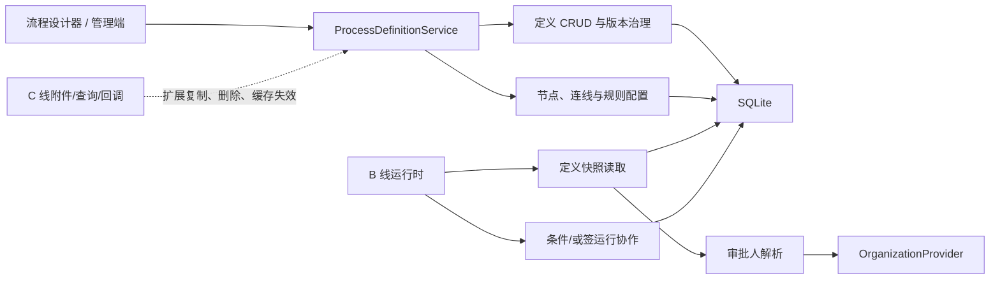

## 3. 基线模型与通用规则（M0）

### 3.1 A 线直接维护的定义期模型

| 表                   | A 使用的关键字段                                                                                                                                                  | 作用           |
| -------------------- | ----------------------------------------------------------------------------------------------------------------------------------------------------------------- | -------------- |
| `process_definition` | `process_code`、`version`、`definition_status`、`activation_status`、`gray_status`、`gray_rule_config`                                                            | 定义及版本治理 |
| `process_node`       | `node_code`、`node_type`、`approver_rule_type`、`approver_rule_config`、`multi_instance_mode`、`listener_config`、`timeout_config`、`reminder_config`、坐标、顺序 | 节点与审批配置 |
| `process_edge`       | 起止节点、`condition_expression`、`default_edge`、`sort_order`                                                                                                    | 连线与条件分支 |

唯一约束：

- `process_definition(process_code, version)` 唯一；
- 同一定义内 `node_code` 唯一；
- 同一定义内 `edge_code` 唯一；
- 连线起点和终点必须属于当前定义。

### 3.2 A 必须理解的运行期模型

| 表                                           | 使用场景                                                                 |
| -------------------------------------------- | ------------------------------------------------------------------------ |
| `process_instance`                           | 灰度选中版本后创建实例；读取 `variables_json` 执行条件表达式             |
| `process_active_task`                        | 审批人解析结果写入候选人；或签任务使用 `task_group_id` 和 `lock_version` |
| `process_task_group`                         | 或签以 `OR_SIGN` 分组并原子竞争唯一推进权                                |
| `process_history_task`                       | 或签完成/取消任务写历史；关联 `operation_id`                             |
| `process_operation_record`                   | 所有修改接口的幂等入口                                                   |
| `process_audit_log` / `process_callback_log` | 版本治理和运行动作留痕，由协作服务统一写入                               |

### 3.3 状态规则

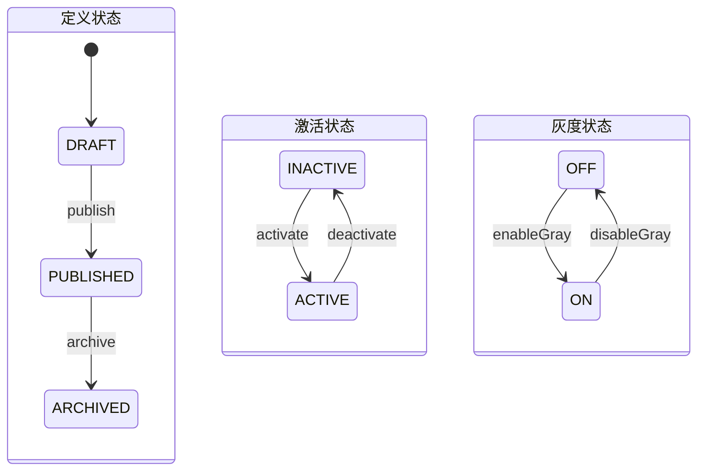

实际状态保存在三个字段中，而不是单一状态：

- 定义状态：`DRAFT -> PUBLISHED -> ARCHIVED`；
- 激活状态：`INACTIVE <-> ACTIVE`；
- 灰度状态：`OFF <-> ON`。

归档版本不可重新激活或灰度，只能复制为新草稿。同一 `processCode` 默认只能有一个全量激活版本。

### 3.4 幂等、事务和乐观锁

所有修改请求必须有 `operationId`。统一处理顺序：

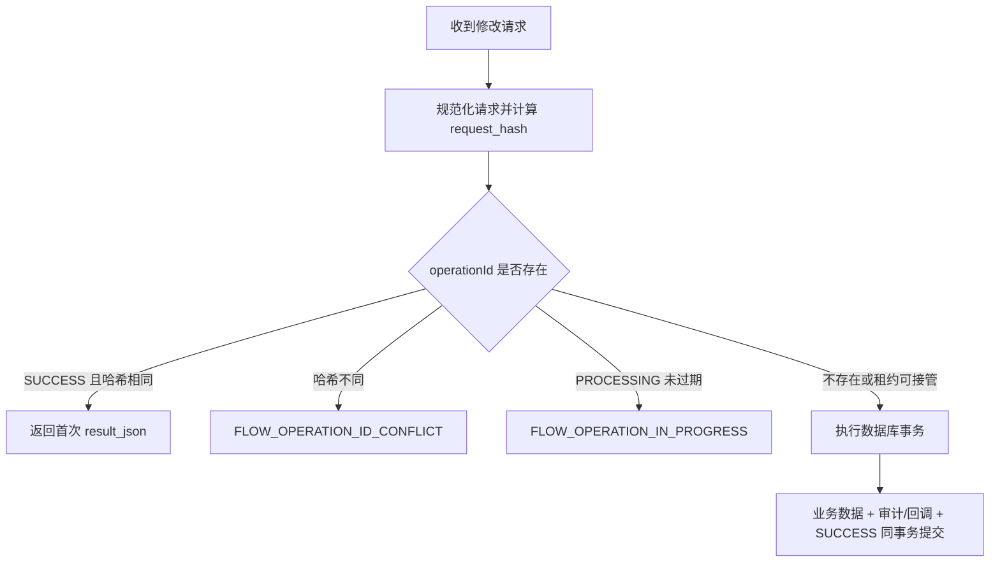

任务和任务组修改必须使用 `lock_version` 条件更新。受影响行数不是 1 时返回并发冲突，禁止继续创建历史、后续任务或回调。外部 SPI 调用不能放在任务抢占和事务提交之间。

### 3.5 通用返回对象

| 返回类型                     | 关键字段                                                                                              |
| ---------------------------- | ----------------------------------------------------------------------------------------------------- |
| `ProcessDefinitionDTO`       | `id`、`processCode`、`processName`、`systemCode`、`version`、三个状态字段、`grayRuleConfig`、审计时间 |
| `ProcessDefinitionDetailDTO` | 定义基本信息，以及 `nodes`、`edges`、`formFields`、`attachmentConfigs`                              |
| `ProcessNodeDTO`             | 节点基本信息、审批规则、多人模式、配置 JSON、坐标和顺序                                               |
| `ValidationResult`           | `valid`、`issues[]`；问题包含 `code`、`message`、`nodeCode/edgeCode`                                  |
| `PageResult<T>`              | `records`、`pageNo`、`pageSize`、`total`、`totalPages`                                                |
| `TaskDTO`                    | `taskId`、实例/节点、候选人/办理人、状态、任务组、`taskVersion`、时间                                 |
| `TaskActionResult`           | `instanceId`、`actionType`、完成/取消任务 ID、`createdTasks`、实例状态                                |

`TaskDTO.taskVersion` 映射 `process_active_task.lock_version`，下一次任务修改时原样回传为 `expectedTaskVersion`。

## 4. 流程定义管理（M1）

### 4.1 接口

对应 `ProcessDefinitionService`：

| 功能     | Service             | REST                                                 |
| -------- | ------------------- | ---------------------------------------------------- |
| 创建     | `createDefinition`  | `POST /api/platform/definitions`                     |
| 保存整图 | `saveGraph`         | `PUT /api/platform/definitions/{definitionId}/graph` |
| 复制     | `copyDefinition`    | `POST /api/platform/definitions/{definitionId}/copy` |
| 删除     | `deleteDefinition`  | `DELETE /api/platform/definitions/{definitionId}`    |
| 详情     | `getDefinition`     | `GET /api/platform/definitions/{definitionId}`       |
| 分页查询 | `searchDefinitions` | `GET /api/platform/definitions`                      |
| 节点查询 | `listNodes`         | 随定义详情或内部接口提供                             |

### 4.2 创建定义

接口：`createDefinition(CreateProcessDefinitionRequest request) -> ProcessDefinitionDTO`

| 入参             | 必填 | 说明           |
| ---------------- | ---- | -------------- |
| `operationId`    | 是   | 全局唯一幂等号 |
| `processCode`    | 是   | 流程编码       |
| `processName`    | 是   | 流程名称       |
| `systemCode`     | 是   | 所属系统编码   |
| `remark`         | 否   | 备注           |
| `operatorUserId` | 是   | 创建人         |

实现步骤：

1. 校验 `operationId`、流程编码、名称和所属系统；
2. 开启 SQLite 写事务；
3. 查询同一 `process_code` 最大版本，分配 `max(version) + 1`；首次为 1；
4. 插入 `process_definition`，固定为 `DRAFT + INACTIVE + OFF`；
5. 写入幂等成功结果并提交；
6. 唯一键冲突时整笔回滚，可有限次重试。

客户端不能指定 `version`。不要在事务外先查最大版本。

返回结果：`ProcessDefinitionDTO`。服务端生成 `id` 和 `version`，状态为 `DRAFT + INACTIVE + OFF`；幂等重试返回第一次结果。

### 4.3 保存节点和连线

采用“整图全量替换”，不提供零散节点写接口。

接口：`saveGraph(String definitionId, SaveProcessGraphRequest request) -> ProcessDefinitionDTO`

| 入参                  | 必填 | 说明                            |
| --------------------- | ---- | ------------------------------- |
| `definitionId`        | 是   | 路径参数，只允许草稿定义        |
| `operationId`         | 是   | 幂等号                          |
| `operatorUserId`      | 是   | 操作人                          |
| `nodes`               | 是   | 完整节点数组                    |
| `edges`               | 是   | 完整连线数组                    |
| `formFields`          | 否   | C 线维护的表单字段              |
| `attachmentConfigs` | 否   | C 线维护的附件配置              |
| `expectedUpdatedAt`   | 建议 | v3 未冻结定义级锁时防止覆盖编辑 |

节点项使用 `ProcessNodeDTO` 字段；连线项至少包含编码、起止节点、条件、默认标志和顺序。

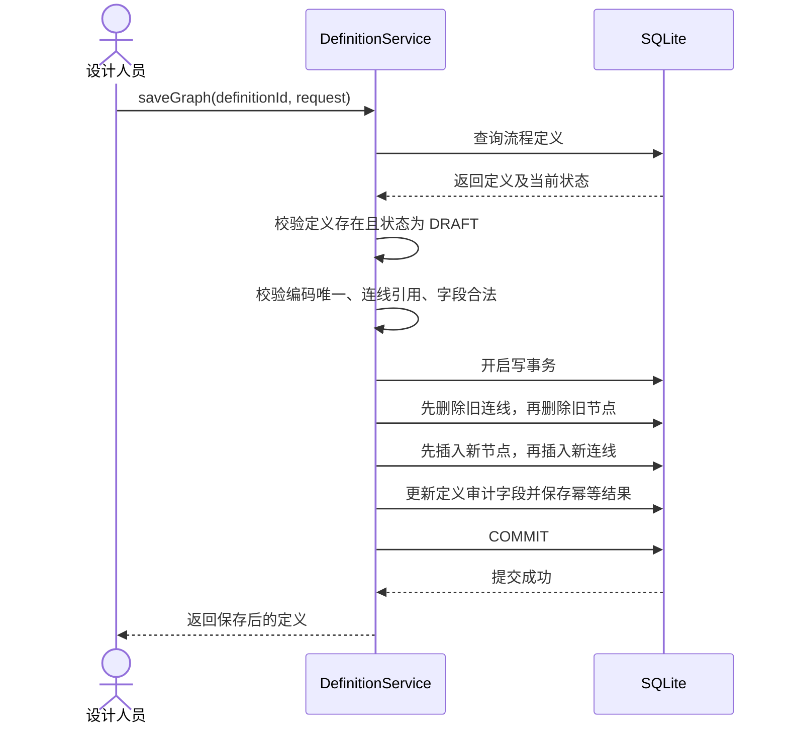

基础保存校验由 A 实现：字段非空、编码不重复、连线引用存在、节点类型与配置字段基本匹配。开始/结束数量、可达性、网关语义等发布校验由 B 实现。

返回结果：保存后的 `ProcessDefinitionDTO`。如页面需要完整结构，再调用 `getDefinition`。

### 4.4 复制和版本管理

接口：`copyDefinition(String definitionId, CopyProcessDefinitionRequest request) -> ProcessDefinitionDTO`

| 入参                | 必填 | 说明                       |
| ------------------- | ---- | -------------------------- |
| `definitionId`      | 是   | 源定义 ID                  |
| `operationId`       | 是   | 幂等号                     |
| `targetProcessName` | 否   | 新版本名称，默认沿用源名称 |
| `remark`            | 否   | 复制说明                   |
| `operatorUserId`    | 是   | 操作人                     |

复制流程：

1. 加载源定义、节点和连线的完整快照；
2. 在写事务内分配同一 `processCode` 的下一版本；
3. 创建 `DRAFT + INACTIVE + OFF` 的目标定义；
4. 复制节点、连线和配置，重建数据库主键，保留业务编码；
5. 同步调用 C 线 `copyExtensions` 复制表单和附件配置草稿；
6. 保存幂等结果并提交；
7. 提交后使目标定义缓存失效。

任何扩展复制失败都必须回滚，不允许生成半份定义。

返回结果：新的 `ProcessDefinitionDTO`。流程编码不变，版本加一，状态为 `DRAFT + INACTIVE + OFF`，扩展数据已一并复制。

### 4.5 删除定义

接口：`deleteDefinition(DefinitionOperationRequest request) -> void`

入参：`definitionId`、`operationId`、`operatorUserId`，均必填。

系统支持删除流程定义，并级联删除该定义下的定义期数据和运行期数据。删除不是普通编辑操作，应校验操作人具有流程管理权限；如果定义仍为 `ACTIVE`，应先停用，避免删除期间继续创建新实例。

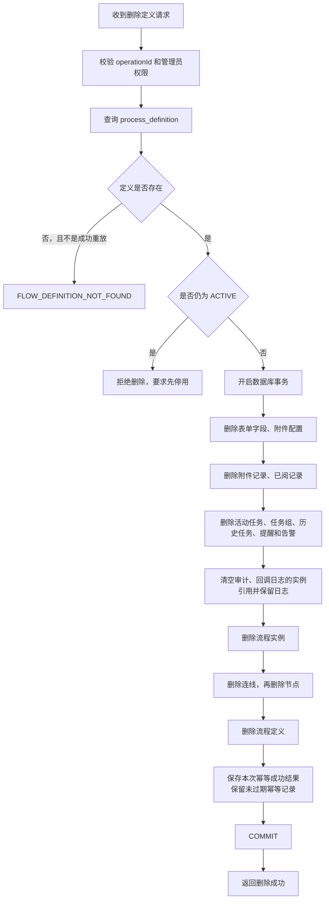

级联删除范围：

| 数据类别 | 删除内容 |
| --- | --- |
| 定义期数据 | `process_edge`、`process_node`、`process_form_field`、`process_definition_attachment_config`、`process_definition` |
| 运行期数据 | `process_attachment`、`process_read_record`、`process_active_task`、`process_task_group`、`process_history_task`、`process_reminder_record`、`process_alert_record`、`process_instance` |
| 默认保留 | `process_audit_log`、`process_callback_log` 删除实例前由 Service 显式清空 `instance_id` 引用后保留；未到 `expires_at` 的 `process_operation_record` 保留 |

所有删除必须在同一数据库事务中执行。顺序遵循“定义期扩展 → 运行期子表 → 清空保留型日志引用 → 实例 → 连线/节点 → 定义”，任何一步失败都回滚，不能留下孤立任务、实例或半份定义。文件内容由文件存储 SPI 管理时，应先记录待清理的存储键，数据库提交后再执行文件删除；文件删除失败写告警，不能恢复已经提交的数据库事务。

返回结果：Service 无业务体；REST 建议返回 `204 No Content`。同幂等号重试仍成功；非重放场景下定义不存在返回 `FLOW_DEFINITION_NOT_FOUND`。

### 4.6 查询定义和节点

| 功能                | 入参                                                       | 返回结果                                                      |
| ------------------- | ---------------------------------------------------------- | ------------------------------------------------------------- |
| `getDefinition`     | 必填 `definitionId`                                        | `ProcessDefinitionDetailDTO`，含定义、排序节点/连线及扩展配置 |
| `listNodes`         | 必填 `definitionId`                                        | `List<ProcessNodeDTO>`，按 `sortOrder, nodeCode` 排序         |
| `searchDefinitions` | 可选流程编码/名称/系统/三个状态；必填 `pageNo`、`pageSize` | `PageResult<ProcessDefinitionDTO>`，默认按 `updatedAt DESC`   |

### 4.7 验收点

- 入金申请 5 个节点、4 条连线可完整保存和读取；
- 保存失败后旧图不变；
- 已发布/归档定义不可编辑；
- 复制后版本递增、主键不同、结构相同；
- 相同 `operationId` 重试不产生重复版本。
- 删除定义后，其节点、连线、实例、活动任务、任务组、历史任务、已阅和附件元数据均不存在；
- 删除中任一步失败时全部回滚，审计、回调和未过期幂等记录仍可用于排查和重试。

## 5. 节点配置读取与解析请求构造（M2）

### 5.1 配置格式

审批配置保存于 `process_node`：

| `approver_rule_type`  | `approver_rule_config` 示例                           | 解析方式                           |
| --------------------- | ----------------------------------------------------- | ---------------------------------- |
| `USER`                | `{"userIds":["u1","u2"]}`                             | 按指定用户查询并去重               |
| `STARTER`             | `{}`                                                  | 使用实例发起人                     |
| `DEPARTMENT`          | `{"departmentId":"d1"}`                               | 查询部门用户                       |
| `ROLE`                | `{"roleCode":"finance"}`                              | 按角色查询用户                     |
| `ROLE_IN_DEPARTMENT`  | `{"roleCode":"manager","departmentSource":"STARTER"}` | 角色与部门交集                     |
| `APPROVER_EXPRESSION` | `{"expression":"..."}`                                | 使用受限表达式解析上下文后查询用户 |

`multi_instance_mode` 决定结果的任务创建方式：`SINGLE`、`OR_SIGN` 或 `COUNTERSIGN`。

### 5.2 输入与返回

内部接口：`buildApproverResolveRequest(instanceId, nodeCode) -> ApproverResolveRequest`

| 入参             | 必填     | 说明                |
| ---------------- | -------- | ------------------- |
| `nodeCode`       | 是       | 用户任务节点编码    |
| `instanceId`     | 是       | 用于读取定义版本、发起人和变量 |

返回 `ApproverResolveRequest`，至少包含 `definitionId`、`nodeCode`、`approverRuleType`、`approverRuleConfig`、`multiInstanceMode`、`instanceId`、`starterUserId`、`starterDeptId` 和 `variables`。

节点配置读取接口：`loadNodeConfig(definitionId, nodeCode) -> ProcessNodeDTO`。两个入参均必填，返回审批规则、多人模式、监听、超时和提醒配置；节点不存在返回 `FLOW_NODE_NOT_FOUND`。

### 5.3 实现流程

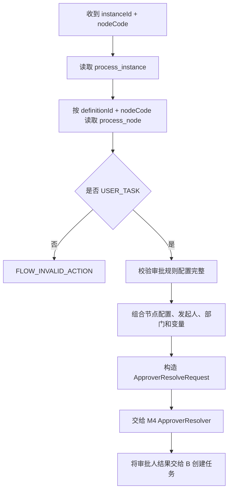

实现要求：

1. 节点必须是 `USER_TASK`；网关不解析审批人；
2. 节点配置必须从实例固化的 `definition_id` 读取，不能读取当前最新版本；
3. M2 只读取和校验配置、构造请求，不直接查询组织架构；
4. `approver_rule_config` 按规则类型完成必要字段校验；
5. `SINGLE/OR_SIGN/COUNTERSIGN` 原样写入解析请求，供 M4 和运行时使用；
6. B 线创建任务前必须调用此流程，禁止自行拼装另一套节点配置。

审批人表达式只负责“谁审批”；连线条件表达式只负责“走哪条线”，两者不能混用。

返回结果：标准化的 `ApproverResolveRequest`。M4 返回空审批人列表或解析失败时，运行时不得创建无人任务。

## 6. 流程版本治理（M3）

### 6.1 接口

| 功能          | Service       | REST                                  |
| ------------- | ------------- | ------------------------------------- |
| 发布          | `publish`     | `POST /definitions/{id}/publish`      |
| 激活          | `activate`    | `POST /definitions/{id}/activate`     |
| 停用          | `deactivate`  | `POST /definitions/{id}/deactivate`   |
| 归档          | `archive`     | `POST /definitions/{id}/archive`      |
| 开启/更新灰度 | `enableGray`  | `POST /definitions/{id}/gray`         |
| 关闭灰度      | `disableGray` | `POST /definitions/{id}/gray/disable` |

以上 REST 路径统一以 `/api/platform` 为前缀。请求必须携带 `operationId` 和 `operatorUserId`；灰度请求还包含 `grayRuleConfig`。

### 6.2 发布、激活、停用、归档

接口及返回类型：

```java
ValidationResult validateForPublish(String definitionId);
ProcessDefinitionDTO publish(DefinitionOperationRequest request);
ProcessDefinitionDTO activate(DefinitionOperationRequest request);
ProcessDefinitionDTO deactivate(DefinitionOperationRequest request);
ProcessDefinitionDTO archive(DefinitionOperationRequest request);
ProcessDefinitionDTO disableGray(DefinitionOperationRequest request);
```

`validateForPublish` 入参为必填 `definitionId`，返回 `valid` 和完整 `issues[]`。其余方法的入参均为必填 `definitionId`、`operationId`、`operatorUserId`，可选 `comment`；返回更新后的 `ProcessDefinitionDTO`。

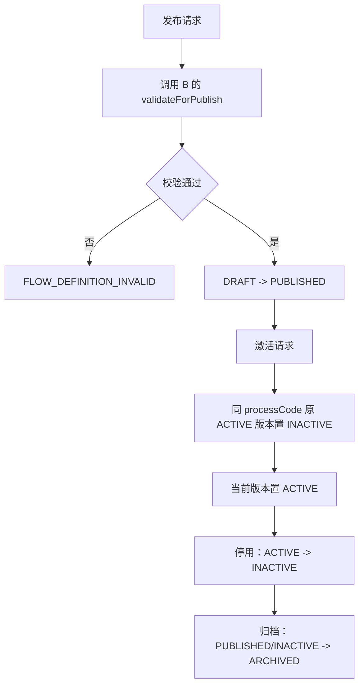

每个状态变化都要：重新读取当前状态、校验合法转换、在同一事务更新状态并写审计/幂等结果、提交后清缓存。激活不能只在应用层“先查再写”，必须由事务和约束保证同一编码只有一个全量激活版本。

返回结果含最新的定义、激活和灰度状态。定义生命周期非法状态转换返回 `FLOW_DEFINITION_NOT_EDITABLE`；发布校验不通过返回 `FLOW_DEFINITION_INVALID`。

### 6.3 灰度发布

灰度版本必须已发布，且 `gray_rule_config` 有效。规则可按用户、部门、角色或比例命中。

接口：`enableGray(GrayReleaseRequest request) -> ProcessDefinitionDTO`

入参：必填 `definitionId`、`operationId`、`operatorUserId`、`grayRuleConfig`。返回 `grayStatus=ON` 且携带已保存灰度规则的定义 DTO。

启动时的版本选择顺序：

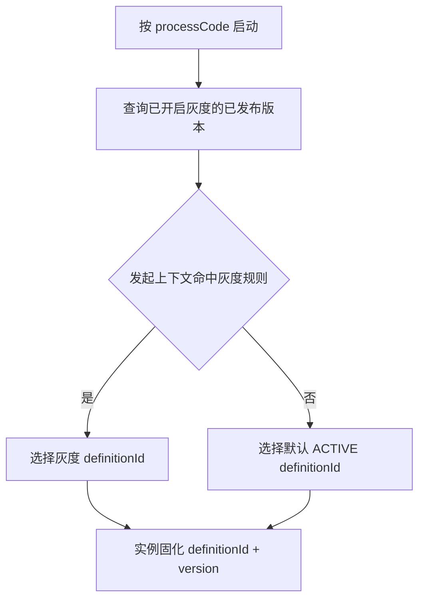

关闭灰度只把 `gray_status` 置为 `OFF`，不改变已启动实例。灰度比例必须使用稳定散列（例如业务键或用户 ID），不能每次随机导致同一用户反复切换版本。

内部版本选择功能 `selectDefinition(processCode, starterContext) -> ProcessDefinitionDTO`：必填流程编码和发起人，可选发起部门、角色和业务键；返回命中的灰度定义或默认激活定义，无可用版本时返回 `FLOW_DEFINITION_NOT_ACTIVE`。

### 6.4 验收点

- 草稿未通过校验不能发布；
- 已发布才可激活或开启灰度；
- 激活新版本后旧全量版本停用；
- 归档版本不可重新启用；
- 灰度命中稳定，未命中回落默认激活版本；
- 每个操作有审计记录且可幂等重放。

## 7. 组织架构与审批人解析 SPI（M4）

M4 接收 M2 构造的 `ApproverResolveRequest`，通过组织架构 SPI 将节点规则解析成实际审批人。第一阶段提供本地 Mock；以后可替换为统一组织架构服务，调用方不变。

### 7.1 SPI 接口

```java
public interface OrganizationProvider {
    List<DepartmentDTO> listDepartments();
    List<UserDTO> listUsersByDepartment(String departmentId);
    List<UserDTO> listUsersByRole(String roleCode);
    List<UserDTO> listUsersByRoleAndDepartment(String roleCode, String departmentId);
    Optional<UserDTO> findUser(String userId);
    Optional<DepartmentDTO> findDepartment(String departmentId);
}

public interface ApproverResolver {
    List<UserDTO> resolveApprovers(ApproverResolveRequest request);
}
```

### 7.2 入参与返回结果

`resolveApprovers` 的请求字段如下：

| 入参 | 必填 | 说明 |
| --- | --- | --- |
| `definitionId`、`nodeCode` | 是 | 定义版本和用户任务节点 |
| `approverRuleType` | 是 | 六类审批人规则之一 |
| `approverRuleConfig` | 是 | 规则 JSON；允许空对象但不能为未知结构 |
| `multiInstanceMode` | 是 | `SINGLE/OR_SIGN/COUNTERSIGN` |
| `instanceId`、`starterUserId` | 是 | 实例和发起人上下文 |
| `starterDeptId`、`variables` | 否 | 部门和表达式上下文 |

返回结果：去重并稳定排序的 `List<UserDTO>`。用户字段至少包括用户 ID、名称、部门、角色和有效状态；结果为空、规则非法或组织数据异常时返回 `FLOW_APPROVER_RESOLVE_FAILED`。

组织架构 SPI 的入参与返回：

| 功能 | 入参 | 返回结果 |
| --- | --- | --- |
| `listDepartments` | 无 | `List<DepartmentDTO>` |
| `listUsersByDepartment` | `departmentId` | 部门有效用户列表 |
| `listUsersByRole` | `roleCode` | 角色有效用户列表 |
| `listUsersByRoleAndDepartment` | `roleCode`、`departmentId` | 角色与部门交集用户 |
| `findUser` | `userId` | `Optional<UserDTO>` |
| `findDepartment` | `departmentId` | `Optional<DepartmentDTO>` |

### 7.3 解析流程

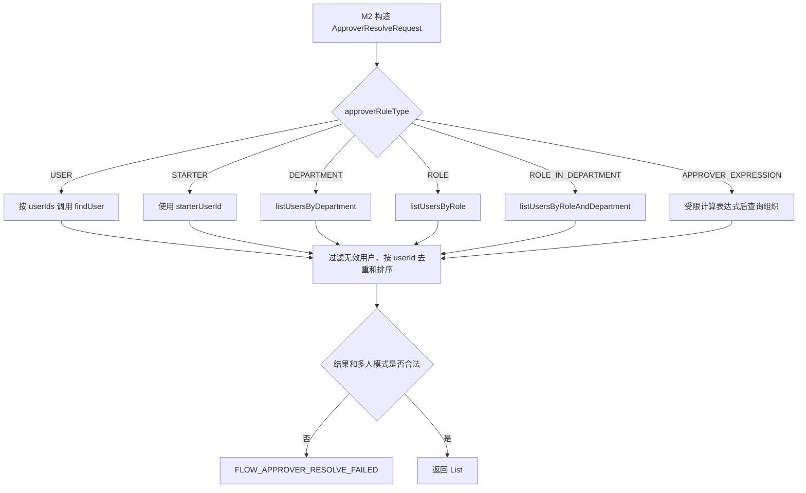

### 7.4 实现与验收要求

1. `USER` 校验配置中的每个用户存在且有效；
2. `STARTER` 返回发起人；
3. `DEPARTMENT/ROLE/ROLE_IN_DEPARTMENT` 通过 `OrganizationProvider` 查询；
4. `APPROVER_EXPRESSION` 只能读取允许的上下文，不允许任意代码执行；
5. 结果按用户 ID 去重并稳定排序；
6. `SINGLE` 的多人结果必须按冻结规则处理，不能随机选人；
7. `OR_SIGN/COUNTERSIGN` 保留全部审批人；
8. Mock 至少提供发起人、部门经理和财务角色数据，支持入金申请联调。

## 8. 增强规则配置（M5）

M5 的 A 线职责是保存和校验配置，运行时动作由 B/C 消费。

### 8.1 节点监听配置

保存位置：`process_node.listener_config`。建议结构：事件类型、处理器标识、失败策略和参数。A 只允许白名单事件和已注册处理器，不在定义保存时执行监听器。运行时在任务创建、完成等事件生成回调记录，事务提交后执行外部处理。

### 8.2 条件表达式配置

保存位置：`process_edge.condition_expression`。只允许条件网关的非默认出线配置；默认出线不需要表达式。同一条件网关最多一条默认出线，出线按 `sort_order` 计算。

表达式必须：

- 只读流程变量和当前上下文；
- 禁止反射、文件、网络、系统命令和任意 Bean 调用；
- 在发布校验时完成语法检查；
- 运行失败时整个流转事务回滚。

### 8.3 会签/或签配置

保存位置：`process_node.multi_instance_mode`。

- `SINGLE`：普通单任务；
- `OR_SIGN`：为多个审批人创建或签任务组，任一人完成即推进；
- `COUNTERSIGN`：为多个审批人创建会签任务组，全部完成后推进。

网关节点不得配置多人处理模式。`OR_SIGN` 或 `COUNTERSIGN` 必须能解析出至少一个审批人。

### 8.4 驳回/直送规则配置

规则属于节点配置，可放在 `listener_config` 的独立命名区或经三方评审增加专用配置字段；不得自行变更 v3 表结构。配置至少说明允许驳回的目标范围、是否允许直送、直送目标来源。

运行边界：B 执行驳回/直送并更新任务；A 提供规则读取和目标合法性校验。驳回目标必须是当前定义版本中的 `USER_TASK`，不能指向开始、网关或结束；直送只能使用已记录的驳回来源。

### 8.5 配置保存流程

这些配置不新增独立接口，统一通过 `saveGraph` 的 `nodes` 和 `edges` 提交：

| 功能       | 入参位置与关键字段                                     | 返回结果                                   |
| ---------- | ------------------------------------------------------ | ------------------------------------------ |
| 节点监听   | `nodes[].listenerConfig`：事件、处理器、失败策略、参数 | 保存后的定义 DTO；非法处理器返回校验错误   |
| 条件表达式 | `edges[].conditionExpression`；默认线表达式为空        | 保存后的定义 DTO；语法问题进入发布校验结果 |
| 默认出线   | `edges[].defaultEdge`                                  | 保存后的定义 DTO                           |
| 会签/或签  | `nodes[].multiInstanceMode`                            | 保存后的定义 DTO                           |
| 驳回/直送  | 节点配置 JSON：目标范围、是否允许、目标来源            | 保存后的定义 DTO                           |

v3 未冻结驳回/直送专用字段，三方评审前不新增数据库列。保存成功表示结构可持久化，能否发布仍以 `ValidationResult` 为准。

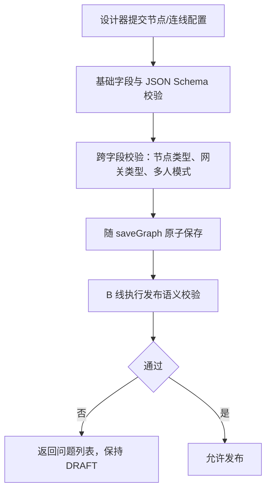

## 9. 条件分支（M6）

### 9.1 数据与入口

- 网关节点：`process_node.node_type = EXCLUSIVE_GATEWAY`；
- 条件出线：`process_edge.condition_expression`；
- 默认出线：`process_edge.default_edge = true`；
- 变量来源：`process_instance.variables_json`；
- 运行入口：通用 `advanceToNode(...)` 到达条件网关时调用路由组件。

普通用户任务只能有一条出线；需要分支必须显式建条件网关。

### 9.2 实现流程

内部接口：`evaluateExclusiveGateway(GatewayRouteRequest request) -> RouteResult`

| 入参                       | 必填 | 说明               |
| -------------------------- | ---- | ------------------ |
| `instanceId`               | 是   | 当前实例           |
| `definitionId`             | 是   | 实例固化的定义版本 |
| `gatewayNodeCode`          | 是   | 条件网关编码       |
| `variables`                | 是   | 当前变量快照       |
| `taskGroupId`、`branchKey` | 否   | 位于并行分支时传入 |
| `visitedNodeCodes`         | 是   | 防止自动节点闭环   |

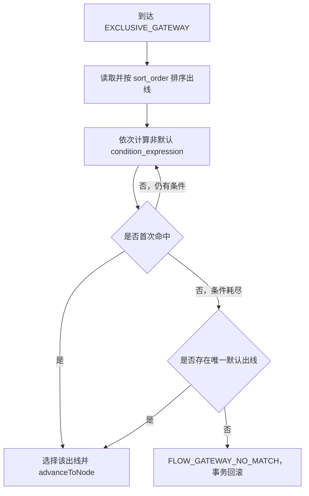

同一次推进要记录已访问自动节点并限制最大步数，防止网关环路无限递归。网关不创建活动任务，也不进入 `current_node_codes` 的长期等待状态。

返回结果：内部 `RouteResult`，包含 `selectedEdgeCode`、`targetNodeCode`、继续推进产生的 `createdTasks` 和实例状态。未命中且无默认线返回 `FLOW_GATEWAY_NO_MATCH`；配置或表达式非法返回 `FLOW_GATEWAY_CONFIG_INVALID`。

### 9.3 发布校验

- 至少两条出线；
- 最多一条默认出线；
- 非默认出线必须有表达式；
- 表达式语法有效；
- 所有目标节点存在且可达；
- 网关不得配置审批人或多人处理模式。

### 9.4 验收点

至少覆盖：首条条件命中、后续条件命中、全部不命中走默认、无默认失败、表达式异常回滚、条件顺序稳定。

## 10. 或签（M6）

### 10.1 数据与协作边界

节点配置 `multi_instance_mode = OR_SIGN`。运行时为审批人列表创建：

- 一条 `process_task_group`：`group_type=OR_SIGN`、`group_status=ACTIVE`、`total_count=N`；
- N 条 `process_active_task`：共享 `task_group_id`，各自持有 `lock_version`。

A 负责或签推进权算法和定义配置；B 可复用普通任务完成、历史归档和后续节点推进；C 补查询、回调与审计。实现时应落在共享运行时 Service 中，不能形成两套事务逻辑。

### 10.2 实现流程

创建或签任务的内部接口：`createOrSignTasks(CreateMultiInstanceTaskRequest request) -> List<TaskDTO>`。

| 入参                                     | 必填 | 说明                 |
| ---------------------------------------- | ---- | -------------------- |
| `instanceId`、`definitionId`、`nodeCode` | 是   | 实例、定义和或签节点 |
| `approvers`                              | 是   | 审批人列表，至少一人 |
| `taskGroupId`                            | 否   | 新建或签组时为空     |
| `branchKey`                              | 否   | 位于并行分支时传入   |

返回全部新建 `TaskDTO`，共享同一个 `taskGroupId`，初始 `taskVersion=0`。

办理或签任务复用 `approve(ApproveTaskRequest request) -> TaskActionResult`，不新增专用 REST 接口。入参如下：

| 入参                   | 必填 | 说明               |
| ---------------------- | ---- | ------------------ |
| `operationId`          | 是   | 幂等号             |
| `taskId`               | 是   | 当前或签任务       |
| `expectedTaskVersion`  | 是   | 任务乐观锁版本     |
| `operatorUserId`       | 是   | 实际办理人         |
| `comment`、`variables` | 否   | 审批意见和变量更新 |

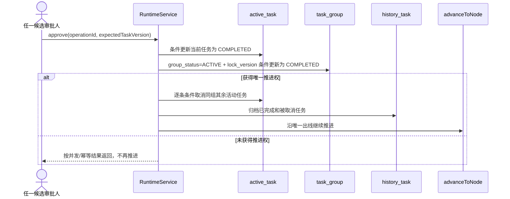

关键不变量：

1. 只有一个请求能把任务组从 `ACTIVE` 改为 `COMPLETED`；
2. 只有获得推进权的请求能创建下一节点任务；
3. 同组其他任务用各自 `lock_version` 更新为 `CANCELED`；
4. 当前任务、任务组、取消任务、历史、下一任务、审计、回调和幂等结果在同一事务提交；
5. 相同 `operationId` 重试返回首次结果，不重复推进。

返回结果：`TaskActionResult`。`completedTaskIds` 含当前任务，`canceledTaskIds` 含同组其余任务，`createdTasks` 仅包含唯一推进产生的后续任务。并发失败返回任务或任务组并发冲突错误。

### 10.3 验收点

- 三人或签中任一人完成即可推进；
- 其余任务全部取消并可追溯；
- 两人并发办理时只产生一组后续任务；
- 乐观锁冲突不生成重复历史或回调；
- 或签后可继续进入用户任务、条件网关、并行网关或结束节点。

## 11. 跨工作线接口

```java
public interface ProcessDefinitionGraphReader {
    ProcessDefinitionGraphSnapshot load(String definitionId);
}

ProcessDefinitionCache.invalidate(definitionId)

public interface DefinitionExtensionLifecycle {
    void copyExtensions(String sourceDefinitionId, String targetDefinitionId);
    void deleteDraftExtensions(String definitionId);
}
```

| 功能                                    | 入参                   | 返回结果                                                 |
| --------------------------------------- | ---------------------- | -------------------------------------------------------- |
| `ProcessDefinitionGraphReader.load`     | `definitionId`         | `ProcessDefinitionGraphSnapshot`，含定义、排序节点和连线 |
| `ProcessDefinitionCache.invalidate`     | `definitionId`         | `void`，仅事务提交后调用                                 |
| `copyExtensions`                        | 源定义 ID、目标定义 ID | `void`，异常使复制事务回滚                               |
| `deleteDraftExtensions`                 | `definitionId`         | `void`，异常使删除事务回滚                               |

协作规则：

- A 保存节点/连线后，事务提交后通知 B 清除定义缓存；
- C 保存表单/附件配置后也清除同一完整定义缓存；
- B 使用 A 的定义快照读取节点、连线和审批配置；
- 复制和删除由 A 统一控制事务，同步调用 C 的扩展生命周期接口；
- B 新增动作时同步 C 补查询/回调；C 新增字段时同步 A/B 调整快照 DTO；
- DTO 和枚举只能保留一份公共定义，不得各线自行复制。

## 12. 错误处理

优先使用 v3 基线错误码：

| 错误码                                | 场景                       |
| ------------------------------------- | -------------------------- |
| `FLOW_DEFINITION_NOT_FOUND`           | 定义不存在                 |
| `FLOW_DEFINITION_INVALID`             | 定义或配置校验失败         |
| `FLOW_DEFINITION_NOT_EDITABLE`        | 定义当前状态不允许编辑、删除或生命周期动作 |
| `FLOW_NODE_NOT_FOUND`                 | 节点或连线引用不存在       |
| `FLOW_OPERATION_ID_REQUIRED`          | 修改请求缺少幂等号         |
| `FLOW_OPERATION_ID_CONFLICT`          | 同一幂等号对应不同请求     |
| `FLOW_APPROVER_RESOLVE_FAILED`        | 审批人解析为空或异常       |
| `FLOW_GATEWAY_NO_MATCH`               | 条件网关没有命中且无默认线 |
| `FLOW_GATEWAY_CONFIG_INVALID`         | 网关配置非法               |
| `FLOW_TASK_CONCURRENT_MODIFIED`       | 活动任务乐观锁冲突         |
| `FLOW_TASK_GROUP_CONCURRENT_MODIFIED` | 或签任务组乐观锁冲突       |
| `FLOW_INVALID_ACTION`                 | 当前状态不允许操作         |

若需要新增“版本冲突”等其他实现级错误码，必须先经过三方接口评审再加入公共枚举。

## 13. 建议实施顺序与完成标准

1. 以 v3 建表并完成枚举、唯一索引和 Repository；
2. 实现统一幂等处理器及任务/任务组乐观锁更新模板；
3. 完成定义创建、整图保存、详情、分页、复制和删除；
4. 接入 B 的发布校验和缓存失效，接入 C 的扩展复制/删除；
5. 完成发布、激活、停用、归档和灰度治理；
6. 实现 `OrganizationProvider` Mock 和 `ApproverResolver`；
7. 完成监听、表达式、多人审批、驳回/直送配置校验；
8. 将条件网关接入统一 `advanceToNode`；
9. 将或签接入共享运行时事务；
10. 为每个功能补单元测试和 SQLite 集成测试。

最终完成标准：

- Java 8、Spring Boot 2.7.18 下编译通过；
- 数据字段、枚举、Service 和 REST 路径与 v3 一致；
- 定义 CRUD、复制和版本治理可幂等执行；
- 审批人按六类规则稳定解析；
- 条件分支和或签在并发下只推进一次；
- 所有状态变化有历史或审计，关键动作有回调；
- 入金申请定义可完成创建、发布、激活，并与 B/C 线联调跑通；
- 平台核心不包含具体业务逻辑。
