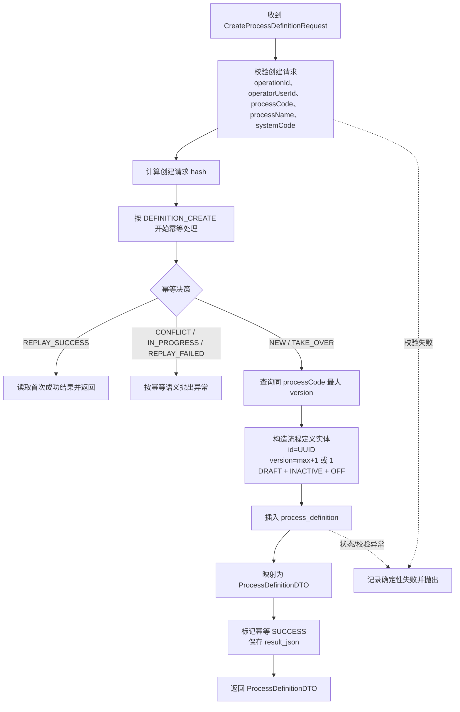
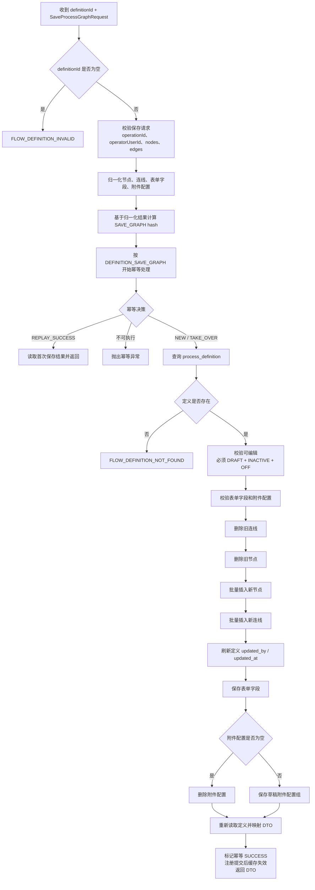
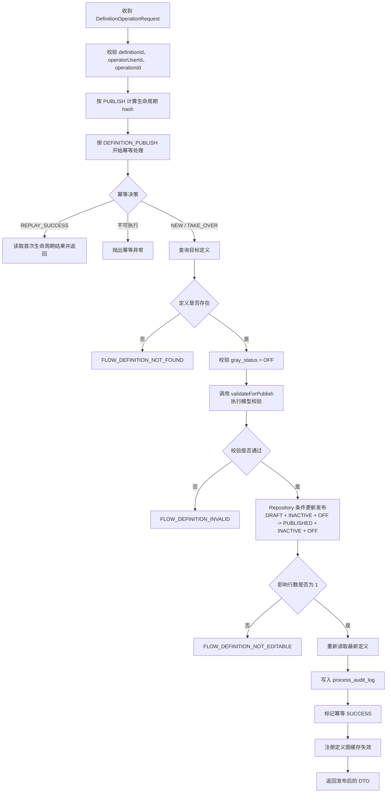
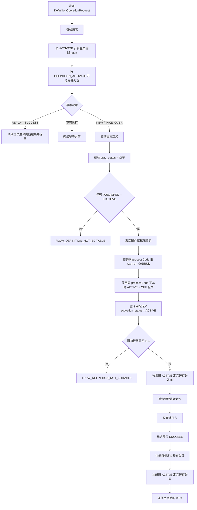
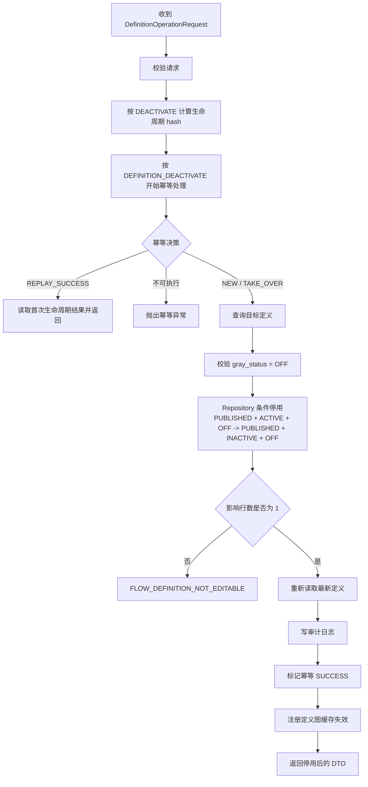
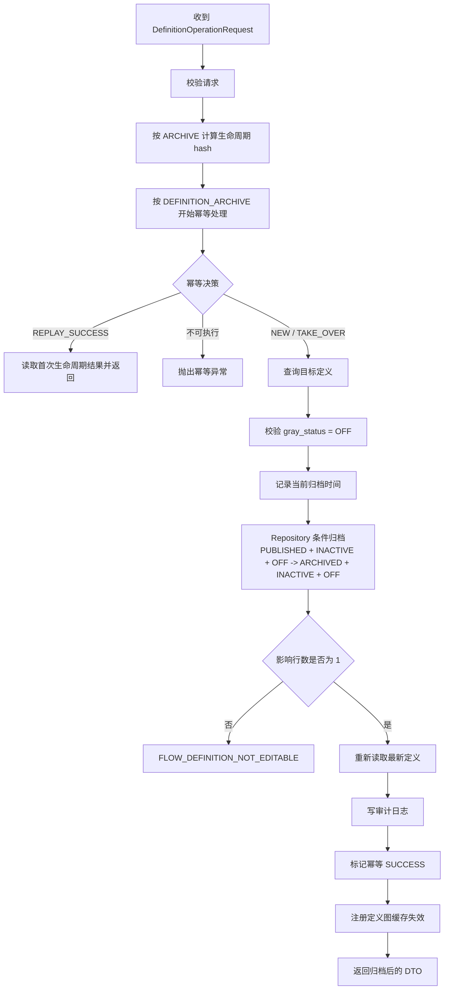
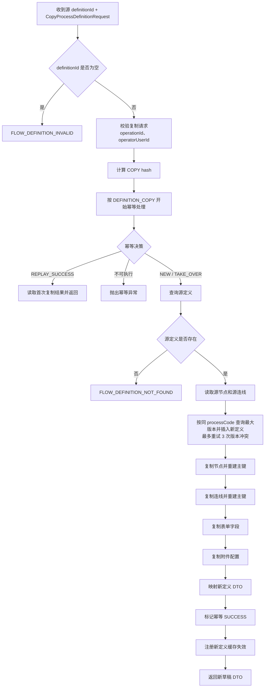
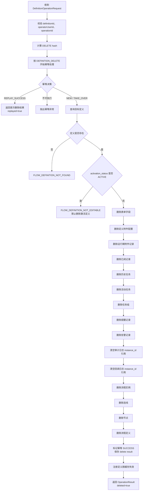
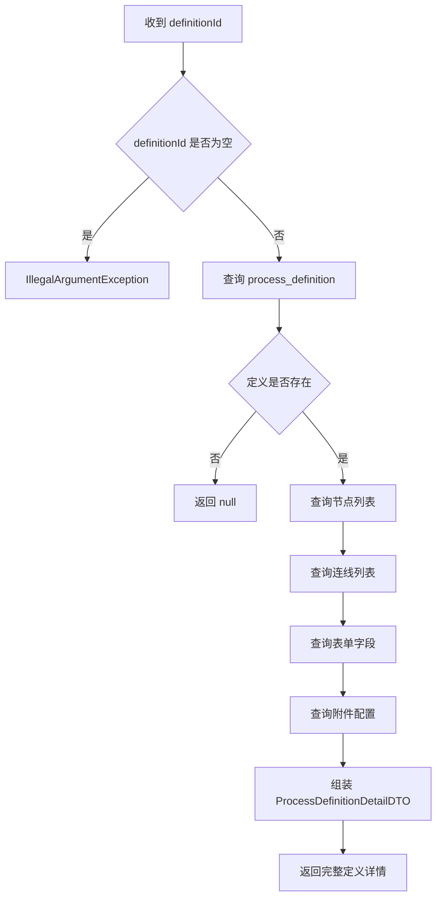
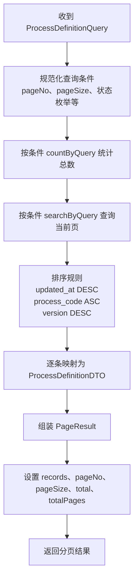

# 流程定义方法流程图

> 依据代码：`ProcessDefinitionService`、`DefaultProcessDefinitionService`、`ProcessDefinitionRepository`  
> 适用范围：流程定义创建、保存流程图结构、发布、激活、停用、归档、复制、删除、查询、分页查询。

## 1. 方法总览

| 功能 | Service 方法 | 核心状态要求 |
| --- | --- | --- |
| 创建流程定义 | `createDefinition` | 新建为 `DRAFT + INACTIVE + OFF` |
| 保存流程图结构 | `saveGraph` | 仅允许 `DRAFT + INACTIVE + OFF` |
| 发布 | `publish` | `DRAFT + INACTIVE + OFF` -> `PUBLISHED + INACTIVE + OFF` |
| 激活 | `activate` | `PUBLISHED + INACTIVE + OFF` -> `PUBLISHED + ACTIVE + OFF` |
| 停用 | `deactivate` | `PUBLISHED + ACTIVE + OFF` -> `PUBLISHED + INACTIVE + OFF` |
| 归档 | `archive` | `PUBLISHED + INACTIVE + OFF` -> `ARCHIVED + INACTIVE + OFF` |
| 复制 | `copyDefinition` | 复制为同 `processCode` 下一版本草稿 |
| 删除 | `deleteDefinition` | 禁止删除 `ACTIVE` 定义 |
| 查询 | `getDefinition` | 按 `definitionId` 返回完整详情 |
| 分页查询 | `searchDefinitions` | 按查询条件分页返回定义概要 |

## 2. 创建流程定义：`createDefinition`

关键点：

- 客户端不能指定版本号，版本由 `findMaxVersionByProcessCode` 后递增生成。
- 创建成功不写节点、连线、表单字段和附件配置，只创建定义主表草稿。

## 3. 保存流程图结构：`saveGraph`

关键点：

- 保存采用整图全量替换：先删旧连线，再删旧节点，再插入新节点和新连线。
- 保存只允许草稿、未激活、未灰度的定义。
- 缓存失效通过 `registerGraphCacheInvalidation(definitionId)` 注册到事务提交后执行。

## 4. 发布：`publish`

关键点：

- 发布前会通过 `validateForPublish` 校验流程模型。
- 发布成功写审计日志，审计详情记录最新定义状态、激活状态和灰度状态。

## 5. 激活：`activate`

关键点：

- 激活会先停用同一 `processCode` 下其他全量激活版本，再激活目标版本。
- 目标版本和旧激活版本的缓存都会失效。

## 6. 停用：`deactivate`

关键点：

- 停用只修改激活状态，不删除定义、节点、连线或运行期数据。
- 已经固化了 `definitionId` 的运行中实例不因停用而切换版本。

## 7. 归档：`archive`

关键点：

- 归档要求定义已经发布且未激活。
- 归档会写入 `archived_by` 和 `archived_at`，归档后不可再激活。

## 8. 复制：`copyDefinition`

关键点：

- 复制后的定义固定为 `DRAFT + INACTIVE + OFF`。
- 复制保留业务编码和配置内容，但重建数据库主键。
- 版本冲突时重新读取最大版本并有限重试。

## 9. 删除：`deleteDefinition`

关键点：

- 删除不是逻辑删除，会删除定义期和运行期关联数据。
- 审计日志和回调日志保留，只清空与被删实例相关的 `instance_id` 引用。
- 成功重放返回首次删除结果，不重复执行级联删除。

## 10. 查询：`getDefinition`

关键点：

- 查询详情不做幂等处理，因为它是只读方法。
- 返回内容包含定义主信息、节点、连线、表单字段和附件配置。

## 11. 分页查询：`searchDefinitions`

关键点：

- Repository 支持按 `processCode`、`processName`、`systemCode`、定义状态、激活状态、灰度状态过滤。
- 默认分页参数由查询规范化逻辑处理；总页数按 `ceil(total / pageSize)` 计算。

