# 流程平台技术文档 - 实习生 B

> 分工依据：`流程平台技术路线_v5.2.md` 与 `doc/实习生B/plan.md`
> 数据模型与接口基线：`流程平台设计与接口文档_v4.md`
> 当前实现状态：M0 的 B0.1～B0.4 已完成；B0.5 等待 A/C 对齐；M1～M6 尚未实施
> 技术栈：Java 8、Spring Boot 2.7.18、Maven、SQLite（后续运行期）

## 1. 文档目标

本文说明实习生 B 的运行时工作线：已经落地的 DTO 契约，以及后续运行时状态机、附件编排和高级任务动作的设计边界。

B 的职责是为流程运行提供稳定输入/输出契约，并在后续阶段实现实例启动、任务流转、历史归档、并发控制和运行期管理动作。B 不重复实现：

- A 负责的流程定义持久化、节点/连线配置、状态/动作枚举与审批人规则；
- C 负责的文件存储、附件元数据、Starter 自动装配、回调投递、查询展示、委托代办及并行汇聚；
- 具体业务领域规则。流程变量仅承载宿主系统数据，平台不解释其业务含义。

当前 M0 的目标是冻结公开 DTO 契约，而不是实现 Service、Repository、SQL、SPI、事件或流程流转。

## 2. 总体实现结构

当前已实现的代码只位于 `platform-core` 的公共 API 包；后续运行期实现必须消费这些契约，不能再创建平行 DTO。

```text
platform
├── platform-core
│   └── src
│       ├── main/java/com/flowmind/platform/api
│       │   ├── request/                 # B0.1、B0.2：运行时输入契约
│       │   └── dto/                     # B0.3：运行时输出契约
│       └── test/java/com/flowmind/platform/api
│           ├── request/                 # B0.1、B0.2、B0.4 契约测试
│           └── dto/                     # B0.3 结果契约测试
└── platform-starter                      # 当前 M0 不实现
```

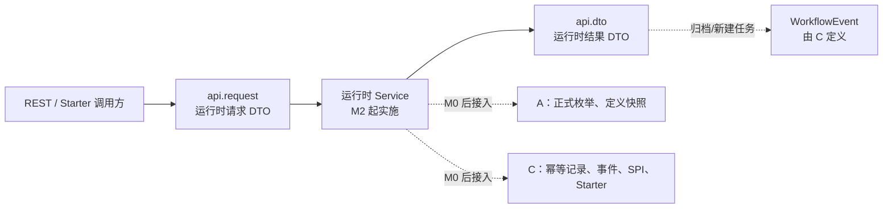

REST 与 Starter 在后续必须调用同一套运行时 Service；DTO 不能包含 SQLite、文件存储、权限或具体业务判断。

## 3. 基线模型与通用规则（M0）

### 3.1 B 必须对齐的运行期模型

下表来自 v4 数据模型。M0 不创建表或 Repository，但字段和语义决定 B 的 DTO 与后续状态机。

| 模型 | B 使用的关键字段/语义 | B 的对应职责 |
| --- | --- | --- |
| `process_instance` | 定义版本快照、附件配置快照、当前节点、变量、实例状态、起止时间 | `ProcessInstanceDTO`；M2 启动与 M3 实例管理 |
| `process_active_task` | 候选人、办理人、委托来源、任务组、分支、`lock_version`、超时时间 | `TaskDTO`；任务级请求回传 `expectedTaskVersion` |
| `process_history_task` | `operation_id`、原任务、办理方式、动作类型、意见、变量快照、完成时间 | `HistoryTaskDTO`；M2/M5 归档与审计表达 |
| `process_operation_record` | 操作号、规范化请求哈希、结果快照、处理租约 | 所有修改请求的 `operationId`；C 实现幂等记录基线 |
| `process_task_group` | 会签/或签/并行分组、完成计数、分支状态、`lock_version` | M6 会签与 C 的并行汇聚协作 |

### 3.2 幂等与乐观锁契约

`operationId` 是所有状态修改请求的公共幂等键；任务级请求还必须携带从 `TaskDTO.taskVersion` 原样取得的 `expectedTaskVersion`。这两个字段只表达调用约束，实际幂等登记、哈希比较和 CAS 更新由后续运行时实施。

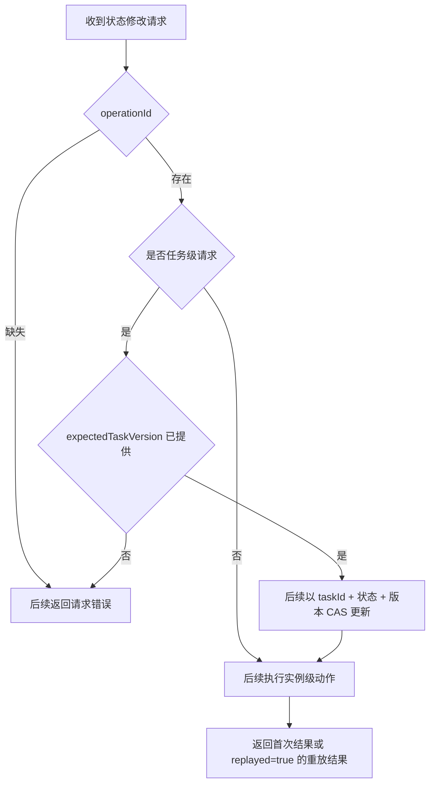

v4 的完整运行规则要求相同操作号且请求哈希一致时返回首次 `result_json`，哈希不同则冲突；任务 CAS 未命中时不得继续写历史、下一任务或回调。M0 仅让 DTO 能表达这些规则，不实现它们。

### 3.3 Java 8 DTO 约束

- 使用公开无参构造、字段及 getter/setter 的 JavaBean；不使用 Lombok、`record` 或 Java 9+ API。
- 不局部添加 `Serializable`。REST JSON、结果快照 JSON 与后续回调 JSON 不要求 Java 原生序列化；若 C 将来明确采用原生序列化，必须统一评估整个对象图和 `Map<String, Object>` 的可序列化性。
- M0 不以 `String` 临时替代 A 负责的共享状态/动作枚举，也不创建重复枚举或兼容别名。

## 4. 运行时请求契约（B0.1、B0.2）

### 4.1 继承结构

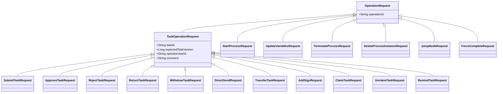

`JumpNodeRequest` 是管理员面向实例的跳转请求，刻意不继承 `TaskOperationRequest`，因此没有 `expectedTaskVersion`。这是 B0.4 需要持续保护的契约。

### 4.2 请求对象与字段责任

| 类别 | 请求对象 | B 已冻结的专有字段/含义 |
| --- | --- | --- |
| 启动 | `StartProcessRequest` | `processCode`、`businessKey`、`instanceTitle`、`starterUserId`、`starterDeptId`、`variables` |
| 变量更新 | `UpdateVariablesRequest` | `instanceId`、`operatorUserId`、`variables` |
| 任务提交 | `SubmitTaskRequest` | `variables`、`List<AttachmentUploadItem> attachments` |
| 基础任务动作 | `ApproveTaskRequest`、`ReturnTaskRequest`、`WithdrawTaskRequest`、`ClaimTaskRequest`、`UnclaimTaskRequest`、`RemindTaskRequest` | 仅复用任务基类字段 |
| 定向任务动作 | `RejectTaskRequest`、`DirectSendRequest` | `targetNodeCode` |
| 人员变更 | `TransferTaskRequest`、`AddSignRequest` | `targetUserId` 或 `addSignUserIds` |
| 实例管理 | `TerminateProcessRequest`、`DeleteProcessInstanceRequest`、`ForceCompleteRequest` | `instanceId` 与所需的操作人/说明 |
| 管理员跳转 | `JumpNodeRequest` | `instanceId`、`targetNodeCode`、`operatorUserId`、`comment` |

`AttachmentUploadItem` 是任务提交的内存载荷，包含附件模板编码、归属范围、文件名、MIME 类型、字节大小和 `byte[] content`。它不表示文件直接存入 SQLite；后续运行期须经 C 的文件存储 SPI 保存内容，并保存元数据。

### 4.3 任务版本传递链

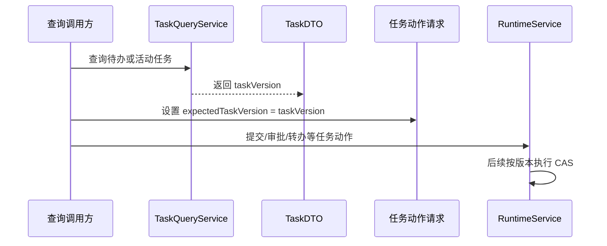

该链路保证 DTO 输出和请求输入表达同一个并发版本，真正的条件更新由 M2 以后实现。

## 5. 运行时结果契约（B0.3）

### 5.1 当前结果对象

| DTO | 当前字段表达的内容 | v4 对应语义 |
| --- | --- | --- |
| `ProcessInstanceDTO` | 实例/定义/附件配置快照、流程信息、发起信息、当前节点、变量、起止时间、`createdTasks` | 启动或推进后返回实例和首批/后续活动任务；并行时可有多个 |
| `TaskDTO` | 任务、实例、定义、节点、候选人、办理人、委托来源、任务组、分支、`taskVersion`、创建/超时时间 | 活动任务查询及后续任务动作的并发版本来源 |
| `HistoryTaskDTO` | 历史/原活动任务、实例、操作号、节点、分组/分支、办理人与委托来源、意见、变量快照、办理时间 | 已办轨迹和任务动作的归档表达 |
| `TaskActionResult` | `operationId`、`instance`、`archivedTasks`、`createdTasks`、`replayed` | 任务动作的完整结果；保留历史明细而非只返回任务 ID |
| `OperationResult` | `operationId`、`targetId`、`deleted`、`replayed` | 删除等实例/定义操作的可重放结果 |

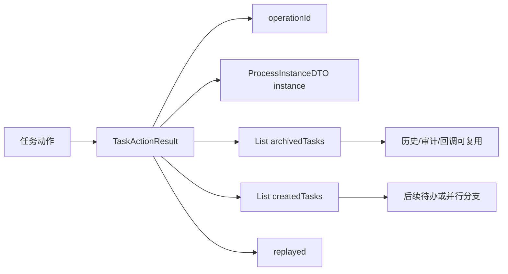

`TaskActionResult` 以当前工作区定义为唯一基线。它不使用过时的 `instanceId + actionType + completedTaskIds + canceledTaskIds + instanceStatus` 组合：

- `instanceId` 已可由 `instance.instanceId` 取得；
- 归档任务需要保留 `HistoryTaskDTO` 的操作号、意见、变量快照与时间，不能退化为 ID 列表；
- 动作类型应在 `HistoryTaskDTO` 的正式枚举字段中表达；实例状态应在 `ProcessInstanceDTO` 的正式枚举字段中表达；
- `replayed` 是幂等重放的结果语义，不能省略。

### 5.2 等待 A 对齐的枚举字段（B0.5）

下列字段在 A 的正式 `api.enums` 合入前不创建临时定义：

| DTO | 等待字段 | 归属 |
| --- | --- | --- |
| `ProcessInstanceDTO` | 实例状态 | A 的实例状态枚举 |
| `TaskDTO` | 活动任务状态 | A 的任务状态枚举 |
| `HistoryTaskDTO` | 办理方式、动作类型 | A 的处理方式/动作枚举 |
| `OperationResult` | 被操作目标类型 | A 的目标类型枚举 |

对齐时应更新 DTO 字段、字段注释和契约测试；不得同时保留字符串兼容字段。

## 6. DTO 契约测试与夹具（B0.4）

M0 的测试是 DTO 契约单元测试，不是运行时功能或数据库测试。

| 测试类 | 覆盖范围 |
| --- | --- |
| `OperationRequestContractTest` | 请求基类的 JavaBean 属性与继承关系 |
| `RuntimeRequestContractTest` | 17 个运行时修改请求的有效夹具、专有字段、`operationId`、任务版本和唯一覆盖门禁 |
| `RuntimeResultContractTest` | 结果 DTO 属性、`createdTasks`、`taskVersion`、归档任务、重放/删除标识和二进制附件内容 |

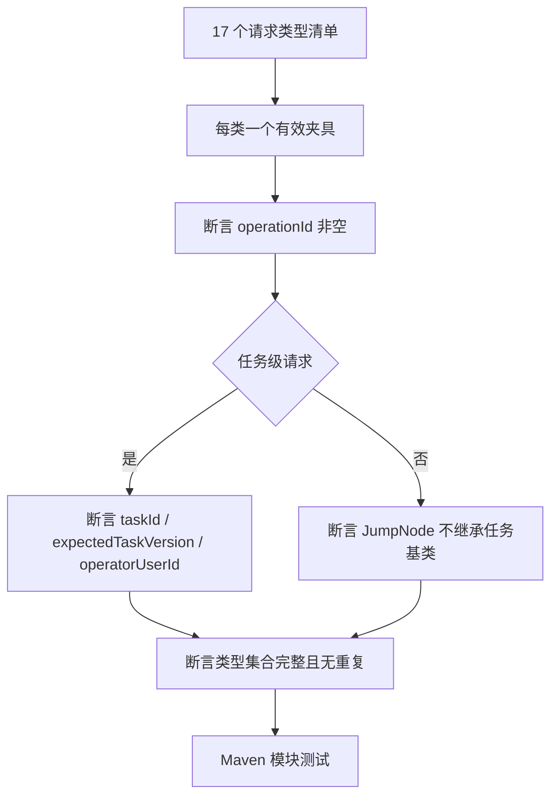

有效夹具只证明 DTO 可以表达一个有效请求/结果样例；它们不替代后续的非空校验、权限判断、幂等哈希、CAS、附件格式校验或事务测试。

当前验证命令：

```powershell
mvn -q -pl platform/platform-core -am test
```

## 7. 流程定义运行前校验与缓存（M1，规划）

B 在 M1 将消费 A 提供的定义、节点和连线快照，提供发布前运行语义校验、运行时图解析和按定义版本失效的缓存。A 负责定义 CRUD 与配置持久化；B 不复制定义表结构或接口。

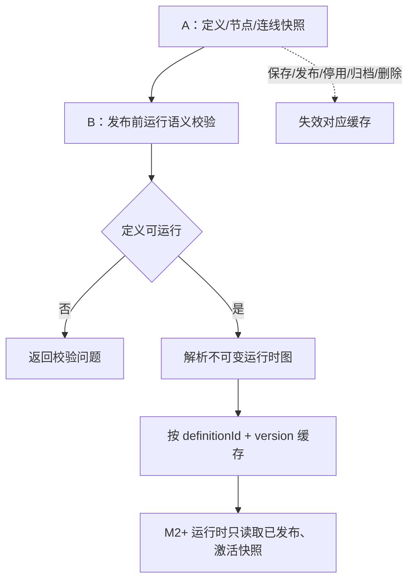

规划校验包括开始/结束节点、连线完整性、可达性、用户任务审批人规则、表单/附件配置去重和网关语义。该阶段尚未开始，本文不把规划接口视为已交付代码。

## 8. 附件运行时编排（M4 前置，规划）

B 的附件职责是运行时校验、实例/任务关联、授权调用和事务编排；C 负责文件存储 SPI、附件元数据 Repository 和本地 Mock。

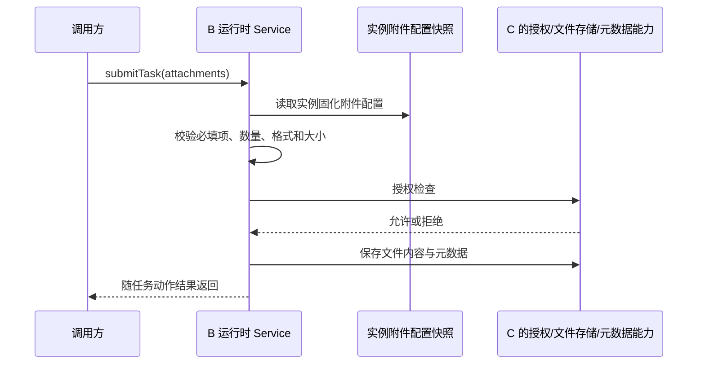

文件内容不得直接存入 SQLite。SPI 缺失、异常或授权拒绝时，后续实现必须拒绝该附件操作；数据库事务失败后对已上传文件执行最佳努力清理。

## 9. 运行时状态机与实例管理（M2、M3，规划）

M2 将实现启动、变量保存、首批用户任务创建、提交/审批、历史归档和后续任务推进；M3 将实现终止、变量更新、实例删除、管理员跳转和强制办结的运行时部分。

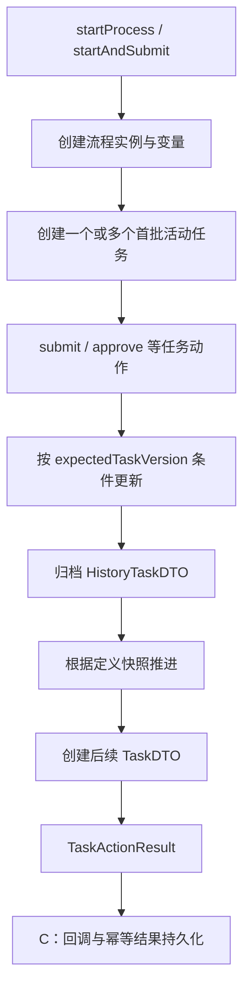

后续实现必须满足：

1. 任务 CAS、历史归档、任务组更新、下一任务创建、审计/回调记录及首次结果快照在同一事务提交；
2. 相同 `operationId` 的同请求重试只返回首次结果，并令 `replayed=true`；
3. 不同请求复用同一操作号必须拒绝；
4. 删除实例要清理关联运行数据，但保留到期前的幂等、审计和回调信息；
5. `startAndSubmit` 只启动并返回首批任务；宿主系统可再调用 `submitTask` 办理申请节点，平台不包含具体业务规则。

## 10. 增强任务动作与会签（M5、M6，规划）

M5 由 B 实现驳回、撤回、转办、加签及其历史归档。M6 由 B 实现会签任务组；A 提供条件/或签配置，C 实现并行汇聚、查询展示和相关基础设施。

| 能力 | B 的规划责任 | 关键不变量 |
| --- | --- | --- |
| 驳回/直送 | 消费 A 的目标节点规则，归档当前任务并创建目标任务 | 目标节点须符合已发布定义语义 |
| 撤回 | 在允许条件下取消下游任务并恢复历史节点 | 不能绕过幂等与任务版本约束 |
| 转办/加签 | 更新办理权或创建临时任务 | 历史需保留实际办理人与来源信息 |
| 会签 | 建任务组、多任务、完成计数和最后一人推进 | 仅最后一个有效请求创建后续任务 |

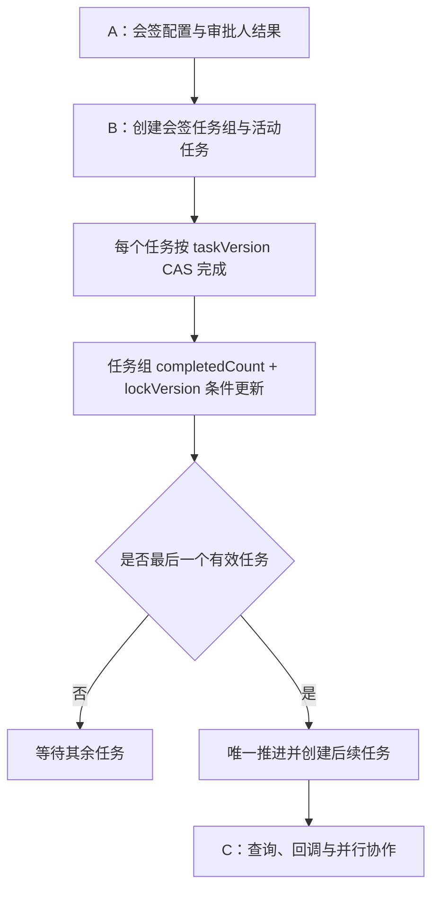

这些是后续设计约束，当前代码尚未实现任务组、状态迁移或事务逻辑。

## 11. 跨工作线接口与 B0.5 对齐

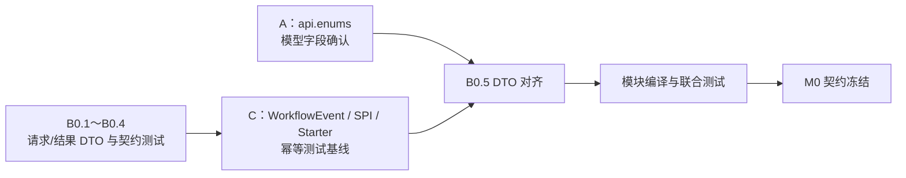

| 协作方 | B 提供 | B 等待/消费 |
| --- | --- | --- |
| A | 运行时请求/结果 DTO 的字段基线 | 正式状态、处理方式、动作和目标类型枚举；实例/任务/历史字段最终确认；定义快照 |
| C | `TaskDTO`、`HistoryTaskDTO`、`TaskActionResult` 可供事件和测试复用 | `WorkflowEvent`、SPI、Starter Service 接口、幂等测试基线、附件/查询基础能力 |

B0.5 的固定动作是：从最新 `develop` 对齐 A/C，使用唯一公共 DTO 与枚举修正字段和泛型，更新契约测试，先运行模块测试，再运行根目录测试。不得为兼容旧定义创建别名、平行类或临时字符串枚举。

## 12. 质量门禁与错误边界

### 12.1 当前 M0 门禁

- 所有修改请求可取得非空 `operationId`；
- 所有任务级请求具备已赋值的 `expectedTaskVersion`；
- `JumpNodeRequest` 不具有任务版本；
- 所有 17 个运行时修改请求均进入参数化夹具，且恰好一次；
- `TaskActionResult` 可表达操作号、实例、归档任务、新建任务与重放；
- `TaskDTO.taskVersion` 与请求 `expectedTaskVersion` 保持语义一致；
- 不出现 Repository、SQL、流程流转、SPI、Starter、事件、重复枚举或具体业务判断。

### 12.2 后续运行期错误边界

后续实现复用 v4 公共错误码和 C 的幂等基线。B 不在 M0 自行新增公共错误码；至少需要正确区分：缺少操作号、操作号冲突、操作处理中、任务并发修改、任务组并发修改和当前状态不允许动作。

对于每个未来动作，测试应分别覆盖正常执行、相同请求重放、同操作号不同请求、任务版本冲突、事务回滚以及回调失败不阻断主流程。

## 13. 实施顺序与完成标准

| 顺序 | 阶段 | 当前状态 | B 的完成条件 |
| --- | --- | --- | --- |
| 1 | M0 B0.1～B0.4 | 已完成 | 请求/结果 DTO、夹具和契约测试已提交并通过模块测试 |
| 2 | M0 B0.5 | 等待 A/C | 枚举、事件、SPI、Starter 接口和联合测试对齐；模块与根测试通过 |
| 3 | M1 | 未开始 | 发布校验、运行时图快照与缓存失效可与 A 联测 |
| 4 | M4 前置、M2 | 未开始 | 附件最小编排与串行实例/任务闭环可运行 |
| 5 | M3 | 未开始 | 实例管理、删除/终止/跳转/强制办结与 C 的 Starter/REST 联测通过 |
| 6 | M5、M6 | 未开始 | 特殊动作、会签及与 A/C 的高级流转集成测试通过 |

第一阶段 B 线完成不只意味着 DTO 编译通过，还要求在 SQLite 上与 A/C 联合满足：实例可启动、任务可安全推进、历史可追溯、相同操作号可重放、并发任务不会重复推进、回调可携带归档与新建任务、Starter 与独立 REST 共用运行时 Service。

在此之前，本文中 M1～M6 的内容均为以 v4 为准的实现设计和协作边界，不应被视为已完成的功能。
