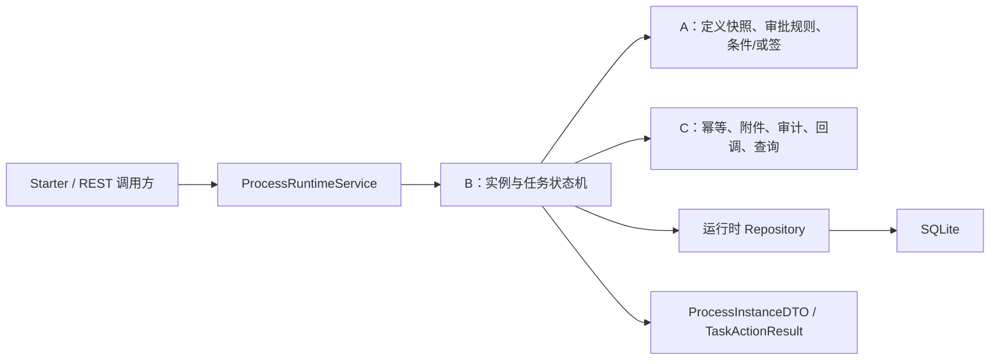
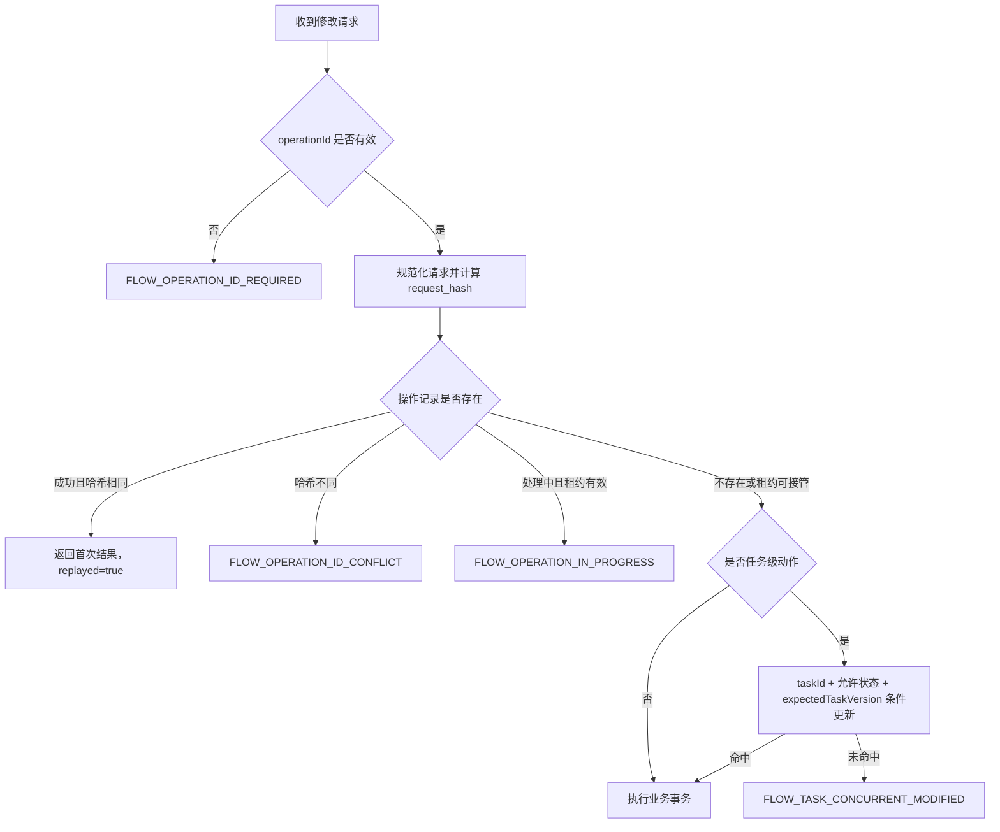
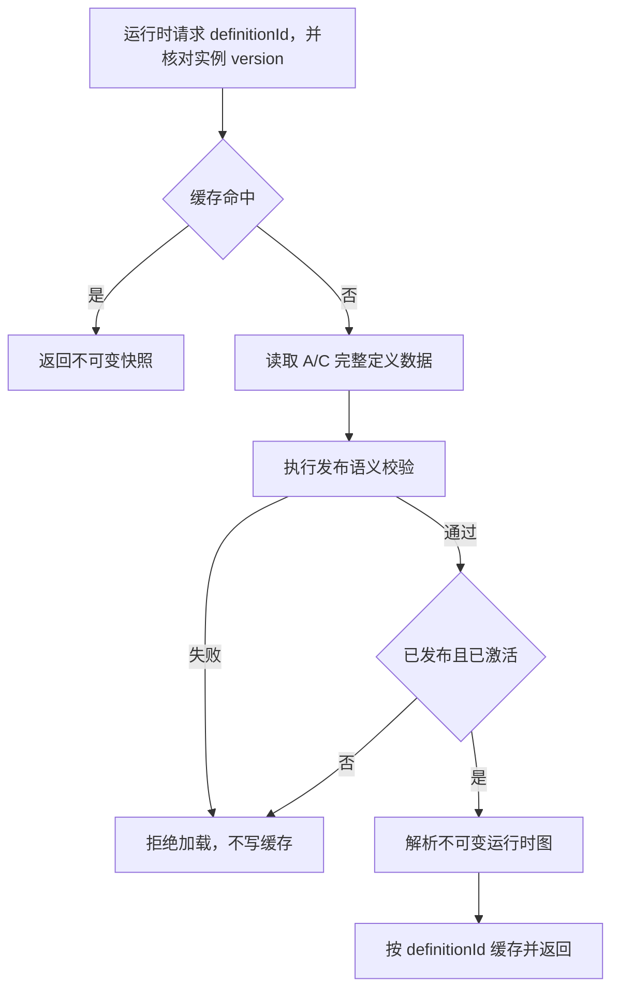
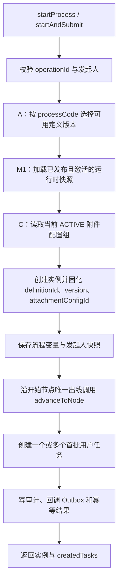
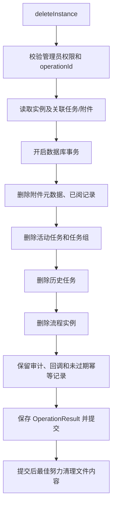
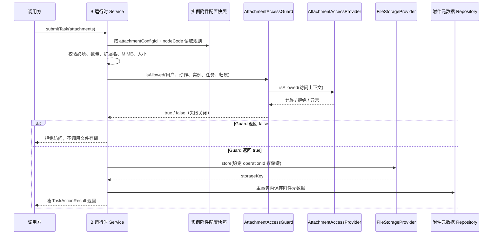
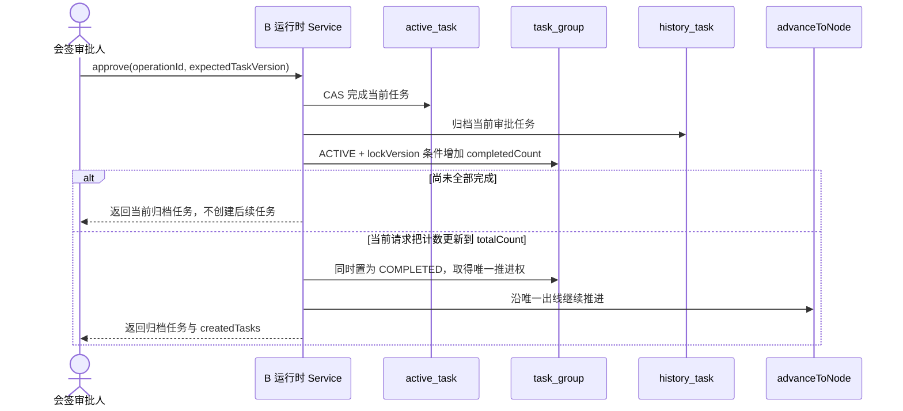

# 流程平台技术文档 - 实习生 B

> 分工依据：`流程平台技术路线_v5.2.md`
> 需求基线：`rebuild-functional-requirements-optimized.md`
> 数据模型与接口基线：`流程平台设计与接口文档_v4.md`
> 编写模板：`实习生A_完整技术文档.md`、`实习生C开发文档.md`
> 技术栈：Java 8、Spring Boot 2.7.18、Maven、SQLite、Spring JDBC 或 MyBatis

## 1. 文档目标

本文只说明实习生 B 的实现范围，并明确与 A、C 两条工作线的边界。B 的核心职责是：

1. M0：冻结运行时请求 DTO、动作结果 DTO、幂等字段和任务版本契约；
2. M1：完成发布前运行语义校验、流程图解析、定义快照加载和缓存失效；
3. M2：实现实例启动、变量保存、活动任务创建、普通提交/审批、历史归档和串行流程推进；
4. M3：实现流程实例终止、删除、变量维护、管理员跳转和强制办结的状态机部分；
5. M4：完成实例附件、任务附件、权限校验和任务办理过程中的附件运行时编排；
6. M5：实现驳回、退回、撤回、直送、转办、加签及相关历史归档；
7. M6：实现会签任务组、完成计数和唯一推进。

B 不重复实现：

- A 负责的流程定义 CRUD、节点/连线持久化、版本治理、审批规则读取与解析、条件分支和或签；
- C 负责的文件存储 SPI、附件元数据持久化、查询聚合、回调投递、审计、Starter 自动装配、委托关系和并行汇聚外围能力；
- 宿主系统的具体业务规则。表单数据只作为流程变量保存，平台核心不得出现“入金”等业务判断。

当前实现状态：M0 的运行时请求/结果 DTO、公共枚举、事件、SPI、Starter Service 与契约测试均已完成联合冻结，并已对齐 A 线的活动任务版本模型和定义管理幂等动作。M1～M6 本文描述的是目标实现与验收标准，不等同于已交付代码。共享基线中已有的最小定义结构校验只作为 M1 的起点，不代表 M1 已收口。

## 2. 总体实现结构

B 的公开契约位于 `platform-core` 的 `api` 包，运行时实现统一收敛到 `platform-core`；`platform-starter` 和独立 REST 入口只做适配，必须调用同一套运行时 Service。

```text
platform
├── platform-core
│   └── src
│       ├── main/java/com/flowmind/platform
│       │   ├── api
│       │   │   ├── dto/                    # 运行时输出契约
│       │   │   ├── request/                # 运行时输入契约
│       │   │   └── service/                # ProcessRuntimeService 等公共接口
│       │   ├── core
│       │   │   ├── definition/             # 图解析、发布校验、定义缓存
│       │   │   ├── runtime/                # 实例状态机和通用节点推进
│       │   │   ├── task/                   # 任务动作、历史归档、任务组
│       │   │   └── attachment/             # 附件运行时编排
│       │   └── persistence
│       │       ├── entity/
│       │       └── repository/             # 运行时 Repository 端口及 SQLite 实现
│       └── test/java/com/flowmind/platform
│           ├── api/                        # DTO 契约测试
│           ├── core/                       # 状态机与图算法单元测试
│           └── integration/                # SQLite 与跨线集成测试
└── platform-starter                       # C 负责自动装配，复用 core Service
```



实现边界：

- 第一阶段只要求 SQLite 完整运行，不实现 Oracle 或国产数据库驱动；
- 运行时 Service 不直接散落 SQLite 专有 SQL，应通过 Repository/持久化边界访问数据；
- 文件内容不得写入 SQLite，平台数据库只保存附件元数据和 `storageKey`；
- Java 代码必须兼容 Java 8，不使用 `record`、`List.of`、`Stream.toList` 等 Java 9+ 语法或 API；
- DTO、枚举、Service、SPI 和事件模型在公共包中只保留一份，不创建平行类型或兼容别名。

公共 SPI 同样遵守 API 边界：`StoreFileRequest` 和 `AttachmentUploadItem` 位于 `api.request`；`StoredFile`、`FileContent` 与 `ProcessMessage` 位于 `api.dto`。`persistence.entity` 只用于数据库映射，不得出现在宿主系统需要实现的 SPI 方法签名中。

## 3. 公共契约与运行时边界（M0）

M0 的目标是冻结 B 线对外输入/输出以及幂等、并发表达能力。M0 不实现 Service、流程流转、Repository、SQL、文件存储、回调投递或运行时参数校验。

### 3.1 运行时请求契约

所有修改请求继承 `OperationRequest` 并携带 `operationId`。任务级动作继承 `TaskOperationRequest`，额外携带任务 ID、任务版本、操作人和意见。


`JumpNodeRequest` 是实例级管理员请求，不继承 `TaskOperationRequest`，因此不携带 `expectedTaskVersion`。跳转时由运行时一次性锁定并处理受影响的活动任务和任务组，不能伪装成单任务动作。

当前请求对象及关键字段：

| 类别 | 请求对象 | 关键字段/语义 |
| --- | --- | --- |
| 启动 | `StartProcessRequest` | `processCode`、`businessKey`、`instanceTitle`、发起人、发起部门、`variables` |
| 变量维护 | `UpdateVariablesRequest` | `instanceId`、操作人、待合并的变量 |
| 任务提交 | `SubmitTaskRequest` | 任务公共字段、`variables`、`List<AttachmentUploadItem>` |
| 普通审批 | `ApproveTaskRequest`、`ReturnTaskRequest` | 复用任务公共字段 |
| 定向动作 | `RejectTaskRequest`、`DirectSendRequest` | `targetNodeCode` |
| 人员变更 | `TransferTaskRequest`、`AddSignRequest` | `targetUserId` 或 `addSignUserIds` |
| 任务控制 | `ClaimTaskRequest`、`UnclaimTaskRequest`、`WithdrawTaskRequest`、`RemindTaskRequest` | 复用任务公共字段 |
| 实例管理 | `TerminateProcessRequest`、`DeleteProcessInstanceRequest`、`ForceCompleteRequest` | `instanceId` 及所需操作人/说明 |
| 管理员跳转 | `JumpNodeRequest` | `instanceId`、`targetNodeCode`、操作人、说明 |

`AttachmentUploadItem` 位于 `api.request`，表示单次调用中的嵌套上传载荷，包含附件编码、归属类型、文件名、MIME 类型、字节数和二进制内容。它不属于查询结果或持久化实体，也不表示文件内容存入数据库；M4 必须调用 C 的文件存储能力保存文件，并只把返回的存储键写入元数据。

### 3.2 运行时结果契约

| DTO | 关键内容 | 运行时用途 |
| --- | --- | --- |
| `ProcessInstanceDTO` | 实例、定义/附件配置快照、流程信息、发起信息、当前节点、变量、起止时间、`createdTasks` | 启动、变量维护、终止和强制办结结果 |
| `TaskDTO` | 实例/定义/节点、候选人、办理人、委托来源、任务组、分支、`taskVersion`、创建/超时时间 | 查询待办和提交下一次任务动作 |
| `HistoryTaskDTO` | 原活动任务、操作号、节点、任务组/分支、实际办理人、委托来源、意见、变量快照和时间 | 历史轨迹、审批意见、审计和回调载荷 |
| `TaskActionResult` | `operationId`、实例、`archivedTasks`、`createdTasks`、`replayed` | 所有任务动作的统一完整结果 |
| `OperationResult` | `operationId`、目标 ID、`deleted`、`replayed` | 删除等需要幂等重放的管理动作 |

`TaskActionResult` 必须保留完整的归档任务和新建任务，而不是只返回 ID 列表。这样 C 的查询、回调和审计可以复用同一份动作结果，不需要重新推断本次状态变化。

结果 DTO 已补齐实例状态、任务状态、历史办理方式、动作类型和操作目标类型，全部直接使用 `api.enums` 的正式枚举，不保留字符串兼容字段。

### 3.3 幂等与乐观锁契约

`operationId` 是所有状态修改请求的幂等键。任务级动作还必须把查询得到的 `TaskDTO.taskVersion` 原样传入 `expectedTaskVersion`；该字段映射 `process_active_task.lock_version`，与流程定义版本无关。



任务 CAS 未命中时，禁止继续写历史任务、下一任务、审计或回调。任务组更新同样必须使用 `group_status + lock_version` 条件更新，并在冲突后有限次重试，禁止无上限自旋。

### 3.4 M0 当前交付与验收点

当前已经落地：

- 运行时请求基类、B0.4 原始 17 类、B0.5 联合冻结后的 21 类及补充超时扫描后的 22 类修改请求和附件上传项；
- 实例、活动任务、历史任务、任务动作结果和通用操作结果 DTO；
- 请求继承、JavaBean 属性、有效夹具、任务版本传递和结果表达能力的契约测试；
- `TaskDTO.taskVersion -> process_active_task.lock_version -> expectedTaskVersion` 的类型和语义对齐；
- 活动任务通过 `definitionId` 关联定义，不重复保存流程定义版本字段；
- 定义管理日志动作通过 `DefinitionActionTypeEnum` 表达，操作/审计日志以 `String actionType` 保存运行时动作名或 `DEFINITION_*`，并保留 `OperationTargetTypeEnum + targetId` 目标定位。

M0 收口条件：

- A/C 的公共枚举、事件、SPI 和 Service 接口合入后，B 的 DTO 能直接复用且不存在重复类型；
- `WorkflowEvent` 能携带 B 的归档任务、新建任务和操作号；
- 所有运行时修改请求均有且只有一份契约夹具；
- 模块测试和根项目测试通过；
- M0 代码中不出现流程流转、数据库写入、文件存储或具体业务判断。

## 4. 流程定义运行前校验与缓存（M1）

M1 的目标是把 A/C 保存的完整定义数据转换为稳定、只读、可校验、可缓存的运行时图。A 负责定义、节点和连线持久化，C 负责表单和附件扩展配置；B 只消费正式数据，不复制其表结构、DTO 或 Repository。

### 4.1 定义读取边界

运行时定义输入至少包含：

| 数据 | 必需内容 |
| --- | --- |
| 定义 | 定义 ID、流程编码、版本、发布状态、激活状态 |
| 节点 | 编码、名称、类型、配对网关、审批人规则、多人模式、监听/超时/提醒配置、坐标、顺序 |
| 连线 | 编码、来源、目标、条件表达式、默认标志、顺序 |
| 表单 | 字段编码、类型、必填、校验配置和顺序 |
| 附件配置 | 配置组、模板编码/版本、必填、数量、大小、格式、适用节点和生效状态 |

节点坐标和节点顺序必须完整保留，供设计器回显和稳定比较使用；运行时路由只依据连线关系及 `sortOrder`，不得根据画布坐标推断流程方向。

### 4.2 不可变流程图解析

B 将完整定义解析为不可变运行时图，至少建立：

- `nodeCode -> node` 索引；
- `edgeCode -> edge` 索引；
- 每个节点的入线和出线邻接表；
- 按 `sortOrder, code` 稳定排序的节点和连线视图；
- 开始、结束、条件网关、并行拆分和并行汇聚的快速读取视图；
- 表单字段和附件配置的只读索引。

构造快照时复制输入集合，对外不得暴露可修改的内部集合。同一份输入无论原始集合顺序如何，都应得到相同的索引和问题顺序。

### 4.3 发布前运行语义校验

共享基线中的最小结构校验应在 M1 扩展为完整发布校验，统一返回 `ValidationResult`，一次聚合全部问题，不首错即停。

校验规则至少包括：

1. 存在且仅存在一个开始节点；
2. 至少存在一个结束节点；
3. 节点编码、连线编码在同一定义版本内分别唯一；
4. 所有连线的来源和目标节点存在；
5. 不存在无法从开始到达或无法到达结束的孤立节点；
6. `START` 和 `USER_TASK` 只能有一条出线，需要分支时必须显式使用网关；
7. 用户任务必须配置审批人规则，网关不得配置审批人规则或多人模式；
8. 条件网关至少两条出线、最多一条默认线，非默认线必须配置条件表达式；
9. 并行拆分至少两条无条件出线，并与类型正确的汇聚网关双向配对；
10. 并行汇聚至少两条入线且只能有一条出线，每条分支路径都能到达配对汇聚；
11. 表单字段编码不重复；
12. 同一附件配置组内附件模板绑定不重复，适用节点必须存在；
13. 已生效附件配置不可原地修改，规则变化必须生成新配置组。

条件表达式在 M1 只做存在性、适用位置和基础语法校验，不执行真实路由。图遍历必须维护 `visited` 集合，带环定义也要有限结束并返回可定位的问题。

### 4.4 定义快照缓存与失效

缓存键使用 `definitionId`。`process_definition.id` 已唯一定位固定版本；版本保留在详情中，并由运行时与实例快照核对。只有已发布、已激活且通过完整校验的定义才能进入缓存；草稿、未激活、校验失败、加载异常或半成品不得缓存。



A 保存、发布、激活、停用、归档或删除定义，或 C 保存表单/附件配置后，必须在数据库事务成功提交后按 `definitionId` 失效对应缓存。事务回滚不得误删当前有效快照。第一阶段使用 Java 8 线程安全内存结构，不引入 Redis 等分布式缓存。

### 4.5 M1 验收点

- 合法串行图、条件图和并行配对图能稳定解析；
- 缺少开始/结束、断裂连线、孤立节点、无审批人任务和非法网关能返回完整问题；
- 节点坐标、节点顺序、连线顺序和扩展配置不丢失；
- 图遍历遇到环路能有限结束；
- 只有已发布且激活的定义进入缓存；
- 定义或扩展配置变更提交后旧缓存失效，回滚时缓存不变；
- 与 A/C 的联合测试使用正式类型和真实读取实现，不保留生产替代类型。

## 5. 串行运行时闭环（M2）

M2 的目标是跑通“启动实例 → 创建申请任务 → 办理申请任务 → 普通审批 → 历史归档 → 创建下一任务 → 办结实例”的串行闭环。

### 5.1 目标 Service 接口

```java
public interface ProcessRuntimeService {
    ProcessInstanceDTO startProcess(StartProcessRequest request);

    ProcessInstanceDTO startAndSubmit(StartProcessRequest request);

    TaskActionResult submitTask(SubmitTaskRequest request);

    TaskActionResult approve(ApproveTaskRequest request);

    ProcessInstanceDTO updateVariables(UpdateVariablesRequest request);

    ProcessInstanceDetailDTO getInstance(String instanceId);
}
```

`startAndSubmit` 的冻结语义是“启动并推进到首批用户任务”，入金申请基准流程返回申请节点任务；它不自动办理申请节点。若业务前端一次提交表单和附件，业务适配层先调用 `startAndSubmit`，再用返回的任务 ID 和版本调用 `submitTask`。

### 5.2 启动流程



启动时必须固化定义 ID、定义版本、流程名称、附件配置组、发起人和流程变量。后续所有节点配置、审批人规则和附件校验都读取实例快照，不读取“当前最新版本”。

创建用户任务前调用 A 的审批人解析能力。解析结果为空或异常时，整个启动/推进事务失败，不得创建无人任务。

### 5.3 办理申请节点与附件前置

办理申请节点的流程：

1. 校验 `operationId`、任务存在、任务状态、办理权限和 `expectedTaskVersion`；
2. 按实例固化的附件配置读取当前节点要求；
3. 在数据库状态事务开始前调用 C 的授权和文件存储能力，使用 `operationId` 生成稳定存储键；
4. 校验必填、数量、扩展名、MIME 类型和大小；
5. 开启数据库事务，以任务 ID、允许状态和版本执行 CAS；
6. 保存附件元数据，申请材料按实例级附件关联，任务补充材料按任务级附件关联；
7. 归档申请任务，动作记为 `SEND`，保存意见和变量快照；
8. 沿唯一出线推进并创建部门经理等下一任务；
9. 同事务写审计、回调 Outbox、操作成功结果并提交；
10. 事务失败时对本次未引用文件执行最佳努力清理。

平台通用代码只按附件配置校验，不能硬编码银行回单。`pdf/jpg/png`、`10MB` 等入金样例规则来自测试数据和定义配置。

### 5.4 审批通过与通用节点推进

所有会改变当前节点的动作统一调用内部推进器：

```text
advanceToNode(instanceId, targetNodeCode, taskGroupId, branchKey, visitedNodeCodes)
```

| 目标节点类型 | 推进规则 |
| --- | --- |
| `USER_TASK` | 调用审批人解析，按多人模式创建活动任务；并行分支任务继承任务组和分支标识 |
| `EXCLUSIVE_GATEWAY` | 交给 A 的条件路由能力按连线顺序选择出线，再递归推进 |
| `PARALLEL_SPLIT_GATEWAY` | 与 C 的并行运行能力协作创建分支任务组并递归推进各出线 |
| `PARALLEL_JOIN_GATEWAY` | 与 C 的汇聚能力协作记录分支到达；未汇齐则停止，最后分支唯一继续 |
| `END` | 确认不存在未完成任务/任务组后，把实例置为 `COMPLETED` 并记录结束时间 |
| `START` | 除初始化外禁止进入，返回流转错误 |

普通审批通过：

1. 校验办理权限并 CAS 完成活动任务；
2. 合并本次变量更新；
3. 保存审批意见并归档历史任务；
4. 根据节点多人模式决定是否取得任务组推进权；
5. 获得推进权后沿出线调用 `advanceToNode`；
6. 到达结束节点时办结实例；
7. 在同一事务写历史、任务组、后续任务、实例状态、审计、回调和幂等结果。

推进器必须记录已访问自动节点并限制最大推进步数，防止网关闭环造成无限递归。

### 5.5 事务、并发与回调

下列数据必须在同一 SQLite 事务提交：

- 活动任务 CAS 结果；
- 历史任务归档；
- 任务组状态和计数；
- 实例变量、当前节点和实例状态；
- 新建活动任务；
- 审计日志；
- 回调 Outbox 记录；
- `process_operation_record` 的成功状态和结果快照。

回调处理器和消息发送属于外部副作用，只能在事务提交后执行。投递失败更新回调日志或告警，但不能回滚已经成功的主流程事务。

### 5.6 M2 验收点

- 启动后首批活动任务正确返回，入金样例首个任务是申请节点；
- 申请节点办理后进入历史任务并创建部门经理任务；
- 部门经理和财务任务按顺序完成，最终实例为 `COMPLETED` 且无活动任务；
- 历史任务包含申请、部门经理、财务三个节点及意见/变量快照；
- 两个不同操作并发办理同一任务时只有一个成功；
- 相同操作号重试返回首次结果，不重复归档、建任务或写回调；
- 回调载荷包含本次归档任务和新建任务，投递失败不影响主流程。

## 6. 流程实例管理与状态维护（M3）

M3 在串行闭环之上补齐实例级管理动作和管理员修复入口。C 负责查询、Starter 自动装配和 REST 适配；B 负责所有改变实例/任务状态的运行时逻辑。

### 6.1 终止、变量更新和实例删除

| 功能 | 目标 Service | 返回结果 | 关键规则 |
| --- | --- | --- | --- |
| 更新变量 | `updateVariables` | `ProcessInstanceDTO` | 仅允许可运行状态；合并后保存变量快照、审计和幂等结果 |
| 终止实例 | `terminate` | `ProcessInstanceDTO` | 取消活动任务和活动任务组，实例置为终止状态，写历史/审计/回调 |
| 删除实例 | `deleteInstance` | `OperationResult` | 级联删除运行数据，保留未过期幂等、审计和回调记录并标记目标删除 |

实例删除顺序：



删除请求重放必须返回第一次 `OperationResult`。文件删除失败只记录告警，不恢复已提交的数据库事务。

### 6.2 任意节点跳转和强制办结

管理员跳转：

1. 校验管理员权限、实例状态和目标节点属于实例固化的定义版本；
2. 禁止跳转到开始节点；
3. 取消受影响的活动任务，并同步取消或重建相关并行任务组；
4. 目标是用户任务时创建新任务，目标是网关时调用通用推进器，目标是结束节点时办结实例；
5. 归档/取消任务、任务组修改、新建任务、实例状态、审计、回调和幂等结果同事务提交。

强制办结：

1. 校验实例尚未结束且操作人有管理员权限；
2. 以乐观锁方式取消全部剩余活动任务和活动任务组；
3. 将被取消任务写入历史或审计；
4. 实例置为 `COMPLETED` 并记录结束时间；
5. 回调携带取消/归档任务集合，`createdTasks` 为空。

### 6.3 Starter 与独立 REST 集成

B 提供唯一的 `ProcessRuntimeService` 和 `AdminProcessService` 状态修改实现。C 的 `PlatformAutoConfiguration`、独立启动应用和 REST Controller 只能装配/调用这些实现，不得在适配层复制状态机。

M3 收口前至少完成两类集成测试：

- Starter 消费方只引入 `platform-starter` 后，可以注入并调用 B 的运行时 Service；
- 独立 REST 应用随机端口启动后，可以通过 REST 完成入金申请串行闭环和实例管理动作。

### 6.4 M3 验收点

- 终止后不存在可办理活动任务，历史/审计/回调可追踪；
- 变量更新受状态和幂等规则保护；
- 删除实例覆盖活动任务、任务组、历史、意见、已阅和附件元数据；
- 删除重试可返回首次结果，审计/回调/未过期幂等记录仍可查询；
- 跳转不会遗留孤立分支或活动任务；
- 强制办结只执行一次，并发请求不会重复归档或回调；
- Starter 与独立 REST 共用同一套运行时 Service。

## 7. 附件运行时管理（M4）

M4 的 B 线职责是把附件能力接入实例和任务状态机：按实例固化配置校验、建立实例/任务关联、调用授权、协调文件暂存与数据库事务。C 负责文件存储 SPI、附件元数据 Repository、附件查询/下载/删除能力和本地 Mock。

### 7.1 职责边界

| 能力 | B 负责 | C 负责 |
| --- | --- | --- |
| 配置来源 | 在运行时按实例的 `attachmentConfigId` 读取并选择当前节点规则 | 保存附件模板和定义附件配置 |
| 权限 | 在任务动作前构造访问上下文并调用授权 SPI；拒绝/异常时终止动作 | 提供 `AttachmentAccessProvider` 及本地 Mock |
| 文件内容 | 编排存储时机、稳定存储键和失败补偿 | 提供 `FileStorageProvider.store/load/delete` |
| 元数据 | 决定实例/任务归属并纳入主事务 | 提供 `process_attachment` Repository 和独立附件 Service |
| 查询下载 | 提供实例、任务和当前操作者上下文 | 实现查询、下载、删除和 DTO 转换 |

### 7.2 附件校验与授权

任务办理前按以下顺序处理：



授权 SPI 缺失、抛出异常或返回拒绝时，一律返回 `FLOW_ATTACHMENT_PERMISSION_DENIED`，且不得调用文件存储或修改任务状态。

### 7.3 实例级与任务级附件

- 实例级附件用于整个流程共享材料，`taskId` 可为空，`ownerType=INSTANCE`；
- 任务级附件用于当前节点补充材料，必须校验任务属于该实例，`ownerType=TASK`；
- 申请节点上传的流程材料按配置保存为实例级附件，后续审批人经授权后可查看；
- 必填计数只统计未删除且匹配附件编码、归属和适用节点的记录；
- 后续附件配置版本变化不影响已经启动并绑定旧配置的实例。

### 7.4 外部文件与数据库事务

文件存储是外部副作用，不能放在任务 CAS 和数据库提交之间。推荐顺序：

1. 幂等登记并完成基础校验；
2. 授权通过后，以 `operationId + attachmentCode + sequence` 生成稳定存储键并暂存文件；
3. 开启数据库主事务，CAS 修改任务并保存附件元数据；
4. 同事务提交任务、历史、后续任务、审计、回调和幂等结果；
5. 事务失败时最佳努力删除本次未引用文件；
6. 清理失败写告警，由后续清理任务重试。

相同请求重放不得重复生成文件；同操作号不同文件内容必须因请求哈希不一致被拒绝。

### 7.5 M4 验收点

- 实例附件和任务附件均可在任务办理链路中保存并正确关联；
- 授权允许、拒绝、SPI 异常和 SPI 缺失均有测试；
- 必填、数量、格式、MIME 和大小限制均按实例固化配置执行；
- 文件内容只存在于文件存储，SQLite 只保存元数据；
- 数据库回滚后无被业务引用的孤立附件元数据，并触发文件补偿清理；
- 相同操作重试不重复存储文件或写附件记录；
- 后续审批节点可在授权通过时查询和下载实例级材料。

## 8. 增强任务动作（M5）

M5 在统一任务执行器和通用推进器之上补齐常用审批动作。所有动作都复用 M2 的幂等、任务 CAS、历史归档、审计、回调和结果快照逻辑，不创建第二套事务流程。

### 8.1 驳回、退回与直送

| 动作 | 运行规则 |
| --- | --- |
| 驳回 `reject` | 目标必须是实例固化定义中允许的已办 `USER_TASK`；归档当前任务，创建目标节点任务，并记录驳回来源 |
| 退回发起人 `returnToStarter` | 目标为冻结规则指定的申请节点/发起节点用户任务，不得直接进入 `START` 网关 |
| 直送 `directSend` | 只允许使用历史中记录的驳回来源/目标关系，跳过已经确认允许跳过的中间节点 |

A 负责保存并校验驳回/直送配置，B 负责读取规则、验证目标和执行状态变化。目标节点不存在、类型非法或不在允许范围内时返回 `FLOW_INVALID_ACTION`。

### 8.2 撤回

采用保守语义：仅允许发起人或冻结规则允许的上一办理人在下游任务尚未被办理时撤回。

1. 校验撤回人、当前下游任务和历史来源；
2. 以各自任务版本取消下游活动任务；
3. 恢复上一历史用户节点并创建活动任务；
4. 写撤回历史/审计，保留被取消任务信息；
5. 触发回调并返回归档/取消及新建任务；
6. 下游已办理、任务版本冲突或并行状态不允许时整笔拒绝。

### 8.3 转办与加签

转办：

- 校验当前办理人有转办权限，目标用户有效且不是非法自转办；
- 以 `taskId + taskStatus + expectedTaskVersion` 修改办理人/候选人并递增版本；
- 原办理人立即失去办理权；
- 历史或审计保留转出人、转入人和操作号；
- 不推进流程，不创建下一节点任务。

加签采用串行语义：为指定人员创建临时审批任务，完成后回到原节点继续。原任务的挂起表达方式必须使用三方冻结的正式状态或任务组结构；在公共模型未冻结前不得自行新增字符串状态、数据库列或平行 DTO。

加签用户列表需去重且不能为空。加签任务、原任务状态、历史/审计和回调必须同事务提交；最后一个加签任务完成时只恢复原任务，不直接绕过原节点推进。

### 8.4 认领、取消认领与委托代办协作

认领和取消认领的状态修改由 B 的运行时 Service 执行：

- 认领只允许候选人对 `ACTIVE` 任务执行，成功后置为 `CLAIMED` 并写办理人；
- 取消认领只允许当前认领人执行，且任务尚未被办理；
- 两者都使用任务状态和版本 CAS，不写完成历史、不推进流程；
- C 的查询层返回最新 `taskVersion`，并补审计和待办展示。

委托关系由 C 的 `DelegateProvider` 或宿主系统提供。代理人办理时，B 必须同时校验实际操作人和委托关系，并在 `HistoryTaskDTO` 中保存实际办理人及 `delegateFromUserId/delegateFromUserName`，不能把代理人伪装成原办理人。

### 8.5 M5 验收点

- 驳回只能到合法已办用户节点，并能按记录直送回来；
- 撤回仅在下游未办理时成功，失败不产生部分取消数据；
- 转办后原办理人失去权限，目标用户可继续办理；
- 串行加签完成后回到原节点，重复/并发请求不创建重复加签任务；
- 认领并发时只有一个候选人成功，取消认领受办理人和版本保护；
- 委托办理历史同时展示实际办理人和委托来源；
- 每个动作都有幂等重放、同号不同请求、任务版本冲突、事务回滚和回调断言。

## 9. 会签运行（M6）

M6 的 B 线核心是会签。A 提供 `COUNTERSIGN` 节点配置和审批人解析；C 提供任务组/分支查询、审计、回调和并行汇聚协作。会签仍复用 B 的普通任务完成与通用节点推进。

### 9.1 会签任务组

到达会签用户节点后创建：

- 一条 `process_task_group`：`group_type=COUNTERSIGN`、`group_status=ACTIVE`、`total_count=N`、`completed_count=0`、`lock_version=0`；
- N 条 `process_active_task`：共享 `task_group_id`，分别绑定审批人，每条任务独立维护 `lock_version`；
- 若位于并行分支内，任务和会签组继续携带外层任务组/分支上下文。

审批人列表必须去重且至少一人。创建任务组、活动任务、实例当前节点、回调和幂等结果同事务提交。

### 9.2 会签完成与唯一推进



任务组冲突后可以重新读取最新版本并有限次重试。只有把 `completedCount` 更新到 `totalCount` 且同时将组置为 `COMPLETED` 的请求能推进；其他请求只能归档自己的任务。

### 9.3 与条件、或签和并行协作

| 场景 | B 的协作责任 |
| --- | --- |
| 条件分支 | 会签完成后把实例变量交给 A 的条件路由，使用其选中出线继续推进 |
| 或签 | 复用普通任务归档和推进器；唯一推进权由 A 的或签任务组规则决定 |
| 并行分支 | 会签任务保留外层 `taskGroupId/branchKey`，完成后将该分支继续推进至 C 的汇聚逻辑 |
| 结束节点 | 仅在无其他活动任务/任务组时办结实例 |

条件、或签、会签和并行必须共享同一个 `advanceToNode` 和事务边界，不能由各线实现彼此不一致的节点推进副本。

### 9.4 M6 验收点

- 三人会签创建一条任务组和三条活动任务；
- 每人完成后只归档自己的任务，前两人不创建后续任务；
- 最后一人只创建一次后续任务并完成任务组；
- 两人并发完成最后两个任务时仍只有一个请求取得推进权；
- 相同请求重放不重复增加完成计数；
- 会签后可继续进入用户任务、条件网关、并行网关或结束节点；
- 位于并行分支中的会签完成后能恢复正确分支上下文。

## 10. 跨工作线接口

以下为 B 需要消费或提供的稳定协作边界。正式代码如已有等价接口，应直接复用，不得按本文名称再建一份。

| 接口/能力 | 调用方向 | B 的使用方式 |
| --- | --- | --- |
| `ProcessDefinitionGraphReader` | B 调 A/C | 读取定义、节点、连线、表单和附件配置的完整快照 |
| `DefinitionCacheInvalidator` | A/C 调 B | 定义或扩展配置事务提交后按定义 ID 清除运行时缓存 |
| `ApproverResolver` | B 调 A | 创建用户任务前解析实际审批人 |
| 条件/或签运行协作 | B 与 A | 条件选择、或签推进权取得后回到统一推进器 |
| `AttachmentAccessProvider` / `AttachmentAccessGuard` | B 调 C/宿主 | 附件上传、查看、下载和删除前执行授权；只有 SPI 明确允许才继续，缺失、拒绝或异常均失败关闭 |
| `FileStorageProvider` / `AttachmentService` | B 调 C | 保存文件内容、附件元数据及执行查询/下载/删除 |
| `CallbackOutboxWriter` | B 调 C | 主事务内追加稳定 `eventId` 的回调记录 |
| `AuditLogWriter` | B 调 C | 主事务内记录实例、任务、附件和管理动作 |
| `ProcessRuntimeService` | B 提供给 C/宿主 | Starter、REST 和业务适配层共用的运行时入口 |
| `TaskQueryService` | C 提供给调用方 | 返回任务及最新 `taskVersion`，供 B 的下一次任务动作使用 |

协作规则：

- B 新增会改变活动任务的动作时，同步 C 补查询字段、审计和回调事件；
- A 修改节点配置、状态枚举或路由结果时，同步 B 调整快照和推进逻辑；
- C 修改附件、事件或查询 DTO 时，同步 A/B 调整公共契约；
- 定义、任务、历史、回调和审计中的 ID、枚举及泛型必须使用同一公共类型；
- 外部 SPI 调用不得夹在任务 CAS 与数据库提交之间；
- 任何跨线依赖未就绪时，可以用测试目录夹具推进纯算法测试，但不得在生产代码创建临时公共替代类型。

## 11. 错误处理

优先使用 v4 基线错误码：

| 错误码 | B 线场景 |
| --- | --- |
| `FLOW_DEFINITION_NOT_FOUND` | 启动或加载时定义不存在 |
| `FLOW_DEFINITION_NOT_ACTIVE` | 定义未发布/未激活，不能启动 |
| `FLOW_DEFINITION_INVALID` | 发布校验或运行时图校验失败 |
| `FLOW_NODE_NOT_FOUND` | 目标节点或连线引用不存在 |
| `FLOW_TASK_NOT_FOUND` | 活动任务不存在 |
| `FLOW_TASK_NOT_ACTIVE` | 当前任务状态不可办理 |
| `FLOW_TASK_PERMISSION_DENIED` | 操作人无任务办理权限 |
| `FLOW_TASK_CONCURRENT_MODIFIED` | 活动任务版本 CAS 未命中 |
| `FLOW_TASK_GROUP_CONCURRENT_MODIFIED` | 会签/或签/并行任务组版本冲突 |
| `FLOW_OPERATION_ID_REQUIRED` | 修改请求缺少操作号 |
| `FLOW_OPERATION_ID_CONFLICT` | 同一操作号对应不同请求 |
| `FLOW_OPERATION_IN_PROGRESS` | 相同操作仍在有效处理租约内 |
| `FLOW_APPROVER_RESOLVE_FAILED` | 审批人解析为空或异常 |
| `FLOW_GATEWAY_NO_MATCH` | 条件网关无命中且无默认出线 |
| `FLOW_GATEWAY_CONFIG_INVALID` | 网关配置、配对或拓扑非法 |
| `FLOW_PARALLEL_GROUP_NOT_FOUND` | 推进中的并行任务组不存在 |
| `FLOW_PARALLEL_JOIN_CONFLICT` | 并行分支到达/汇聚状态冲突 |
| `FLOW_ATTACHMENT_REQUIRED` | 当前节点必填附件缺失 |
| `FLOW_ATTACHMENT_TYPE_NOT_ALLOWED` | 附件扩展名或 MIME 类型不允许 |
| `FLOW_ATTACHMENT_TOO_LARGE` | 附件超过模板限制 |
| `FLOW_ATTACHMENT_PERMISSION_DENIED` | 附件授权拒绝、异常或无法判定 |
| `FLOW_INVALID_ACTION` | 当前实例/任务状态不允许所请求动作 |

实现级异常不得暴露 SQL、数据库文件路径、文件存储键或宿主系统内部细节。确定性失败应写入幂等失败结果；进程崩溃、数据库连接中断等不确定失败保留处理租约，等待相同请求安全接管。

新增错误码必须先经过 A/B/C 公共接口评审，不在 B 的实现包中创建私有同义错误码。

## 12. 测试与质量门禁

### 12.1 分阶段测试矩阵

| 阶段 | 单元/契约测试 | SQLite/跨线集成测试 |
| --- | --- | --- |
| M0 | 请求继承、字段/泛型、JavaBean、夹具唯一性、结果表达、任务版本链 | A/C 正式契约合入后的编译与联合契约测试 |
| M1 | 图索引、稳定排序、不可变性、全部校验规则、环路、缓存状态门禁 | A/C 真实定义与扩展读取、提交后缓存失效 |
| M2 | 启动、任务 CAS、历史归档、推进器、幂等执行器 | 入金申请串行闭环、回调 Outbox、并发审批 |
| M3 | 状态转换、终止、删除、跳转、强制办结 | Starter 注入、独立 REST、级联删除和保留记录 |
| M4 | 附件规则、权限失败关闭、稳定存储键、补偿清理 | 文件 Mock、元数据事务、实例/任务附件全链路 |
| M5 | 每个增强动作的权限、状态、版本和历史 | 驳回/撤回/转办/加签/认领/委托端到端 |
| M6 | 会签计数、最后一人推进、冲突重试 | 会签与条件、并行、结束节点的组合流程 |

### 12.2 通用质量门禁

- 所有状态修改请求都有 `operationId`，所有任务级修改都有 `expectedTaskVersion`；
- 任务和任务组修改使用状态 + 版本条件更新，禁止先查后无条件写；
- 历史、下一任务、任务组、审计、回调 Outbox 和幂等结果同事务提交；
- 相同请求重放不重复归档、创建任务、累计任务组、保存附件或生成事件；
- 回调和消息失败不回滚主事务；
- 文件内容不进入 SQLite；
- Starter 与 REST 共用同一 Service；
- 平台代码不包含具体业务判断；
- 模块测试与根项目测试均通过。

建议验证命令：

```powershell
mvn -q -pl platform/platform-core -am test
mvn -q test
```

## 13. 建议实施顺序与完成标准

建议顺序：

1. 完成 M0 公共枚举、事件、SPI、Service 和联合契约冻结；
2. 在 M1 扩展发布校验，完成不可变流程图、状态门禁和缓存失效；
3. 在 M4 先完成任务办理所需的最小附件授权、校验、暂存和元数据编排；
4. 完成 M2 的启动、申请节点、普通审批、历史归档和通用节点推进；
5. 完成 M3 的终止、变量维护、删除、跳转、强制办结及 Starter/REST 联测；
6. 完成 M4 的实例/任务附件全能力和失败补偿；
7. 完成 M5 的驳回、退回、撤回、直送、转办、加签、认领及委托办理协作；
8. 完成 M6 会签，并与 A 的条件/或签、C 的并行汇聚联测；
9. 运行全部必测流程、并发用例、幂等重放和 SQLite 集成测试。

最终完成标准：

- Java 8、Spring Boot 2.7.18 下编译和测试通过；
- 发布校验、图解析和定义缓存与 A/C 的定义数据一致；
- 入金申请串行流程可完成启动、申请节点办理、部门经理审批、财务确认和办结；
- 任务并发办理只有一个请求成功，相同操作号重试返回首次结果；
- 历史轨迹、审批意见、审计和回调能准确反映每次状态变化；
- 终止、删除、跳转和强制办结不遗留孤立活动任务或任务组；
- 实例/任务附件通过授权和文件存储 SPI 运行，文件内容不入库；
- 驳回、撤回、转办、加签、认领和委托办理可追溯；
- 会签在并发下只由最后一个有效请求推进一次，并可与条件、或签和并行组合；
- Starter 嵌入和独立 REST 运行使用同一套 B 线运行时 Service；
- 平台核心保持业务无关，第一阶段在 SQLite 上完整通过需求文档 11.2 验收。
