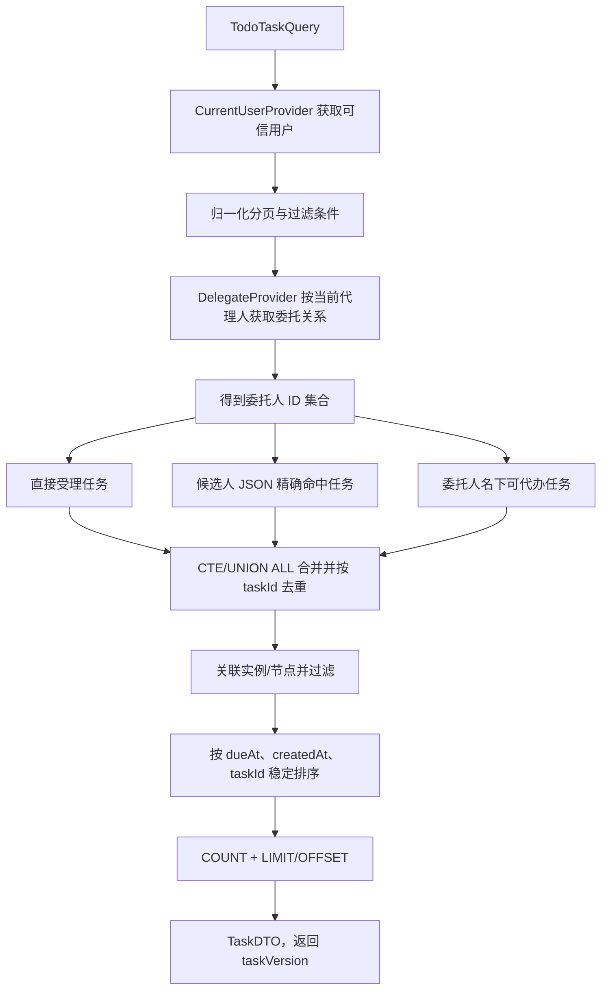
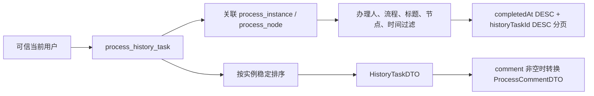
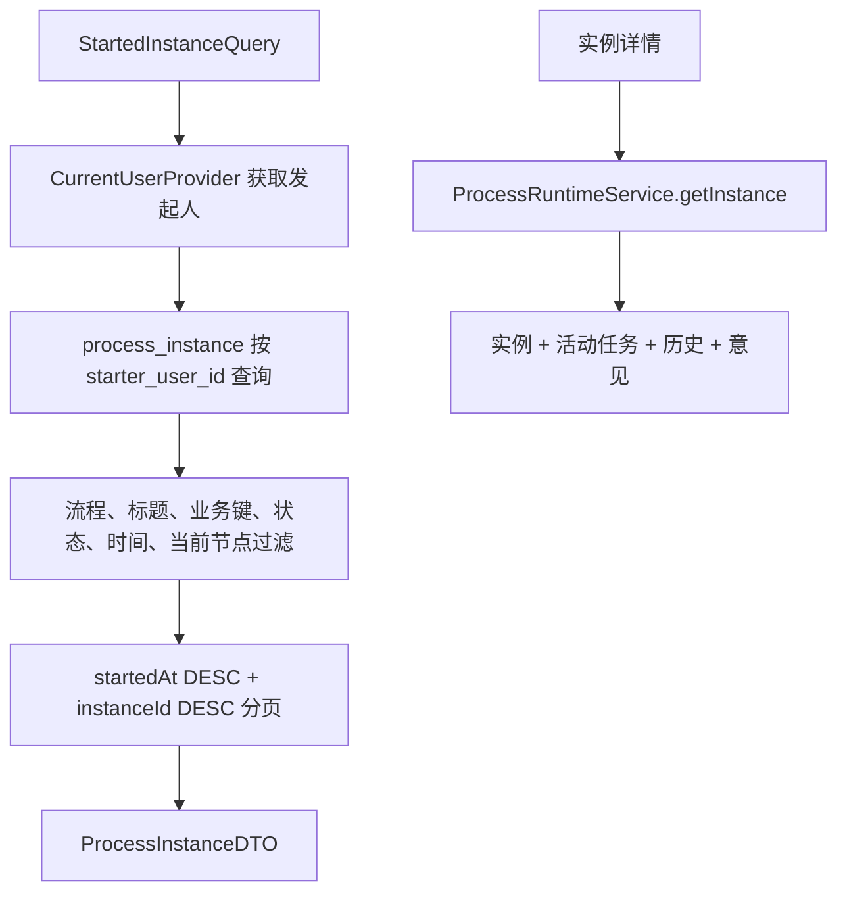
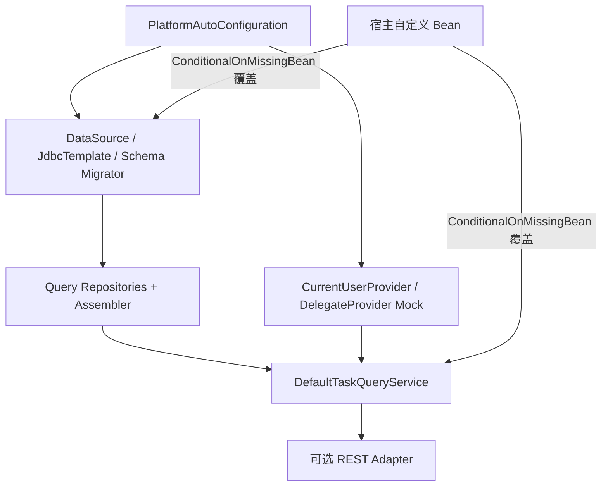

# 实习生 C：M3 查询能力与 Starter 自动装配执行计划

> 编制日期：2026-07-23  
> 范围：`platform-core` 查询读模型与 REST 查询适配层、`platform-starter` 真实自动装配。  
> 依据：实习生 C 开发文档、平台技术路线、设计与接口文档，以及当前代码基线。

## 1. M3 目标与职责边界

M3 由 C 线主负责流程运行态的**读侧闭环**：待办、已办、我发起、活动任务、历史任务、审批意见通过统一 Service、Starter 消费方和 REST 查询入口访问。A、B 线产生运行数据，C 线不复制数据，也不在查询时补写状态。

### 1.1 C 线必做项

| 范围 | C 线交付 | 说明 |
| --- | --- | --- |
| 任务查询 | 待办、已办、活动任务、历史任务、审批意见 | 完成 `TaskQueryService` 的 M3 方法，统一分页、过滤、排序与身份来源。 |
| 实例查询 | 我发起列表、实例详情读侧协作 | 列表由 C 实现；详情复用 B 已实现的 `ProcessRuntimeService.getInstance`。 |
| 查询持久化 | Query Repository 与 Assembler | 只读现有 `process_*` 表，不写流程状态、历史、回调和幂等数据。 |
| REST 适配 | 查询类 `GET` 接口及参数/异常转换 | Controller 只做 HTTP 适配，不写 SQL 和业务规则。 |
| Starter | SQLite/JDBC/Schema 与真实查询 Service 的条件装配 | 宿主可用 `@ConditionalOnMissingBean` 覆盖。 |
| 测试联调 | 单测、Repository 集成测、Starter/REST 集成测、A/B 联调 | 覆盖串行流程、候选人、委托、分页和宿主覆盖。 |

### 1.2 不属于 C 线 M3 主实现

| 内容 | 负责人/阶段 | C 的配合 |
| --- | --- | --- |
| 定义发布、激活、停用、归档 | A 线 M3 | 正确展示 A 写入的流程编码、名称和版本；灰度接口当前明确不实现。 |
| 发起、提交、审批、终止、删除、跳转、强制办结等写动作 | B 线及 A/B 协作 | 为动作后状态提供查询验证；查询代码绝不修改状态。 |
| 已阅记录写入及 `queryReadRecords` 的完整能力 | M5 | 接口保留，M3 不伪造空成功结果。 |
| 附件读写、文件权限 | M4 | 详情仅保留后续聚合扩展点。 |
| 催办、告警、审计写入 | M5/M6 | M3 可复用已有回调日志查询；审计查询依赖动作线提供读库支撑。 |

## 2. 当前代码基线与缺口

### 2.1 已有可复用能力

| 组件 | 当前状态 | M3 使用方式 |
| --- | --- | --- |
| `TaskQueryService` | 公共接口已确定，已声明 7 个查询方法 | 直接补齐，不创建重复任务查询接口。 |
| `DefaultTaskQueryService` | 已实现历史任务、审批意见和已办分页 | 扩展为完整 M3 读服务，保持已有行为。 |
| `ProcessHistoryTaskRepository` | 已支持按实例、已办分页、总数 | 复用并扩展过滤与展示字段。 |
| `ProcessRuntimeService.getInstance` | 已聚合实例、开放活动任务、历史和意见 | 作为详情基础，避免 C 再复制一套详情聚合。 |
| `DefaultCallbackService.queryCallbackLogs` | 已实现分页查询 | 管理端回调日志入口直接委托。 |
| `PageQueryNormalizer` | 已统一默认页码、页大小和上限 | 所有 M3 分页入口必须复用。 |
| `CurrentUserProvider`、`DelegateProvider` | SPI 与 Starter Mock 已具备 | 待办身份和委托关系必须经 SPI，不信任外部用户 ID。 |

### 2.2 SPI 使用结论

原始需求明确要求宿主系统负责组织架构、用户、委托关系等基础能力，平台通过 SPI 获取这些数据。因此 M3 查询层调用 `CurrentUserProvider` 和 `DelegateProvider` 是合理的。

- `CurrentUserProvider` 是“我的待办、我的已办、我发起”的可信身份来源，查询层不得以请求参数中的 `userId` 覆盖当前登录用户。
- `DelegateProvider` 是委托代办的唯一外部关系来源，平台不维护真实委托关系，也不得遍历用户或猜测委托关系。
- M3 待办查询需要的是“当前代理人可以代办哪些委托人的任务”。如果现有 `DelegateProvider` 只能按委托人查询代理人，则需要在实现前补充或调整为支持按代理人查询有效委托关系。

### 2.3 当前明确缺口

1. `DefaultTaskQueryService` 的 `queryTodoTasks`、`queryStartedInstances`、`queryActiveTasks` 仍抛出 `UnsupportedOperationException`。
2. 已办查询当前只支持 `userId`、`processCode`，未满足流程名称、标题、发起人、时间、节点、状态等过滤要求。
3. `ActiveTaskRepository` 只能按任务 ID 或实例 ID 查询，不能按待办来源、候选人、委托人组合过滤分页。
4. `ProcessInstanceRepository` 只有单实例读取和状态更新，缺少“我发起”列表及总数查询。
5. 当前 `TaskDTO` 没有流程编码/名称、实例标题、发起人等列表展示字段；筛选与展示字段需要在 M3 编码前确认。
6. 当前没有 REST Controller；`platform-core` 的 `web` 包只有说明文件，模块也未引入 Spring Web MVC。
7. `PlatformAutoConfiguration` 默认注册的是 `UnsupportedTaskQueryService`；`PlatformProperties.sqlite.path` 当前没有接通 DataSource、JdbcTemplate 或 Schema 初始化。
8. 测试 Schema 加载器只执行 `001_init_flow_platform.sql`。存量 SQLite 还需升级 M2 的 `002_m2_runtime_operation_actions.sql`；新增 M3 迁移时测试加载器也要按版本执行全部脚本。

## 3. 需要实现或协作实现的接口

### 3.1 C 线主接口：`TaskQueryService`

| 方法 | M3 状态 | 实现要求 |
| --- | --- | --- |
| `queryTodoTasks(TodoTaskQuery)` | 新增实现 | 可信当前用户、直接/候选/委托来源合并、去重、稳定排序、数据库分页。 |
| `queryCompletedTasks(CompletedTaskQuery)` | 增强 | 历史表查询，补齐规定过滤和展示；默认仅当前用户已办。 |
| `queryStartedInstances(StartedInstanceQuery)` | 新增实现 | 当前用户作为发起人，查询实例状态、当前节点和时间范围。 |
| `queryActiveTasks(String)` | 新增实现 | 仅读 `ACTIVE`/`CLAIMED`，稳定排序，补齐节点名称、候选人、版本。 |
| `queryHistoryTasks(String)` | 保留并回归 | 保持 `started_at, completed_at, id` 稳定顺序。 |
| `queryComments(String)` | 保留并回归 | 只转换非空 `comment_text`，不新建评论表。 |
| `queryReadRecords(ReadRecordQuery)` | 保持占位 | M5 实现；M3 明确抛阶段未实现异常。 |

### 3.3 REST 查询接口

| HTTP | 路径 | 委托 Service | M3 状态 |
| --- | --- | --- | --- |
| `GET` | `/api/platform/tasks/todo` | `TaskQueryService.queryTodoTasks` | 必做。 |
| `GET` | `/api/platform/tasks/completed` | `TaskQueryService.queryCompletedTasks` | 必做。 |
| `GET` | `/api/platform/instances/started` | `TaskQueryService.queryStartedInstances` | 必做。 |
| `GET` | `/api/platform/instances/{instanceId}/active-tasks` | `TaskQueryService.queryActiveTasks` | 必做。 |
| `GET` | `/api/platform/instances/{instanceId}/history-tasks` | `TaskQueryService.queryHistoryTasks` | 必做。 |
| `GET` | `/api/platform/instances/{instanceId}/comments` | `TaskQueryService.queryComments` | 必做。 |
| `GET` | `/api/platform/instances/{instanceId}` | `ProcessRuntimeService.getInstance` | 建议一并提供，确保详情与拆分查询一致。 |
| `GET` | `/api/platform/admin/callback-logs` | `CallbackService.queryCallbackLogs` | 可用现成 Service。 |
| `GET` | `/api/platform/admin/audit-logs` | `AdminProcessService.queryAuditLogs` | 联调门禁，依赖 A/B 可用管理 Service 和审计读 Repository。 |

Controller 只负责参数绑定、统一异常转换和返回结果，不能承载授权、分页决策、SQL 或状态判断。

## 4. 数据库范围与操作方式

### 4.1 M3 必读表

| 表 | 场景 | 关键字段 | M3 操作 |
| --- | --- | --- | --- |
| `process_active_task` | 本人、候选、委托待办；实例活动任务 | `assignee_user_id`、`candidate_user_ids`、`task_status`、`lock_version`、`created_at`、`due_at` | 只读；`lock_version` 映射为 `taskVersion`。 |
| `process_instance` | 我发起；待办/已办关联过滤 | 流程编码/名称、标题、业务键、发起人、状态、当前节点、开始/结束时间 | 只读。 |
| `process_history_task` | 已办、轨迹、意见 | 办理人、委托来源、动作、意见、任务组、分支、完成时间 | 只读；非空意见映射为评论。 |
| `process_definition` | 流程信息 | `id`、编码、名称、版本 | 优先使用实例快照，避免定义修改影响历史展示。 |
| `process_node` | 节点名称和筛选 | `definition_id`、`node_code`、节点名称 | 只读关联。 |
| `process_task_group` | 任务组/分支展示 | `id`、`group_status`、分支信息 | 需要展示时只读关联。 |
| `process_callback_log` | 回调日志 | 事件、状态、操作号、创建时间 | 经 `CallbackService` 只读。 |

### 4.2 明确不写的表

M3 查询链路不得写 `process_instance`、`process_active_task`、`process_history_task`、`process_operation_record`、`process_callback_log` 或 `process_audit_log`。读取失败不得为了“补数据”修改状态、历史或幂等记录。

`process_read_record`、`process_attachment`、`process_reminder_record`、`process_alert_record` 留给 M4–M6；M3 基础列表不依赖它们。

### 4.3 索引和迁移策略

1. 先复用现有索引；新增索引前以代表性数据执行 `EXPLAIN QUERY PLAN`。
2. `candidate_user_ids` 是 JSON 数组，候选人匹配必须用 SQLite JSON 数组精确匹配（例如 `json_each`），**禁止** `LIKE '%userId%'`，避免 `u1` 错匹配 `u10`。
3. 三类待办应在数据库层以 CTE/`UNION ALL` 合并后统一过滤、排序、`COUNT` 和 `LIMIT/OFFSET`；禁止各来源分别分页后再内存拼接。
4. 如压测确认索引不足，新增 `003_m3_query_indexes.sql`，只增加索引；测试 Schema 加载器必须按 `001`、`002`、`003` 顺序执行。
5. 存量库发布时先执行 `002_m2_runtime_operation_actions.sql`，再执行 M3 脚本；新库初始化和升级脚本都必须可重复执行。

## 5. 关键查询流程

### 5.1 待办查询

- 直接任务：`assignee_user_id = currentUserId`，状态为 `ACTIVE` 或 `CLAIMED`。
- 候选任务：状态必须为 `ACTIVE`，候选 JSON 精确包含当前用户；已被他人认领的任务不进入候选待办。
- 委托任务：按现有 SPI 得到当前用户可代理的委托人 ID；填充已有 `delegateFromUserId`、`delegateFromUserName` 区分本人和代办。
- 同一任务命中多个来源时按 `taskId` 去重；直接受理优先，委托标记只用于非本人任务。

### 5.2 已办、轨迹、意见

- 已办只读历史任务，不从活动任务推断。
- 轨迹保留实际办理人、委托来源、动作、意见、任务组、分支和完成时间。
- 审批意见不是独立表，只转换 `comment_text` 非空历史记录，顺序与轨迹一致。

### 5.3 我发起与实例详情

M3 不再创建第二套实例详情聚合。M4 附件、M5 已阅如需加入详情，应在对应阶段扩展现有 `ProcessInstanceDetailDTO`。

## 6. DTO、Repository 和实现拆分

### 6.1 补齐 Query DTO

现有 `TodoTaskQuery`、`CompletedTaskQuery`、`StartedInstanceQuery` 只有用户/流程编码和分页，无法表达 M3 文档的全部过滤。编码前补齐字段并更新对应测试：

| Query DTO | 建议新增字段 |
| --- | --- |
| `TodoTaskQuery` | 流程名称、实例标题、发起人、节点编码、任务状态、时间范围、排序选项；用户 ID 仅兼容保留。 |
| `CompletedTaskQuery` | 流程名称、实例标题、发起人、节点编码、动作类型、完成时间范围；办理人取可信当前用户。 |
| `StartedInstanceQuery` | 实例标题、业务键、实例状态、当前节点、发起时间范围；发起人取可信当前用户。 |

`TaskDTO` 现缺少流程和实例展示信息。若 REST 列表需展示，应补充可选 `processCode`、`processName`、`instanceTitle`、`starterUserId`、`starterUserName` 字段；委托区分优先复用已有 `delegateFromUserId`/`delegateFromUserName`。所有公共 DTO 增量均更新中文 JavaDoc 和 DTO 测试，防止 A/B/C 重复定义。

### 6.2 推荐内部组件

| 组件 | 职责 |
| --- | --- |
| `TaskQueryRepository` 或扩展 `ActiveTaskRepository` | 待办三来源 CTE、实例活动任务、总数和 SQL 参数绑定。 |
| `ProcessInstanceQueryRepository` 或扩展 `ProcessInstanceRepository` | 我发起列表、总数和实例过滤。 |
| `ProcessHistoryTaskRepository` | 扩展已办过滤和关联展示，避免第二套历史 Repository。 |
| `RuntimeQueryAssembler` | SQL 行/实体映射到任务、历史、实例 DTO；不含查询决策和 JDBC。 |
| `PlatformQueryWebController` | 只暴露 M3 查询 GET 接口。 |

组件继续放在 `core.query`、`persistence.repository`、`web`，使用 Java 8、Spring JDBC、SQLite；不引入 ORM、第二数据库或具体业务规则。

## 7. Starter 自动装配

### 7.1 改造原则

当前 Starter 默认返回 `UnsupportedTaskQueryService`，不满足“Starter 与独立 REST 使用同一 Service”的目标。M3 应改为条件装配真实 `DefaultTaskQueryService`：

1. `flow-mind.platform.enabled=false` 时不装配平台 Bean；
2. 宿主提供 `TaskQueryService` 时 Starter 让位；
3. 宿主提供 `DataSource`/`JdbcTemplate` 时优先复用；未提供时用 `flow-mind.platform.sqlite.path` 创建 SQLite 数据源；
4. 本地 SQLite 启动时按顺序执行可重复 Schema/Migration；失败明确报错，不能回退为空实现；
5. Starter 显式注册查询所需 Repository、Assembler、真实 Service，不能依赖宿主包扫描是否覆盖 `com.flowmind.platform`；
6. 本地 Mock SPI 仍以 `@ConditionalOnMissingBean` 和 `flow-mind.platform.mock.enabled` 控制；生产 SPI 缺失时拒绝或明确失败，不能静默放宽权限。

建议将当前大配置类拆为数据源、查询、Mock SPI 三个内部配置类，避免不同条件互相干扰；不能同时维护 Starter 专用查询实现和 Core 查询实现。

### 7.2 REST 依赖决策

当前 `platform-core` 没有 Spring Web MVC 依赖。实现 REST 前须确认模块边界：

- 若遵循当前工程说明中“`platform-core` 包含 REST 适配”的约定，则在 Core 补充 Spring Web MVC，并以条件类存在方式装配 Controller；
- 若要求 Core 完全无 Web 依赖，则新建 Web Adapter 模块；这是模块结构变更，需先由负责人确认；
- 无论选择哪一种，Controller 只能依赖公共 Service 接口，不能依赖 JDBC Repository。

## 8. 分步执行

### M3.0：实现前确认与夹具

1. 确认 `DelegateProvider` 支持按当前代理人查询有效委托关系；若现有方法只能按委托人查代理人，先补充或调整 SPI 用法。
2. 确认 Query DTO 字段、默认排序、空值语义和 `TaskDTO` 展示字段。
3. 建立 SQLite 夹具：直接、候选、委托、已完成、已取消任务，以及多流程、多标题、多发起人和时间边界。
4. 验证目标 SQLite JDBC 支持 `json_each`，写 `u1` 不命中 `u10` 的回归用例。

**完成门槛：**当前用户来源和委托查询方向清晰；测试数据覆盖三类待办；DTO 与 A/B 无重复定义。

### M3.1：Repository 与 Assembler

1. 待办以单一 CTE/SQL 实现列表和总数，三来源合并后再过滤、排序、分页。
2. 扩展实例 Repository，实现按发起人、流程、标题、业务键、状态、时间、当前节点分页。
3. 扩展历史 Repository，增加已办过滤、实例/节点展示信息和总数 SQL。
4. 统一映射：`lock_version -> taskVersion`、候选 JSON -> `List<String>`、节点编码 -> 节点名称。
5. 所有 SQL 参数化；动态排序只接受白名单字段和固定方向。

**完成门槛：**Repository 集成测试通过；列表/总数采用相同过滤条件；没有 N+1 查询和内存二次分页。

### M3.2：完成 `DefaultTaskQueryService`

1. 注入可信身份 SPI、委托 SPI、Query Repository 和 Assembler。
2. 实现待办、我发起、活动任务，回归历史、意见、已办。
3. 所有分页统一调用 `PageQueryNormalizer`，返回完整 `PageResult`。
4. 对空实例、越权用户、非法时间范围/枚举/排序返回稳定平台异常。
5. `queryReadRecords` 继续显式标记为 M5 未实现。

**完成门槛：**公共接口所有 M3 方法均可工作；查询没有状态写入；重复查询不改变数据。

### M3.3：REST 与管理查询协作

1. 新建查询 Controller，实现第 3.3 节的六个必做 GET 接口。
2. 在统一异常处理处转换参数、身份、资源不存在错误，不能泄露 SQLite/SQL/路径细节。
3. 回调日志委托 `CallbackService`；审计、管理实例/任务/历史等待 B 的 `AdminProcessService` 接入，C 提供读库支撑和联调测试。
4. 使用 MockMvc 或等价 MVC 测试验证参数绑定、默认分页、HTTP 状态和 Service 透传。

**完成门槛：**独立 REST 入口不复制业务逻辑；查询路径和 Service 结果一致。

### M3.4：Starter 真实装配

1. 从默认路径移除 `UnsupportedTaskQueryService`，改装配真实查询 Service。
2. 接通 `PlatformProperties.sqlite.path`、Schema/Migration、`DataSource`、`JdbcTemplate`、Repository、Assembler、Service。
3. 保持 Service/SPI/DataSource 的覆盖规则，补充未配置依赖的异常测试。
4. 用临时 SQLite 启动 Starter 消费方，插入夹具后验证真实待办、已办、我发起查询；验证宿主自定义 Service、DataSource、SPI 可覆盖。

**完成门槛：**Starter 不再只返回占位 Service；独立 REST 与 Starter 使用同一查询实现和同一 SQL 行为。

### M3.5：A/B 联调与交付

1. 用 A 的已发布定义和 B 的串行实例验证发起、提交、两级审批、办结后的查询闭环。
2. 验证 B 的认领/取消认领、终止/删除后，查询不展示失效活动任务，历史和保留日志符合动作语义。
3. 在 `platform` 执行 `mvn -q test`，在仓库根目录执行 `mvn -q test`。
4. 更新阶段完成记录：交付内容、实际迁移、测试结果、风险和交接项。

## 9. 测试与验收

| 类别 | 必测场景 |
| --- | --- |
| 待办 | 直接受理、候选精确匹配、委托代办、来源去重、已取消/完成排除、`taskVersion`、稳定排序。 |
| 安全与权限 | 请求用户与 SPI 不一致、委托方向、空用户/实例、非法排序、页码小于 1、页大小超限。 |
| 已办/轨迹 | 多节点历史顺序、空意见不生成评论、委托来源和任务组保留、时间/流程/节点过滤与总数一致。 |
| 我发起 | 流程、标题、业务键、状态、节点、时间过滤；只返回可信当前用户的数据。 |
| Repository | JSON 精确匹配、CTE 后分页、`COUNT` 与列表条件一致、空结果 `PageResult` 正确。 |
| REST | 六个必做端点的参数绑定、默认分页、错误响应、详情与拆分查询一致。 |
| Starter | 默认真实 Bean、宿主 Service/DataSource 覆盖、Mock SPI 启停、SQLite 路径和 Schema 初始化。 |
| 联调 | 串行流程办结后待办减少、已办增加、我发起状态更新、活动任务清空、历史/意见完整。 |

M3 通过标准：

1. 待办、已办、我发起、活动任务、历史任务、审批意见可查询，列表统一使用 `PageResult`；
2. 待办可靠区分本人任务和委托代办，并返回最新 `taskVersion`；
3. 办结后可查完整轨迹和意见，查询不修改运行数据；
4. REST 与 Starter 没有两套查询实现；
5. 宿主能覆盖默认 Service/SPI/DataSource；
6. M3 新增测试通过，并确保既有回归不被破坏；
7. A/B 写动作造成的状态变化能被 C 的查询正确反映。

## 10. 风险、依赖和提交建议

| 风险/依赖 | 影响 | 处理方式 |
| --- | --- | --- |
| 委托 SPI 只支持按委托人查询代理人 | 待办无法从当前用户反查可代办任务，可能漏查或越权 | C 在 M3.0 先确认并补齐按代理人查询有效委托关系的能力，再进入待办编码。 |
| 候选 JSON 无索引 | 大数据量待办变慢 | 先验证 JSON1 与执行计划，确认瓶颈后再添加 M3 索引/结构化关联。 |
| DTO 不足 | 列表没有流程/标题/发起人上下文 | C 提交字段增量，A/B 审核，共同更新公共 DTO 测试。 |
| `AdminProcessService` 混合读写 | C 单独实现会产生半成品 Service | C 提供读库支撑，B 实现管理 Service 并联调。 |
| Starter 无真实数据源/Schema | 只能得到占位 Service | M3.4 接通 DataSource、迁移和查询 Bean，写临时 SQLite 集成测试。 |
| 存量库未升级 M2 | 运行时表/枚举不一致 | 发布说明要求先升级 `002`；测试加载器改为全量脚本顺序执行。 |

建议按以下微任务提交，避免混入 A/B 写动作重构或无关格式化：

1. `m3-c-query-prep`：委托用法确认、DTO/Query 扩展、基础测试；
2. `m3-c-query-repository`：待办/实例/历史 SQL、Assembler、Repository 集成测试；
3. `m3-c-query-service`：完成 `DefaultTaskQueryService` 和单元测试；
4. `m3-c-web-query`：REST Adapter、错误处理和 MVC 测试；
5. `m3-c-starter-real-service`：DataSource/Schema/真实 Service 自动装配及 Starter 集成测试；
6. `m3-c-ab-integration`：串行流程联调、阶段完成记录和交接说明。
