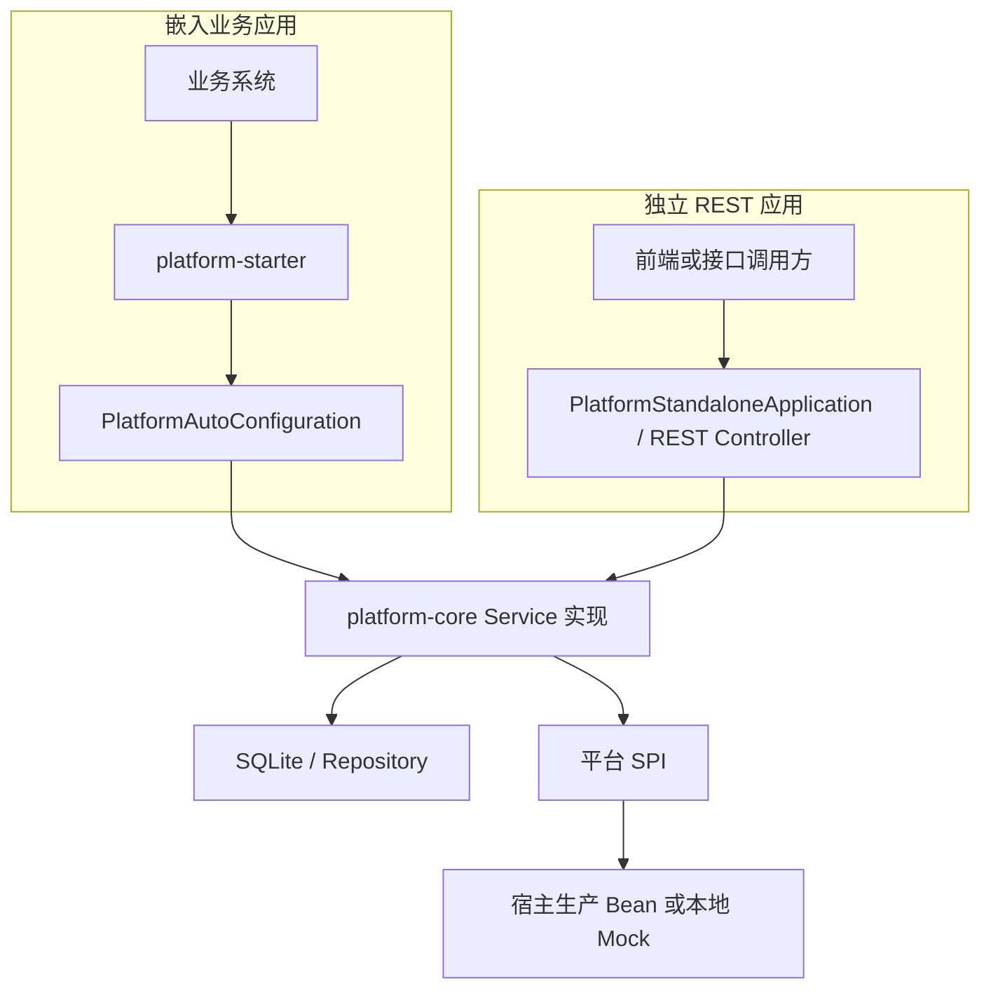
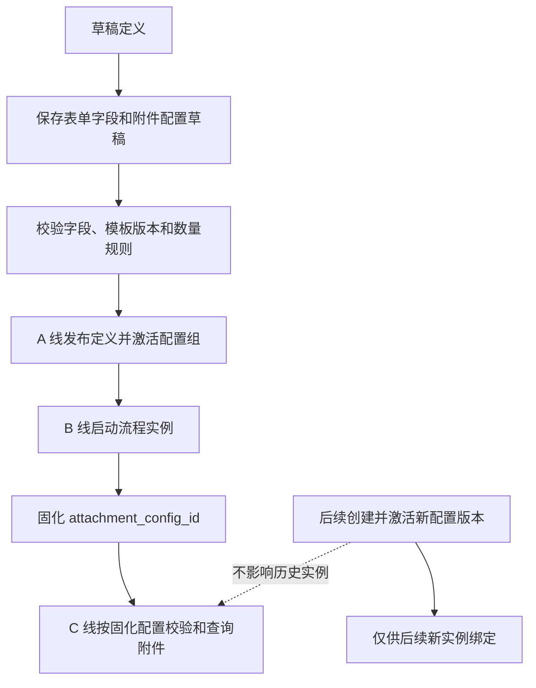
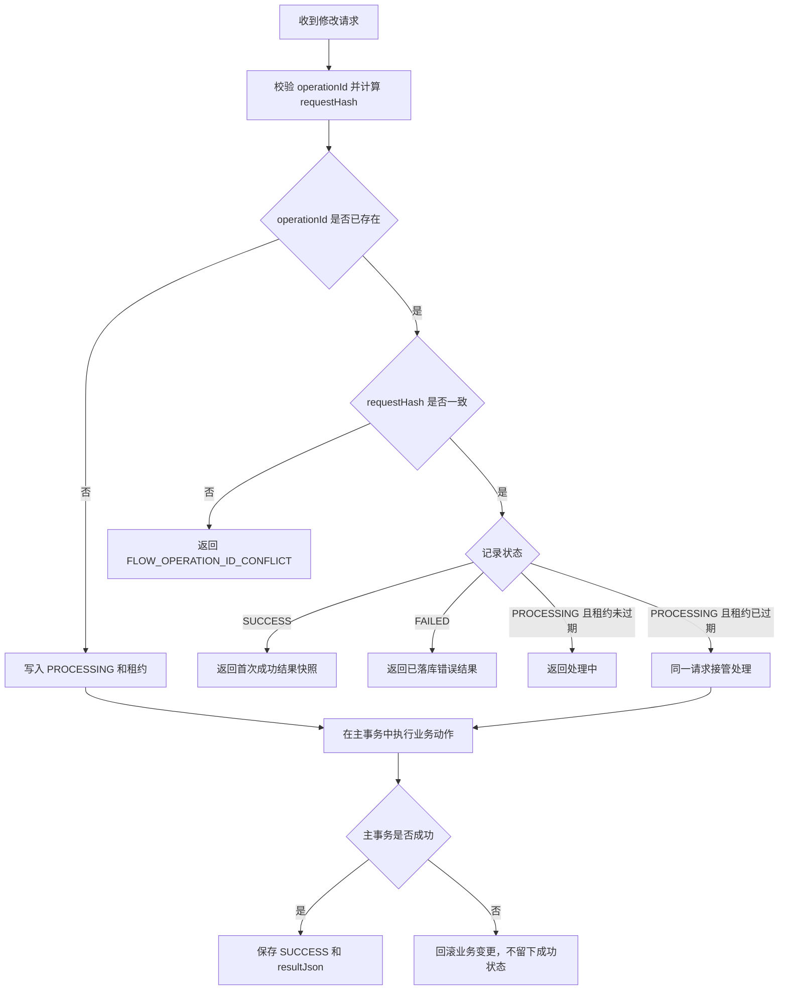
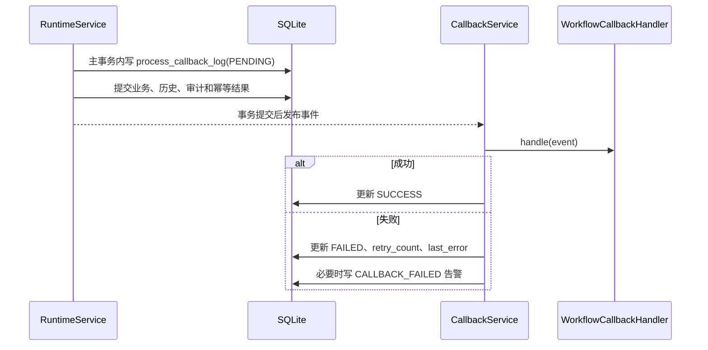
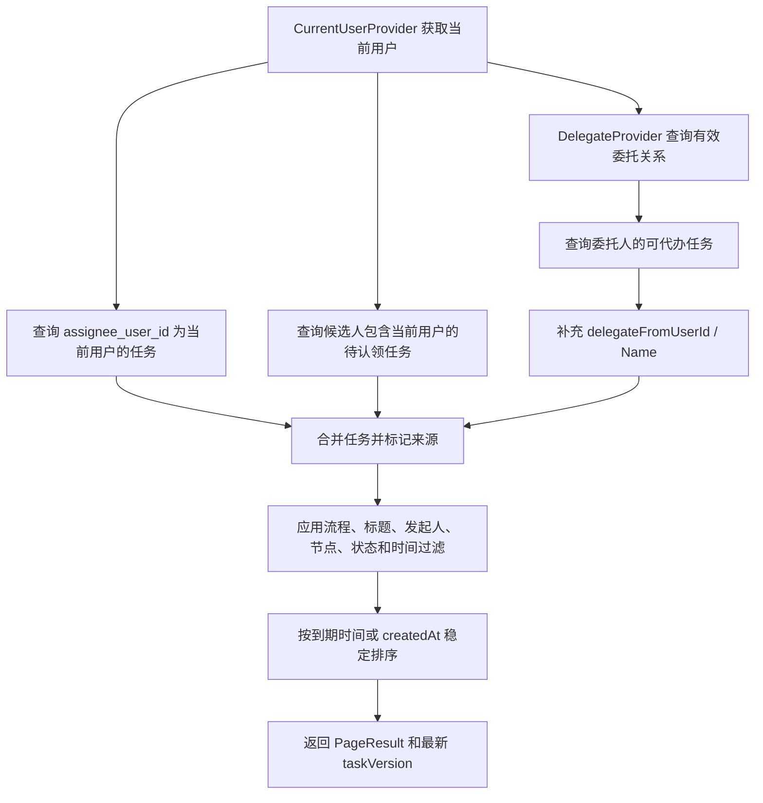
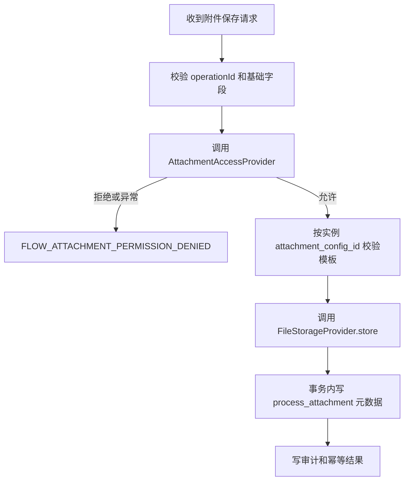
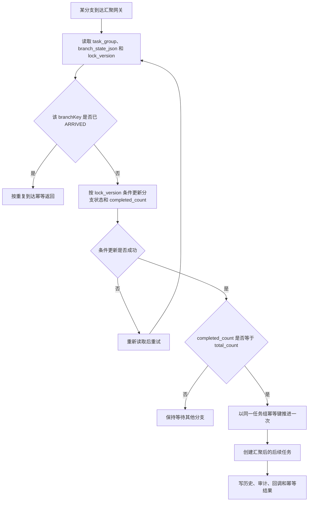
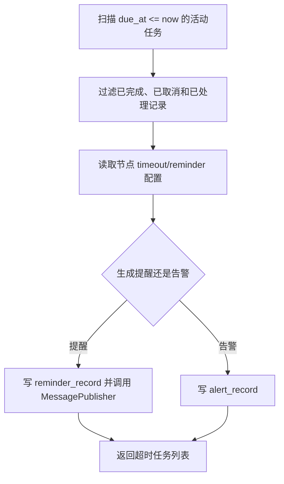

# 流程平台技术文档 - 实习生 C

> 分工依据：`流程平台技术路线_v5.2.md`  
> 数据模型与接口基线：`流程平台设计与接口文档_v4.md`
> 技术栈：Java 8、Spring Boot 2.7.18、SQLite、Spring JDBC、Spring Boot Starter

## 1. 文档目标

本文只说明实习生 C 的实现范围，并明确与 A、B 两条工作线的边界。C 的核心职责是：

1. M0：冻结 SPI 接口、Starter 接口、回调事件模型、并发与幂等验收用例；
2. M1：表单字段、附件模板、流程定义附件配置；
3. M2：操作幂等记录、审批意见、流程轨迹、回调幂等、运行状态验证；
4. M3：待办、已办、我发起、活动任务查询、Starter 自动装配、本地验收和集成测试；
5. M4：文件存储 SPI、附件元数据、消息推送 SPI、Mock 实现；
6. M5：委托代办、认领/取消认领、审计日志、已阅、提醒、回归测试；
7. M6：并行汇聚、管理员修复、超时处理、催办、异常告警。

C 不重复实现 A 负责的流程定义 CRUD、发布激活、审批规则保存、条件表达式和或签配置，也不重复实现 B 负责的实例启动、普通审批、历史归档、驳回/撤回/转办/加签和会签运行。C 负责为这些动作提供可查询、可追踪、可回调、可扩展和可嵌入的外围能力。

## 2. 总体实现结构

```text
platform-core
  ├── api
  │   ├── dto
  │   ├── enums
  │   ├── service
  │   └── spi
  ├── core
  │   ├── definition
  │   ├── runtime
  │   ├── task
  │   ├── query
  │   ├── attachment
  │   ├── callback
  │   ├── reminder
  │   ├── monitor
  │   ├── audit
  │   └── validation
  ├── persistence
  │   ├── entity
  │   ├── repository
  │   └── schema
  ├── web
  └── mock

platform-starter
  └── autoconfigure
```

模块收敛规则：

- `platform-core` 是流程平台主体模块，第一阶段承载 API 合约、核心逻辑、SQLite 持久化、REST 适配和本地 Mock。
- `platform-starter` 只负责 Spring Boot 自动装配，依赖 `platform-core`，不重复实现流程逻辑。
- `platform-core.web` 必须提供 `PlatformStandaloneApplication`，作为可执行的 `@SpringBootApplication` 启动入口；它加载 REST Controller、SQLite 数据源和平台 Service，供本地独立运行。
- `platform-core` 必须引入 `spring-boot-starter-web`，并提供 `application-platform-standalone.yml` 配置 SQLite 数据源；该应用可通过 Spring Boot Maven 插件启动。
- `platform-starter` 的 `PlatformAutoConfiguration` 必须装配与独立应用相同的 Service 实现，并以 `@ConditionalOnMissingBean` 留出业务侧覆盖点。
- 第一阶段必须具备两类集成测试：业务样例仅引入 Starter 后可注入并调用 `ProcessRuntimeService`；独立应用以随机端口启动后可通过 REST 完成入金申请串行闭环。

两种运行方式最终复用同一套 `platform-core` Service，实现关系如下：



## 3. M0 生成类与契约说明

M0 当前完成的是公共对象、Service/SPI 接口、回调事件模型、Starter 骨架和验收测试基线。查询、附件、回调、监控、Repository 和 REST 的生产实现不属于当前已落地内容。

### 3.1 DTO、Request 与辅助 Entity

当前公开对象分布在 `com.flowmind.platform.api.dto` 和 `com.flowmind.platform.api.request`。名称以 `Query`、`Result` 结尾的类仍属于 DTO，不存在独立的 `api.query` 或 `api.result` 包。`persistence.entity` 仅保留 4 个文件、附件和消息相关的辅助 JavaBean。

**DTO（`api.dto`）**

 42 个 DTO：

| 分组 | 当前代码中的 DTO |
| --- | --- |
| 公共上下文与分页 | `PageResult`、`UserDTO`、`DepartmentDTO`、`UserContext` |
| 流程定义 | `ProcessDefinitionDTO`、`ProcessDefinitionDetailDTO`、`ProcessNodeDTO`、`ProcessEdgeDTO`、`ProcessFormFieldDTO`、`ProcessAttachmentConfigDTO`、`ValidationResult` |
| 流程运行与任务 | `ProcessInstanceDTO`、`ProcessInstanceDetailDTO`、`TaskDTO`、`HistoryTaskDTO`、`ProcessCommentDTO`、`TaskActionResult`、`OperationResult` |
| C 线外围能力 | `AttachmentDTO`、`AttachmentDownloadDTO`、`AttachmentTemplateCheckResult`、`AuditLogDTO`、`CallbackLogDTO`、`DelegateRelationDTO`、`OperationRecordDTO`、`ReadRecordDTO`、`ReminderDTO`、`AlertDTO`、`WorkflowEvent` |
| 查询条件 DTO | `ProcessDefinitionQuery`、`TodoTaskQuery`、`CompletedTaskQuery`、`StartedInstanceQuery`、`AttachmentQuery`、`AuditLogQuery`、`CallbackLogQuery`、`ReadRecordQuery`、`ReminderQuery`、`AlertQuery`、`AdminInstanceQuery`、`AdminTaskQuery`、`AdminHistoryTaskQuery` |

DTO 均采用 Java 8 JavaBean。分页查询条件使用 `pageNo`、`pageSize`，分页结果使用 `PageResult<T>`；`AttachmentQuery` 对应非分页的 `List<AttachmentDTO>`。普通 `AttachmentDTO` 只表达元数据，下载内容由 `AttachmentDownloadDTO.content` 承载。

**Request（`api.request`）**

34 个 Request：

| 分组 | 当前代码中的 Request |
| --- | --- |
| 基类 | `OperationRequest`、`TaskOperationRequest` |
| 定义与审批人解析 | `CreateProcessDefinitionRequest`、`SaveProcessGraphRequest`、`DefinitionOperationRequest`、`GrayReleaseRequest`、`CopyProcessDefinitionRequest`、`ApproverResolveRequest` |
| 运行时与管理动作 | `StartProcessRequest`、`SubmitTaskRequest`、`ApproveTaskRequest`、`RejectTaskRequest`、`ReturnTaskRequest`、`WithdrawTaskRequest`、`DirectSendRequest`、`TransferTaskRequest`、`AddSignRequest`、`ClaimTaskRequest`、`UnclaimTaskRequest`、`TerminateProcessRequest`、`DeleteProcessInstanceRequest`、`UpdateVariablesRequest`、`JumpNodeRequest`、`ForceCompleteRequest` |
| C 线外围能力 | `AttachmentAccessRequest`、`CheckAttachmentRequest`、`DeleteAttachmentRequest`、`DownloadAttachmentRequest`、`HandleAlertRequest`、`RemindTaskRequest`、`SaveInstanceAttachmentRequest`、`SaveTaskAttachmentRequest`、`StoreFileRequest`、`TimeoutScanRequest` |

`OperationRequest` 只冻结 `operationId`；任务级修改请求通过 `TaskOperationRequest` 增加 `taskId`、`expectedTaskVersion`、`operatorUserId` 和 `comment`，当前包括运行时任务动作、`RemindTaskRequest` 和 `SaveTaskAttachmentRequest`。`TimeoutScanRequest`、查询型请求和 SPI 辅助请求不强制继承幂等基类。

**辅助 Entity（`persistence.entity`）**

| Entity | 当前代码作用 |
| --- | --- |
| `AttachmentUploadItem` | 单个上传附件，包含附件编码、归属范围、文件元数据和二进制内容 |
| `FileContent` | 文件存储 SPI 读取结果，包含文件元数据和二进制内容 |
| `StoredFile` | 文件存储 SPI 保存结果，包含 `storageKey` 和文件元数据 |
| `ProcessMessage` | 消息 SPI 使用的类型、标题、正文、接收人、扩展载荷和创建时间 |

这 4 个类不是 `process_*` 数据库表的一一映射。当前 M0 只有 `process_operation_record`、`process_callback_log` 两张基线 DDL，没有 Repository Entity 或生产持久化实现。

### 3.2 Service 与 SPI

**Service 接口**

当前 `api.service` 共有 7 个接口：

| Service | 契约职责 | 主要归属 | 当前 Starter 状态 |
| --- | --- | --- | --- |
| `ProcessDefinitionService` | 流程定义创建、图保存、校验、发布状态、灰度、复制、删除和查询 | A 线 | 不装配 |
| `ProcessRuntimeService` | 流程启动、任务动作、认领、实例终止/删除、变量更新和详情查询 | B 线 | 不装配 |
| `AdminProcessService` | 管理端实例、任务、历史、审计和回调查询，以及跳转、强制办结入口 | C 负责查询，A/B 负责状态修改 | 不装配 |
| `TaskQueryService` | 待办、已办、我发起、活动任务、历史任务、审批意见和已阅查询 | C 线 | 装配可覆盖骨架 |
| `AttachmentService` | 实例/任务附件保存、下载、查询、删除和必填校验 | C 线 | 装配可覆盖骨架 |
| `CallbackService` | 回调事件发布和回调日志分页查询 | C 线 | 装配可覆盖骨架 |
| `ProcessMonitorService` | 催办、提醒查询、超时扫描、告警查询和处理 | C 线 | 装配可覆盖骨架 |

`PlatformAutoConfiguration` 当前只为 4 个 C 线 Service 提供 `@ConditionalOnMissingBean` 骨架。骨架方法会抛出 `UnsupportedOperationException`，只用于冻结注入契约，不代表业务逻辑已经实现。

**SPI 接口**

有 8 个接口：

| SPI | 方法 | 技术作用 | 当前 Starter 默认实现 |
| --- | --- | --- | --- |
| `ApproverResolver` | `resolveApprovers` | 根据 `ApproverResolveRequest` 解析可办理用户列表 | 无，由宿主实现 |
| `AttachmentAccessProvider` | `isAllowed` | 判断附件访问请求是否允许 | 固定允许的 Mock |
| `CurrentUserProvider` | `getCurrentUser` | 获取当前用户上下文 | 返回测试用户 |
| `DelegateProvider` | `findDelegates` | 按委托人和时间查询有效委托关系 | 返回空列表 |
| `FileStorageProvider` | `store`、`load`、`delete` | 保存、读取和删除文件内容 | 内存文件存储 |
| `MessagePublisher` | `publish` | 发布通用流程消息 | 内存记录消息 |
| `OrganizationProvider` | 部门、用户和角色查询方法 | 提供宿主组织架构只读查询 | 无，由宿主实现 |
| `WorkflowCallbackHandler` | `handle` | 处理 `WorkflowEvent` | 空处理器 |

6 个默认 Mock 受 `flow-mind.platform.mock.enabled` 控制，并可被宿主 Bean 覆盖。`FileStorageProvider`、`MessagePublisher` 当前使用辅助 Entity；`ApproverResolver`、`OrganizationProvider` 只冻结接口，不提供默认 Mock。

### 3.3 回调事件模型

`WorkflowEvent` 包含以下字段：

| 字段 | 类型 | 说明 |
| --- | --- | --- |
| `eventId` | `String` | 全局唯一事件标识 |
| `operationId` | `String` | 触发动作的幂等号 |
| `eventType` | `WorkflowEventTypeEnum` | 工作流事件类型 |
| `processCode` | `String` | 流程编码 |
| `instanceId` | `String` | 流程实例 ID |
| `actionType` | `ActionTypeEnum` | 触发事件的动作类型 |
| `operator` | `UserContext` | 操作人快照 |
| `archivedTasks` | `List<HistoryTaskDTO>` | 本次归档或取消的历史任务 |
| `createdTasks` | `List<TaskDTO>` | 本次创建的活动任务 |
| `variables` | `Map<String, Object>` | 事件发生后的变量快照 |
| `occurredAt` | `LocalDateTime` | 事件发生时间 |

`WorkflowEventTypeEnum` 当前包含 14 个事件值：

| 类别 | 事件值 |
| --- | --- |
| 流程生命周期 | `PROCESS_STARTED`、`PROCESS_REJECTED`、`PROCESS_RETURNED`、`PROCESS_WITHDRAWN`、`PROCESS_DIRECT_SENT`、`PROCESS_JUMPED`、`PROCESS_TERMINATED`、`PROCESS_CANCELED`、`PROCESS_COMPLETED` |
| 任务生命周期 | `TASK_CREATED`、`TASK_SUBMITTED`、`TASK_COMPLETED`、`TASK_TRANSFERRED`、`TASK_ADDED_SIGN` |

`WorkflowCallbackHandler.handle(WorkflowEvent)` 和 `CallbackService.publishCallback(WorkflowEvent)` 已冻结接口；`WorkflowEventContractTest` 已覆盖事件字段、枚举转换和 `eventId` 幂等键表达能力。`process_callback_log.event_id` 在 M0 DDL 中具有唯一约束。

当前尚未实现生产回调 Outbox 写入、事务后投递、失败重试或 `eventId` 生成器。相同 `operationId` 不产生重复事件属于后续实现必须遵守的契约，不应表述为已经落地的运行行为。

**M0 当前验收结论**

- 公共 DTO、Request、Service、SPI、枚举和回调事件模型可编译；
- 幂等与并发使用内存夹具建立了验收基线，尚无生产幂等处理器；
- Starter 可以注入 4 个 C 线 Service 骨架，并支持宿主自定义 Bean 覆盖；
- 文件、消息、附件授权、回调、委托和当前用户提供本地 Mock；
- 根项目自动化测试当前通过。

## 4. 表单字段与附件模板（M1）

### 4.1 表单字段

表单字段属于流程定义版本，随 `definitionId` 保存。C 线负责字段持久化和读取，A 的 `saveGraph` 统一控制保存事务。

字段建议包含：

| 字段 | 说明 |
| --- | --- |
| `fieldCode` | 字段编码，同一定义内唯一 |
| `fieldName` | 字段名称 |
| `fieldType` | 字段类型，如文本、数字、日期、枚举 |
| `required` | 是否必填 |
| `defaultValue` | 默认值 |
| `optionConfig` | 枚举或选择配置 JSON |
| `validationConfig` | 校验规则 JSON |
| `sortOrder` | 展示顺序 |

保存规则：

1. 只允许草稿定义修改表单字段；
2. `fieldCode` 在同一 `definitionId` 下唯一；
3. 字段类型和配置 JSON 必须能被解析；
4. 保存失败必须回滚整次 `saveGraph`；
5. 查询定义详情时随 `ProcessDefinitionDetailDTO.formFields` 返回。

### 4.2 附件模板

附件模板是全局可复用版本，不直接绑定流程定义版本。

| 字段 | 说明 |
| --- | --- |
| `attachmentCode` | 附件编码 |
| `templateVersion` | 模板版本，由后端递增 |
| `attachmentName` | 附件名称 |
| `allowedExtensions` | 允许扩展名 |
| `maxSizeBytes` | 最大文件大小 |
| `contentTypeLimit` | 可选的 MIME 类型限制 |
| `description` | 说明 |

规则：

- `attachmentCode + templateVersion` 唯一；
- 已被生效配置引用的模板版本不可原地修改关键校验字段；
- 如需调整格式或大小，创建同一 `attachmentCode` 的新版本；
- 入金申请基准模板为 `bankReceipt`，允许 `pdf/jpg/png`，最大 `10MB`。

### 4.3 流程定义附件配置

附件配置是定义版本下的一组配置记录，由 `attachmentConfigId` 标识。

| 字段 | 说明 |
| --- | --- |
| `attachmentConfigId` | 附件配置组 ID |
| `definitionId` | 流程定义 ID |
| `configStatus` | `DRAFT/ACTIVE/INACTIVE` |
| `attachmentTemplateId` | 引用的模板版本 |
| `attachmentCode` | 附件编码 |
| `required` | 是否必填 |
| `minCount/maxCount` | 数量限制 |
| `applicableNodeCodes` | 适用节点集合 |
| `sortOrder` | 展示顺序 |

运行时新建实例时，平台把当前 `ACTIVE` 的附件配置组 ID 固化到 `process_instance.attachment_config_id`。后续附件校验必须按实例固化的配置读取，不能读取定义最新配置。

附件配置从定义期进入运行期的版本固化流程如下：



### 4.4 与 A 线的扩展生命周期接口

```java
public interface DefinitionExtensionLifecycle {
    void copyExtensions(String sourceDefinitionId, String targetDefinitionId);
    void deleteDraftExtensions(String definitionId);
}
```

协作规则：

- A 复制定义时，事务内调用 `copyExtensions` 复制表单字段和附件配置草稿；
- A 删除定义时，事务内调用 C 的扩展删除逻辑；
- C 保存表单或附件配置后，提交后通知定义缓存失效；
- 扩展复制或删除失败时，A 的定义事务必须整体回滚。

### 4.5 M1 验收点

- 入金申请表单字段可随定义保存和读取；
- 银行回单附件模板和定义附件配置可保存；
- 已发布或归档定义不可修改表单和附件配置；
- 复制定义时表单字段和附件配置一并复制；
- 新实例绑定当时生效的附件配置，后续配置变更不影响历史实例。

## 5. 幂等、审批意见、流程轨迹与回调（M2）

### 5.1 操作幂等记录

C 线负责提供统一幂等记录模型和测试基线，B/A 的修改动作复用同一约束。

`process_operation_record` 核心字段：

| 字段 | 说明 |
| --- | --- |
| `operationId` | 调用方生成的全局唯一幂等号 |
| `requestHash` | 规范化请求内容哈希 |
| `operationStatus` | `PROCESSING/SUCCESS/FAILED` |
| `resultJson` | 首次成功结果快照 |
| `errorCode` | 已落库失败错误码 |
| `processingExpiresAt` | 处理中租约截止时间 |
| `expiresAt` | 幂等记录保留截止时间 |

验收用例必须覆盖：

1. 相同 `operationId + requestHash` 的成功重试返回首次结果；
2. 相同 `operationId` 携带不同请求返回 `FLOW_OPERATION_ID_CONFLICT`；
3. `PROCESSING` 未过期返回处理中；
4. `PROCESSING` 租约过期允许同一请求接管；
5. 事务回滚时不留下成功状态。

统一幂等处理的判定流程如下，A/B/C 的修改动作均复用此流程：



### 5.2 审批意见和流程轨迹

审批意见来自 `process_history_task.comment_text`，特殊动作可读取 `extra_json`。C 的查询层负责把历史任务转成面向前端的轨迹和意见列表。

`queryComments(instanceId)` 返回：

| 字段 | 来源 |
| --- | --- |
| `instanceId` | 历史任务 |
| `taskId/historyTaskId` | 活动任务或历史任务 |
| `nodeCode/nodeName` | 节点快照 |
| `actionType` | 历史动作 |
| `operator` | 实际办理人 |
| `delegateFrom` | 委托来源 |
| `comment` | 审批意见 |
| `createdAt` | 完成时间 |

轨迹排序按 `startedAt, completedAt, historyTaskId` 稳定排序。并行任务需要保留 `taskGroupId` 和 `branchKey`，便于前端展示分支。

### 5.3 回调日志写入和投递

运行时动作由 B/A 创建 `WorkflowEvent`，C 负责落库、查询和投递治理。



实现要求：

- `eventId` 唯一，重复插入必须被视为幂等重放；
- `payloadJson` 保存完整 `WorkflowEvent`；
- 回调失败不能抛回主流程；
- 查询回调日志支持实例、事件类型、状态和分页过滤；
- 第一阶段使用数据库日志 + Mock 消息推送，HTTP 投递只保留扩展点。

### 5.4 运行状态验证

C 的集成测试需要验证运行状态对查询和回调的影响：

- 活动任务变更后待办列表同步变化；
- 历史任务写入后已办和意见可查；
- 实例办结后活动任务为空；
- 回调载荷包含本次归档任务和新建任务；
- 并发请求只产生一组历史、后续任务和回调。

## 6. 查询能力与 Starter 自动装配（M3）

### 6.1 查询接口

| 功能 | Service | REST |
| --- | --- | --- |
| 待办查询 | `queryTodoTasks` | `GET /api/platform/tasks/todo` |
| 已办查询 | `queryCompletedTasks` | `GET /api/platform/tasks/completed` |
| 我发起的 | `queryStartedInstances` | `GET /api/platform/instances/started` |
| 活动任务 | `queryActiveTasks` | `GET /api/platform/instances/{instanceId}/active-tasks` |
| 历史任务 | `queryHistoryTasks` | `GET /api/platform/instances/{instanceId}/history-tasks` |
| 审批意见 | `queryComments` | `GET /api/platform/instances/{instanceId}/comments` |
| 已阅记录 | `queryReadRecords` | `GET /api/platform/read-records` |
| 审计日志 | `queryAuditLogs` | `GET /api/platform/admin/audit-logs` |
| 回调日志 | `queryCallbackLogs` | `GET /api/platform/admin/callback-logs` |

所有分页接口必须使用 `PageResult<T>`，并校验 `pageNo >= 1`、`pageSize` 在合理范围内。

### 6.2 待办查询

待办来源：

1. `assignee_user_id = currentUser` 的已认领或指定任务；
2. `candidate_user_ids` 包含 currentUser 的待认领任务；
3. `DelegateProvider` 返回的委托关系对应的代办任务。

返回要求：

- 区分本人任务和委托代办任务；
- 返回 `taskVersion`，用于后续任务级动作的 `expectedTaskVersion`；
- 支持按流程编码、流程名称、标题、发起人、时间范围、节点、状态过滤；
- 默认按 `createdAt DESC` 或到期时间优先排序，排序规则必须稳定。

待办列表需要聚合本人、候选和委托三类来源，再统一过滤和分页：



### 6.3 已办、我发起和实例详情查询

已办查询读取 `process_history_task`，必须展示操作人、动作、意见、完成时间、节点、委托来源和任务组信息。

我发起查询读取 `process_instance`，支持按：

- `processCode`；
- `instanceTitle`；
- `businessKey`；
- `instanceStatus`；
- 发起时间范围；
- 当前节点。

实例详情由 B 的 `ProcessRuntimeService.getInstance` 提供基础数据，C 补齐活动任务、历史轨迹、评论、附件和已阅状态的查询聚合。

### 6.4 Starter 自动装配

`platform-starter` 必须自动装配与独立 REST 应用相同的 Service 实现。

要求：

1. Service Bean 使用 `@ConditionalOnMissingBean`，允许宿主覆盖；
2. SPI Mock 使用条件装配，仅本地或未提供生产 Bean 时启用；
3. 配置项集中在 `PlatformProperties`；
4. Starter 不重复实现业务逻辑，只装配 `platform-core` 能力；
5. 独立 REST 应用和 Starter 消费方必须通过同一组集成测试。

### 6.5 M3 验收点

- 能查询待办、已办、我发起三类基础列表；
- 流程结束后可查完整轨迹和审批意见；
- 待办可区分本人任务与委托代办；
- 管理端可查实例、活动任务、历史任务、审计日志和回调日志；
- Starter 消费方可注入并调用 C 线 Service；
- 独立 REST 应用和 Starter 使用同一套 Service。

## 7. 文件存储、附件元数据和消息 Mock（M4）

### 7.1 附件保存流程



保存实例附件和任务附件均走同一套流程。任务附件必须校验任务属于该实例，且当前用户具备访问权限。

### 7.2 附件校验

`checkRequiredAttachments(CheckAttachmentRequest request)` 用于任务办理前校验当前节点要求的附件。

校验规则：

- 根据 `process_instance.attachment_config_id` 读取配置；
- 只校验适用于当前节点的附件；
- `required=true` 时已上传数量必须满足 `minCount`；
- 数量不能超过 `maxCount`；
- 扩展名、MIME 类型和大小必须符合模板版本；
- 已软删除附件不计入数量。

入金申请的申请节点必须存在银行回单附件，格式限制 `pdf/jpg/png`，大小不超过 `10MB`。

### 7.3 附件查询、下载和删除

| 功能 | 要求 |
| --- | --- |
| 查询 | 调用授权 SPI；默认排除 deleted；支持按实例、任务、附件编码过滤 |
| 下载 | 调用授权 SPI；读取元数据后调用 `FileStorageProvider.load` |
| 删除 | 调用授权 SPI；事务内软删除元数据；提交后可异步删除文件内容 |

数据库事务提交后删除文件失败时，不回滚元数据，只写告警或日志，后续由清理任务处理。

### 7.4 消息推送 Mock

`MessagePublisher` 用于：

- 手动催办；
- 自动超时提醒；
- 回调通知 Mock；
- 异常告警提示。

Mock 实现应记录发送请求，便于测试断言目标用户、标题、内容和 payload。

### 7.5 M4 验收点

- 文件内容通过 `FileStorageProvider` 保存，平台只保存元数据；
- 附件授权允许、拒绝、异常三类场景均有测试；
- 实例附件和任务附件均可保存、查询、下载和删除；
- 必填附件缺失时任务办理被拦截；
- 消息推送 Mock 可被提醒、回调和告警复用。

## 8. 委托代办、认领、已阅、审计和提醒（M5）

### 8.1 委托代办

`DelegateProvider.findDelegates(principalUserId, at)` 返回当前用户代理哪些委托人的任务。待办查询时：

1. 查询本人任务；
2. 查询当前用户代理的委托人任务；
3. 对委托任务标记 `delegateFromUserId` 和 `delegateFromUserName`；
4. 办理时由 B 写历史任务，C 查询层展示实际办理人与委托来源。

委托关系本身由宿主系统决定，平台第一阶段只提供 Mock。

### 8.2 认领和取消认领

认领和取消认领由 B 的运行时 Service 修改任务状态，C 负责：

- 待办查询展示 `ACTIVE/CLAIMED` 差异；
- 查询结果返回最新 `taskVersion`；
- 补充认领/取消认领的审计日志；
- 回归测试并发认领时只有一个请求成功。

认领类动作必须使用 `id + task_status + expectedTaskVersion` 条件更新。

### 8.3 已阅记录

已阅接口建议由查询详情或显式标记动作触发。

规则：

- 同一实例同一用户重复标记已阅应幂等；
- 查询已阅记录支持实例、用户、时间范围和分页；
- 删除实例时已阅记录随实例删除；
- 审计日志默认可记录首次已阅动作。

### 8.4 审计日志

审计日志用于追踪平台动作，不承载具体业务逻辑。

| 字段 | 说明 |
| --- | --- |
| `targetType` | `DEFINITION/INSTANCE/TASK/ATTACHMENT` |
| `targetId` | 目标 ID |
| `actionType` | 动作类型 |
| `operationId` | 幂等号 |
| `operatorId` | 操作人 |
| `detailJson` | 结构化详情 |
| `createdAt` | 创建时间 |

查询要求：

- 管理端分页；
- 支持目标类型、目标 ID、实例、动作、操作人、时间范围过滤；
- 删除定义或实例后审计日志默认保留，并标记目标已删除。

### 8.5 手动催办和自动提醒

`remindTask(RemindTaskRequest request)` 负责手动催办：

1. 校验任务存在且未完成；
2. 解析提醒目标人；
3. 写 `process_reminder_record(PENDING)`；
4. 调用 `MessagePublisher`；
5. 更新 `SENT/FAILED` 和错误信息；
6. 写审计和幂等结果。

自动提醒由 `scanTimeoutTasks` 扫描 `due_at <= now` 的活动任务，并按节点提醒配置生成提醒或告警。

### 8.6 M5 验收点

- 待办能展示委托代办；
- 认领和取消认领并发下只允许合法状态转换；
- 实例详情可标记和查询已阅；
- 管理员可分页查询审计日志；
- 手动催办能写提醒记录并调用消息 Mock；
- 自动提醒不会对同一任务重复无限发送。

## 9. 并行汇聚、管理员修复、超时和告警（M6）

### 9.1 并行汇聚

并行汇聚依赖 `process_task_group`：

- `group_type = PARALLEL_GATEWAY`；
- `total_count` 是分支数；
- `completed_count` 是已到达汇聚网关的分支数；
- `branch_state_json` 记录每个 `branchKey` 的 `RUNNING/ARRIVED/CANCELED`；
- `lock_version` 防止多个分支同时到达时重复推进。

C 的职责：

1. 提供任务组和分支状态查询展示；
2. 为并行汇聚补充审计和回调字段；
3. 提供并发验收用例：重复分支到达不重复计数，最后一个分支只推进一次；
4. 管理端能看到等待中的分支和已到达分支。

实际推进逻辑由共享运行时 Service 完成，不在查询层重复实现。

并行分支到达汇聚点时，需要通过任务组版本控制确保只推进一次：



### 9.2 管理员修复

管理员修复包括跳转、强制办结、异常告警处理、必要的状态排查查询。

C 负责：

- 管理员查询实例、任务、历史、审计、回调和告警；
- 跳转和强制办结后补齐审计、回调和查询展示；
- 告警处理记录 `handledBy`、`handledAt` 和处理意见；
- 不直接绕过 B/A 的状态机修改流程状态。

### 9.3 超时扫描

`scanTimeoutTasks(TimeoutScanRequest request)`：

| 入参 | 说明 |
| --- | --- |
| `now` | 扫描基准时间，测试可传固定时间 |
| `limit` | 单次扫描上限 |
| `operatorUserId` | 扫描触发人或系统用户 |
| `dryRun` | 可选，仅查询不发送 |

流程：



必须避免同一任务在同一提醒窗口内重复发送。可通过提醒记录、任务 ID、提醒类型和时间窗口做幂等判断。

### 9.4 异常告警

告警类型：

| 类型 | 说明 |
| --- | --- |
| `TASK_TIMEOUT` | 任务超时 |
| `CALLBACK_FAILED` | 回调失败 |
| `ACTION_EXCEPTION` | 流程动作异常 |

告警状态：

- `OPEN`：待处理；
- `HANDLED`：已处理；
- `IGNORED`：已忽略。

`handleAlert` 必须校验告警存在且未关闭，更新状态和处理信息，并写审计。

### 9.5 M6 验收点

- 并行分支重复到达不得重复增加计数；
- 最后一个分支只能创建一次汇聚后的任务；
- 管理端可查并行任务组和分支状态；
- 超时任务能生成提醒或告警；
- 回调失败能生成告警；
- 告警可处理或忽略，并保留审计记录。

## 10. 跨工作线接口

```java
public interface DefinitionExtensionLifecycle {
    void copyExtensions(String sourceDefinitionId, String targetDefinitionId);
    void deleteDraftExtensions(String definitionId);
}

public interface DefinitionCacheInvalidator {
    void invalidate(String definitionId);
}

public interface CallbackOutboxWriter {
    void append(WorkflowEvent event);
}

public interface AuditLogWriter {
    void append(AuditLogDTO auditLog);
}
```

| 接口 | 调用方 | 说明 |
| --- | --- | --- |
| `copyExtensions` | A | 复制定义时复制表单和附件配置 |
| `deleteDraftExtensions` | A | 删除定义时清理扩展数据 |
| `DefinitionCacheInvalidator.invalidate` | C/A | 表单、附件或定义变更后清缓存 |
| `CallbackOutboxWriter.append` | B/A | 主事务内写回调日志 |
| `AuditLogWriter.append` | A/B/C | 主事务内写审计日志 |

协作规则：

- A 保存定义结构后，C 的表单和附件配置必须与定义事务一致；
- B 新增运行时动作时，必须同步 C 补查询字段、审计和回调；
- C 新增附件或查询字段时，必须同步 A/B 调整 DTO 和快照；
- 回调、审计、历史和幂等结果必须与主动作同事务提交；
- DTO、枚举和 SPI 只能保留一份公共定义。

## 11. 错误处理

优先使用 v4 基线错误码：

| 错误码 | 场景 |
| --- | --- |
| `FLOW_OPERATION_ID_REQUIRED` | 修改请求缺少幂等号 |
| `FLOW_OPERATION_ID_CONFLICT` | 同一幂等号对应不同请求 |
| `FLOW_TASK_CONCURRENT_MODIFIED` | 活动任务乐观锁冲突 |
| `FLOW_TASK_GROUP_CONCURRENT_MODIFIED` | 任务组乐观锁冲突 |
| `FLOW_ATTACHMENT_REQUIRED` | 必填附件缺失 |
| `FLOW_ATTACHMENT_TYPE_NOT_ALLOWED` | 附件格式不允许 |
| `FLOW_ATTACHMENT_TOO_LARGE` | 附件过大 |
| `FLOW_ATTACHMENT_PERMISSION_DENIED` | 附件访问被拒绝 |
| `FLOW_CALLBACK_FAILED` | 回调失败 |
| `FLOW_INVALID_ACTION` | 当前状态不允许操作 |

实现级异常不得泄露数据库或文件系统细节。SPI 异常应转换为平台错误，并写入审计、回调日志或告警中可排查的摘要信息。

## 12. 建议实施顺序与完成标准

建议顺序：

1. 冻结 C 线 DTO、SPI、Service 接口和契约测试；
2. 实现幂等记录模型和测试基线；
3. 实现表单字段、附件模板和定义附件配置持久化；
4. 实现回调事件模型、回调日志和 Mock 投递；
5. 实现待办、已办、我发起、活动任务、历史任务和意见查询；
6. 完成 Starter 自动装配和独立 REST 查询接口；
7. 实现文件存储、附件授权、附件元数据和必填校验；
8. 实现委托代办查询、已阅、审计日志和提醒；
9. 实现超时扫描、异常告警和告警处理；
10. 与 A/B 联调并补齐并行汇聚、删除、跳转、强制办结后的查询和回调验收。

最终完成标准：

- Java 8、Spring Boot 2.7.18 下编译通过；
- Starter 消费方和独立 REST 应用共用同一套 Service；
- 所有分页查询返回 `PageResult<T>`；
- 待办、已办、我发起、轨迹、意见、附件、审计和回调均可查询；
- 附件通过 SPI 保存文件内容，平台只保存元数据；
- 回调失败不影响主流程，并能记录失败和告警；
- 幂等、并发、删除、附件权限、超时提醒和告警处理都有测试；
- 入金申请串行流程可完成发起、附件校验、审批、查询、回调和审计闭环；
- 平台核心不包含具体业务判断。
