# 流程平台技术文档 - 实习生 C

> 分工依据：`流程平台技术路线_v5.2.md`  
> 数据模型与接口基线：`流程平台设计与接口文档_v4.md`
> 技术栈：Java 8、Spring Boot 2.7.18、SQLite、Spring JDBC、Spring Boot Starter

## 1. 文档目标

本文只说明实习生 C 的实现范围，并明确与 A、B 两条工作线的边界。C 的核心职责是：

1. M0：冻结 SPI 接口、Starter 接口、回调事件模型、并发与幂等验收用例；
2. M1：表单字段、附件模板、流程定义附件配置；
3. M2：操作幂等记录、审批意见、流程轨迹、回调幂等、运行状态验证；
4. M3：待办、已办、我发起、活动任务查询、Starter 自动装配、本地验收和集成测试；
5. M4：文件存储 SPI、附件元数据、消息推送 SPI、Mock 实现；
6. M5：委托代办、认领/取消认领、审计日志、已阅、提醒、回归测试；
7. M6：并行汇聚、管理员修复、超时处理、催办、异常告警。

C 不重复实现 A 负责的流程定义 CRUD、发布激活、审批规则保存、条件表达式和或签配置，也不重复实现 B 负责的实例启动、普通审批、历史归档、驳回/撤回/转办/加签和会签运行。C 负责为这些动作提供可查询、可追踪、可回调、可扩展和可嵌入的外围能力。

## 2. 总体实现结构

```text
platform-core
  ├── api
  │   ├── dto
  │   ├── enums
  │   ├── service
  │   └── spi
  ├── core
  │   ├── definition
  │   ├── runtime
  │   ├── task
  │   ├── query
  │   ├── attachment
  │   ├── callback
  │   ├── reminder
  │   ├── monitor
  │   ├── audit
  │   └── validation
  ├── persistence
  │   ├── entity
  │   ├── repository
  │   └── schema
  ├── web
  └── mock

platform-starter
  └── autoconfigure
```

模块收敛规则：

- `platform-core` 是流程平台主体模块，第一阶段承载 API 合约、核心逻辑、SQLite 持久化、REST 适配和本地 Mock。
- `platform-starter` 只负责 Spring Boot 自动装配，依赖 `platform-core`，不重复实现流程逻辑。
- `platform-core.web` 必须提供 `PlatformStandaloneApplication`，作为可执行的 `@SpringBootApplication` 启动入口；它加载 REST Controller、SQLite 数据源和平台 Service，供本地独立运行。
- `platform-core` 必须引入 `spring-boot-starter-web`，并提供 `application-platform-standalone.yml` 配置 SQLite 数据源；该应用可通过 Spring Boot Maven 插件启动。
- `platform-starter` 的 `PlatformAutoConfiguration` 必须装配与独立应用相同的 Service 实现，并以 `@ConditionalOnMissingBean` 留出业务侧覆盖点。
- 第一阶段必须具备两类集成测试：业务样例仅引入 Starter 后可注入并调用 `ProcessRuntimeService`；独立应用以随机端口启动后可通过 REST 完成入金申请串行闭环。

两种运行方式最终复用同一套 `platform-core` Service，实现关系如下：

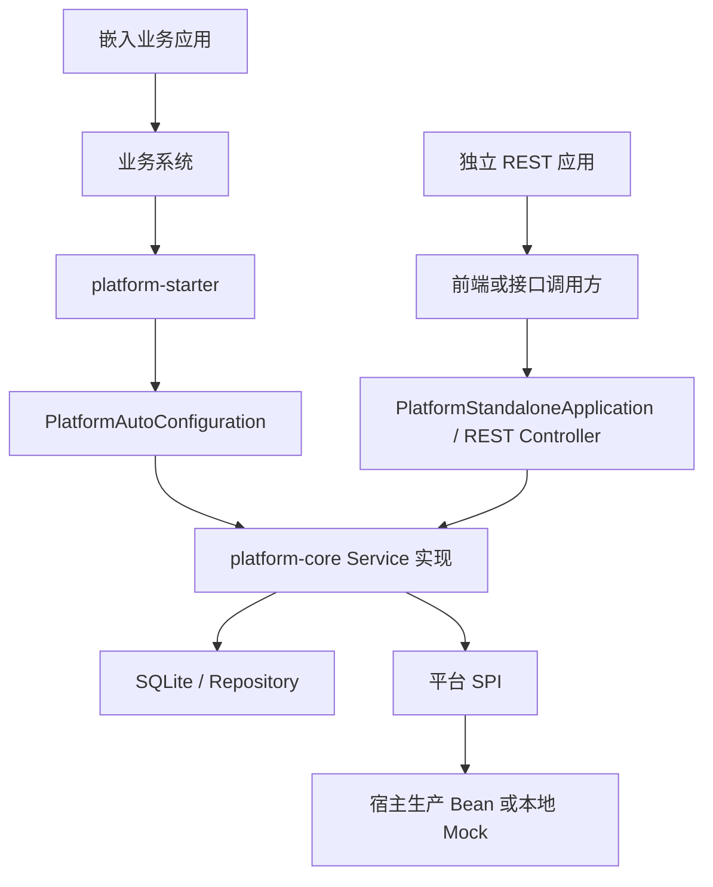

## 3. M0 契约冻结与验收基线

M0 的目标不是完成查询、附件、回调等业务功能，而是为 A、B、C 三条工作线建立一套能够共同遵守的接口基线和测试基线。C 线在本阶段重点负责 SPI、Starter、回调事件模型以及并发与幂等验收规则的规划和冻结，后续 M1～M6 的具体实现均以本阶段冻结的契约为准。

### 3.1 M0 目标与边界

M0 由三人共同完成，C 线负责推动以下内容达成一致：

1. 冻结宿主系统接入平台所需的 SPI，包括当前用户、组织架构、审批人解析、委托关系、消息推送、文件存储、附件访问授权和流程回调；
2. 冻结 Starter 对外暴露的 Service 接口、自动装配约定和宿主 Bean 覆盖规则；
3. 冻结 `WorkflowEvent` 字段、事件类型和 `eventId` 的唯一性语义；
4. 与 B 线共同冻结所有状态修改请求的 `operationId`，以及任务级修改请求的 `expectedTaskVersion`；
5. 编写幂等、乐观锁和回调事件的契约测试，作为 M1–M6 的回归基线。

M0 不要求完成查询、附件、回调、监控、Repository 或 REST 的生产实现，也不以“接口能够注入”代表业务功能已经可用。Mock 仅用于本地开发和契约测试，生产环境必须允许宿主系统提供自己的实现。

### 3.2 SPI 契约

C 线计划在 `platform-core.api.spi` 中冻结以下 SPI。M0 只确定接口职责、输入输出，具体生产实现由宿主系统提供.

| SPI | 职责 | M0 需要冻结的要点 |
| --- | --- | --- |
| `CurrentUserProvider` | 获取当前操作人 | 返回 `UserContext`；不得由平台猜测真实用户 |
| `OrganizationProvider` | 查询部门、用户和角色 | 只读接口；数据归宿主系统所有 |
| `ApproverResolver` | 按节点规则解析审批人 | 输入包含流程、节点、申请人和变量上下文；输出为用户列表 |
| `DelegateProvider` | 查询有效委托关系 | 按委托人和指定时间查询，供待办和任务分配使用 |
| `MessagePublisher` | 推送待办、提醒和告警消息 | 推送失败不得破坏已提交的流程事务 |
| `FileStorageProvider` | 保存、读取和删除文件内容 | 平台数据库只保存文件元数据和 `storageKey` |
| `AttachmentAccessProvider` | 判定附件操作权限 | 覆盖上传、查看、下载和删除；拒绝或异常均不得访问文件存储 |
| `WorkflowCallbackHandler` | 流程回调事件 | 使用 `eventId` 去重；处理失败由回调日志记录并允许重试 |

Starter 中的默认实现必须使用 `@ConditionalOnMissingBean`，宿主提供同类型 Bean 时自动让位。是否启用本地 Mock 由独立配置项控制；未提供关键生产 SPI 时应在启动或首次调用时给出明确错误，不能静默采用宽松权限。

### 3.3 Starter 与 Service 契约

M0 计划冻结流程平台对外暴露的 Service 接口。C 线负责外围能力接口的详细设计，同时参与 A、B 核心接口的请求和返回对象评审。

| 类别         | Service                    | 主要能力                                           |
| ------------ | -------------------------- | -------------------------------------------------- |
| 流程定义入口 | `ProcessDefinitionService` | 定义创建、流程图保存、发布、激活、复制、删除和查询 |
| 流程运行入口 | `ProcessRuntimeService`    | 启动实例、任务动作、变量更新、终止和实例详情       |
| 管理入口     | `AdminProcessService`      | 跳转、强制办结以及实例、任务、审计和回调查询       |
| 查询入口     | `TaskQueryService`         | 待办、已办、我发起、活动任务、历史轨迹、意见和已阅 |
| 附件入口     | `AttachmentService`        | 附件保存、查询、下载、删除和必填校验               |
| 回调入口     | `CallbackService`          | 事件发布、回调日志查询和后续重试扩展               |
| 监控入口     | `ProcessMonitorService`    | 催办、提醒查询、超时扫描、告警查询和处理           |

- `platform-starter` 的自动装配计划如下：
  1. `platform-starter` 只依赖 `platform-core`，不重复编写流程逻辑；
  2. 使用 Spring Boot 2.7 的自动装配机制注册 `PlatformAutoConfiguration`；
  3. Starter 与独立 REST 应用装配同一套 `platform-core` Service 实现；
  4. 可扩展 Service 和 SPI Bean 使用 `@ConditionalOnMissingBean`，宿主提供自定义实现时自动让位；
  5. Mock 能力通过独立配置项控制，默认不得替代生产环境必须提供的关键 SPI；
  6. M0 先验证自动装配结构和覆盖规则，完整 Service 实现分别在对应里程碑完成。

### 3.4 回调事件模型

`WorkflowEvent` 在 M0 冻结以下字段：

| 字段 | 说明 |
| --- | --- |
| `eventId` | 全局唯一事件标识，也是回调消费的幂等键 |
| `operationId` | 触发本次事件的业务操作幂等号 |
| `eventType` | 流程或任务生命周期事件类型 |
| `processCode`、`instanceId` | 流程定义编码和实例标识 |
| `actionType` | 触发事件的动作类型 |
| `operator` | 操作人快照 |
| `archivedTasks` | 本次归档或取消的任务快照 |
| `createdTasks` | 本次创建的活动任务快照 |
| `variables` | 事件发生后的流程变量快照 |
| `occurredAt` | 事件发生时间 |

事件模型只负责描述已经发生的业务事实。M0 冻结事件字段和类型，但生产级 Outbox 写入、事务提交后投递、失败重试及告警在 M2 以后实现。同一 `operationId` 的成功重放必须返回首次结果，不得重复生成事件；同一次操作如产生多个不同事件，每个事件使用不同且稳定的 `eventId`。

### 3.5 幂等与并发处理契约

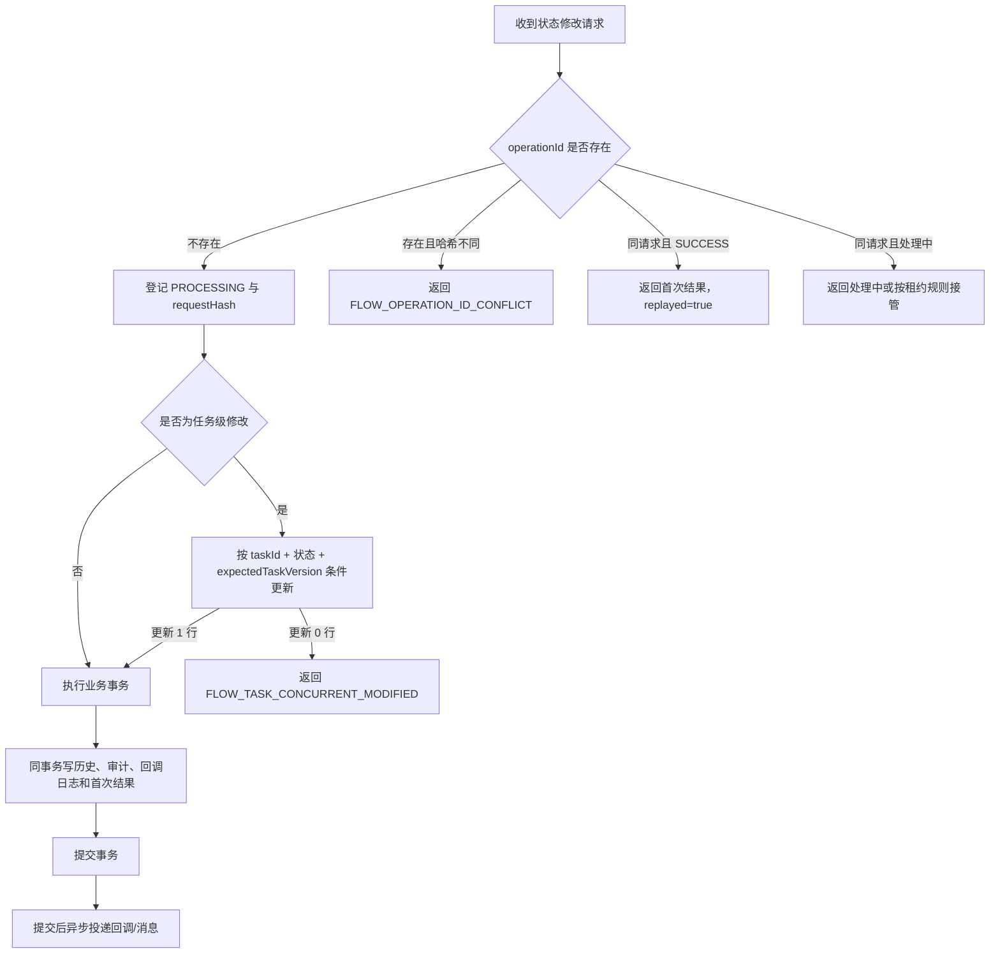

必须固定以下语义：

- 所有状态修改请求携带全局唯一 `operationId`；任务级修改额外携带客户端读取到的 `expectedTaskVersion`；
- 相同 `operationId`、相同业务请求返回第一次执行结果，不重复归档任务、创建下一任务、累加任务组或生成回调；
- 相同 `operationId` 对应不同业务请求时拒绝执行；
- 两个不同 `operationId` 使用同一任务版本并发修改时，只允许一个成功；失败请求不得留下历史任务、后续任务或回调记录；
- 活动任务更新、历史归档、任务组更新、下一任务创建、审计、回调日志和幂等成功结果位于同一数据库事务；外部 SPI 投递不夹在该事务中间。

### 3.6 M0 验收用例

| 用例 | 操作 | 预期结果 |
| --- | --- | --- |
| 相同请求重放 | 使用同一 `operationId` 连续提交两次 | 第二次返回首次结果，且不产生重复数据 |
| 幂等号冲突 | 同一 `operationId` 提交不同业务参数 | 返回 `FLOW_OPERATION_ID_CONFLICT` |
| 任务并发 | 两个请求使用不同 `operationId` 和同一 `expectedTaskVersion` | 仅一个成功，另一个返回并发修改错误 |
| 事务回滚 | 在历史归档或下一任务创建时制造异常 | 活动任务、历史、后续任务、审计和回调均不产生部分提交 |
| 事件契约 | 序列化并反序列化全部事件类型 | 字段完整、枚举稳定、`eventId` 可作为唯一键 |
| Starter 默认装配 | 业务应用仅引入 Starter | 所需 Bean 可注入，未实现能力有明确错误 |
| 宿主覆盖 | 宿主提供自定义 SPI Bean | 自动装配让位并调用宿主实现 |
| 回调失败隔离 | 回调处理器抛出异常 | 主流程事务不回滚，失败状态被记录并可重试 |

M0 完成标准是上述契约经 A、B、C 三方评审并由自动化测试固化，而不是“生成了一批类”。测试可以先使用内存夹具或 Mock 表达期望，但 M2 接入真实持久化和事务后，必须复用同一组用例验证生产实现。

## 4. 表单字段与附件模板（M1）

### 4.1 M1 目标与职责边界

M1 阶段的目标是补齐流程定义中的业务表单结构和材料要求，使 A 线创建的流程定义不仅包含节点与连线，还能够完整描述“需要填写哪些字段、需要提交哪些附件、附件在哪个节点生效”。完成后，`ProcessDefinitionDetailDTO` 应能返回节点、连线、表单字段和附件配置，形成一份可被发布校验、Agent 和后续运行时共同使用的完整流程定义。

C 线在 M1 阶段负责：

1. 实现表单字段的数据库表、Entity、DTO、Repository、校验、保存、查询、复制和删除；

2. 实现全局附件模板的版本化管理，维护附件名称、允许格式、大小限制和启停状态；

3. 实现流程定义附件配置，维护模板引用、必填规则、数量限制、适用节点和配置组状态；

4. 接入 A 线的 `saveGraph`、`getDefinition`、`copyDefinition` 和 `deleteDefinition`，保证扩展数据与流程定义处于同一事务；

5. 为 A 线后续发布、激活流程定义提供附件配置校验和配置组激活能力。

6. 编写 Repository、校验器和流程定义集成测试，验证入金申请的表单字段及银行回单配置。

   M1 不实现以下运行期能力：

   - 不接收或保存用户实际上传的文件；
   - 不实现 `process_attachment` 运行数据的增删改查；
   - 不调用 `FileStorageProvider` 保存或读取文件内容；
   - 不实现附件上传、下载、访问授权和软删除；
   - 不在任务办理时判断必填附件是否已经上传；
   - 不保存用户填写的表单值，用户填写值由 B 线在运行期写入 `process_instance.variables_json`。

   因此，M1 实现的是“字段定义和附件要求”，不是“实际表单数据和实际附件文件”。

### 4.2 数据模型

#### 4.2.1 `process_form_field` 表单字段定义

表单字段表示流程的表单结构，不保存用户实际填写值。入金申请中的申请人姓名、入金金额和入金账号都属于表单字段定义；实际填写结果在实例启动后保存到 process_instance.variables_json。

| 字段              | 说明                                                     |
| ----------------- | -------------------------------------------------------- |
| `id`              | 主键                                                     |
| `definition_id`   | 所属流程定义 ID                                          |
| `field_code`      | 字段编码                                                 |
| `field_name`      | 字段名称                                                 |
| `field_type`      | `string`、`number`、`date`、`boolean`、`select` 等       |
| `control_type`    | `input`、`textarea`、`number`、`datePicker`、`select` 等 |
| `required`        | 是否必填                                                 |
| `validation_rule` | 校验规则 JSON                                            |
| `default_value`   | 默认值                                                   |
| `sort_order`      | 展示顺序                                                 |

约束：

- 同一 `definition_id` 下 `field_code` 唯一；
- 不同定义版本可以使用相同的 `field_code`；
- `required` 在 SQLite 中使用 `0/1` 保存；
- `validation_rule` 保存合法 JSON，不增加 `option_config`、`validation_config` 等未在 v4 基线冻结的字段；
- 表单字段随流程定义版本保存，定义复制时生成新的数据库主键并绑定目标 `definition_id`。

#### 4.2.2 附件模板

附件模板定义可复用的材料规则，例如“银行回单允许 pdf、jpg、png，单文件最大 10MB”。模板不直接绑定某个流程定义，也不包含“是否必填、需要几份、在哪个节点上传”等流程特定规则。

| 字段                      | 说明                  |
| ------------------------- | --------------------- |
| `id`                      | 主键                  |
| `attachment_code`         | 附件编码              |
| `template_version`        | 模板版本号            |
| `attachment_name`         | 附件名称              |
| `description`             | 说明                  |
| `allowed_extensions`      | 允许的扩展名集合      |
| `max_size_bytes`          | 单文件大小限制        |
| `template_status`         | `ENABLED`、`DISABLED` |
| `created_by / created_at` | 创建信息              |
| `updated_by / updated_at` | 更新信息              |

- 约束：
  - `attachment_code + template_version` 唯一；
  - `template_version` 由后端按相同 `attachment_code` 的最大版本加一生成，调用方不能直接控制；
  - `allowed_extensions` 统一转为小写并去除前导点，可使用 JSON 数组保存；
  - `max_size_bytes` 必须大于 0；
  - 已被生效配置引用的模板版本不可原地修改格式和大小；规则变化时创建新版本；
  - 模板禁用只阻止新配置引用，不影响已绑定该版本的历史配置。

#### 4.2.3 流程定义附件配置

流程定义附件配置表示某个定义如何使用全局附件模板。required、min_count、max_count 和 applicable_node_codes 都属于该表，而不属于全局模板。

| 字段                      | 说明                          |
| ------------------------- | ----------------------------- |
| `id`                      | 主键                          |
| `attachment_config_id`    | 附件配置组 ID                 |
| `definition_id`           | 流程定义 ID                   |
| `config_status`           | `DRAFT`、`ACTIVE`、`INACTIVE` |
| `activated_at`            | 生效时间                      |
| `attachment_template_id`  | 引用的附件模板版本 ID         |
| `attachment_code`         | 附件编码快照                  |
| `required`                | 是否必填                      |
| `min_count / max_count`   | 数量限制                      |
| `applicable_node_codes`   | 适用节点编码 JSON             |
| `sort_order`              | 展示顺序                      |
| `created_by / created_at` | 创建信息                      |
| `updated_by / updated_at` | 更新信息                      |

同一个 `attachment_config_id` 下的多行组成一组附件要求，必须具有相同的 `definition_id`、`config_status` 和 `activated_at`。同一流程定义同一时刻只允许一个配置组为 `ACTIVE`。

附件配置从定义期进入运行期的版本固化流程如下：

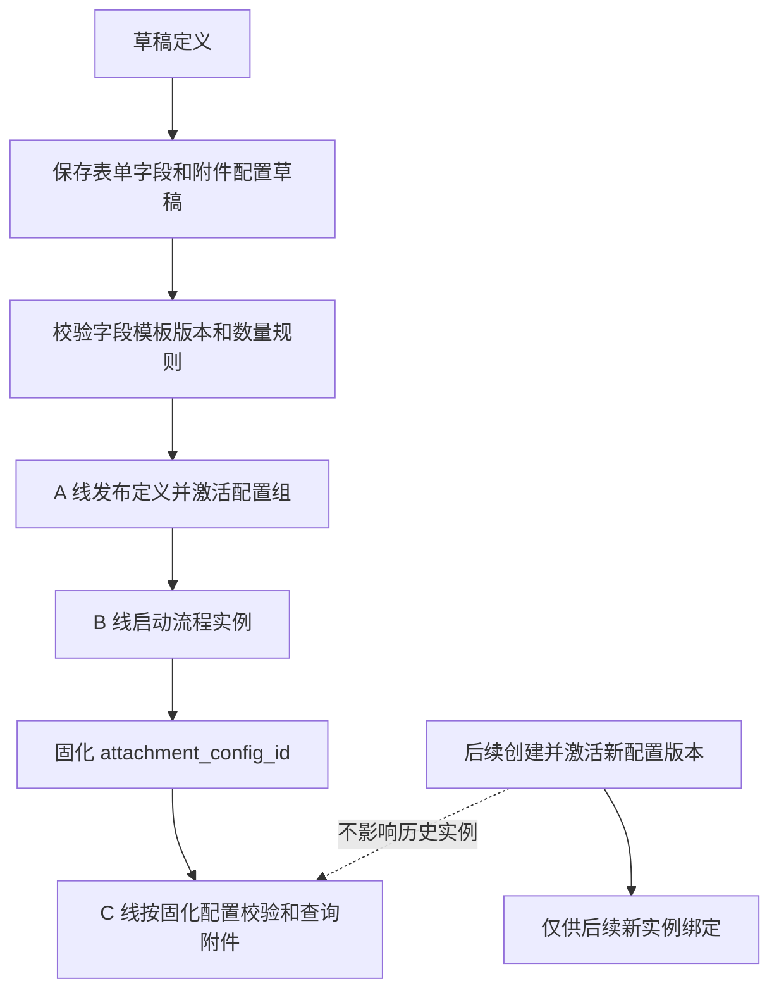

### 4.3 表单字段保存与查询

#### 4.3.1 校验规则

保存前至少校验：

1. 当前流程定义存在且状态为 `DRAFT`；

2. `fieldCode`、`fieldName`、`fieldType` 和 `controlType` 非空；

3. 同一请求中的 `fieldCode` 不重复；

4. `fieldType` 仅允许首期冻结的类型；

5. `controlType` 与 `fieldType` 基本匹配；

6. `sortOrder` 不得为负数；

7. `validationRule` 非空时必须是合法 JSON；

8. `defaultValue` 与 `fieldType` 兼容；

9. 空 `formFields` 表示清空当前定义的全部表单字段，而不是保留旧数据。

   类型映射:

   | `fieldType`   | 允许的 `controlType`          |
   | ------------- | ----------------------------- |
   | `string`      | `input`、`textarea`、`select` |
   | `number`      | `number`、`input`             |
   | `date`        | `datePicker`                  |
   | `boolean`     | `checkbox`、`select`          |
   | `select`      | `select`                      |

#### 4.3.2 保存流程

表单字段采用按 `definitionId` 整组替换的方式保存：

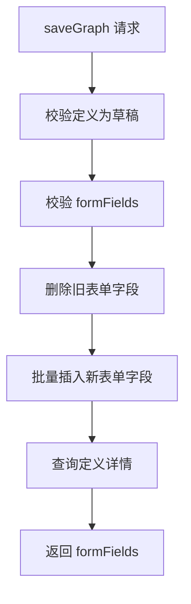

表单字段删除、插入必须与节点、连线、附件配置和 `process_operation_record` 的成功结果位于同一事务。任一步失败，整次 `saveGraph` 回滚，旧流程图和旧表单字段保持不变。

### 4.4 附件模板版本管理

#### 4.4.1 创建新模板版本

附件模板按 `attachment_code` 维护多版本。调用方提交附件编码、名称、说明、允许扩展名和大小限制，后端读取同编码最大 `template_version` 后加一创建新版本。首期不允许调用方指定版本号，也不允许复用已存在的 `attachment_code + template_version`。

创建前至少校验：

1. `attachmentCode`、`attachmentName`、`allowedExtensions` 和 `maxSizeBytes` 非空；
2. `allowedExtensions` 统一转为小写，去除前导点，并去重；
3. 扩展名只保存后缀，不保存 MIME 探测结果；
4. `maxSizeBytes > 0`，入金申请银行回单基准值为 `10MB`；
5. 默认状态为 `ENABLED`。

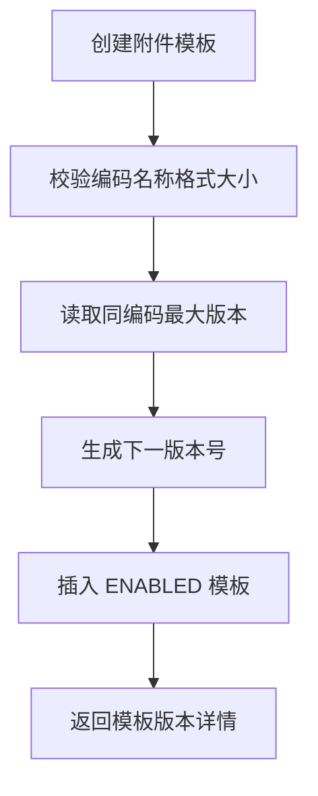

#### 4.4.2 模板变更与禁用

已被 `ACTIVE` 或 `INACTIVE` 附件配置引用的模板版本不可原地修改 `allowed_extensions`、`max_size_bytes` 和 `attachment_code`。如需调整格式或大小，必须创建同一 `attachment_code` 的新版本，再由草稿定义引用新版本。

允许修改的内容限于未被引用版本的名称、说明和状态。`DISABLED` 模板不能被新的流程定义附件配置引用，但不影响已经发布定义或历史实例按旧配置校验。

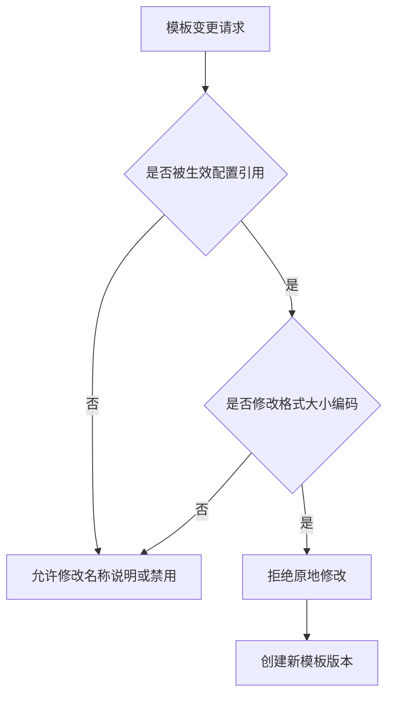

#### 4.4.3 查询要求

模板查询至少支持按 `attachmentCode`、`templateStatus` 和版本号过滤。流程定义配置页默认只展示 `ENABLED` 模板；管理端排查时可以查看 `DISABLED` 和历史版本。返回结果必须包含 `templateVersion`，避免前端只按附件编码误引用最新版本。


### 4.5 流程定义附件配置

#### 4.5.1 保存校验

至少校验以下规则：

1. 当前流程定义存在且为 `DRAFT`；
2. `attachmentTemplateId` 对应的模板版本存在；
3. 被引用的模板状态为 `ENABLED`；
4. DTO 中的 `attachmentCode` 与模板记录一致；
5. 同一配置组中 `attachmentTemplateId` 不重复；
6. 同一配置组中 `attachmentCode` 不重复；
7. `minCount >= 0`、`maxCount >= 1` 且 `minCount <= maxCount`；
8. `required=true` 时 `minCount >= 1`；
9. `applicableNodeCodes` 非空时，其中的每个节点都属于当前定义；
10. 首期只允许附件配置绑定 `USER_TASK` 节点；
11. `ACTIVE` 和 `INACTIVE` 配置不可原地修改；
12. 空附件配置列表表示当前草稿定义不要求附件，保存一个空配置结果并清理旧草稿组。

校验模板引用和适用节点时，应读取同一事务中的最新节点数据，不能读取尚未失效的旧定义缓存。

#### 4.5.2 草稿配置保存

同一 `attachment_config_id` 下各行的 `definition_id`、`config_status` 和 `activated_at` 必须一致。保存配置失败时，节点、连线、表单字段和定义审计字段全部回滚。

草稿配置同样采用整组替换方式保存。若请求中没有附件配置，则删除当前定义的草稿配置组；若请求中存在配置，则为本次草稿生成或复用一个 `attachment_config_id`，并按 `sortOrder` 批量插入配置行。

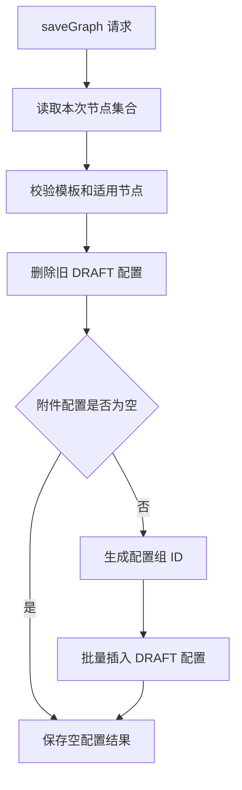

#### 4.5.3 配置组激活

A 线发布或激活流程定义时，C 线需要在同一事务内把当前草稿附件配置组固化为 `ACTIVE`。如果流程定义没有附件要求，可以不生成 `ACTIVE` 配置组；如果存在草稿配置，则必须先完成模板和节点校验，再切换状态。

激活规则：

1. 只能对可发布或可激活的流程定义执行；
2. 草稿配置引用的模板版本必须仍为 `ENABLED`；
3. `applicableNodeCodes` 必须仍能在当前定义节点中找到；
4. 同一定义原有 `ACTIVE` 配置组切换为 `INACTIVE`；
5. 当前草稿配置组切换为 `ACTIVE`，并写入同一个 `activated_at`；
6. 激活失败时，流程定义发布或激活动作整体回滚；
7. B 线启动实例时只读取当前 `ACTIVE` 配置组，并把 `attachment_config_id` 固化到 `process_instance.attachment_config_id`。

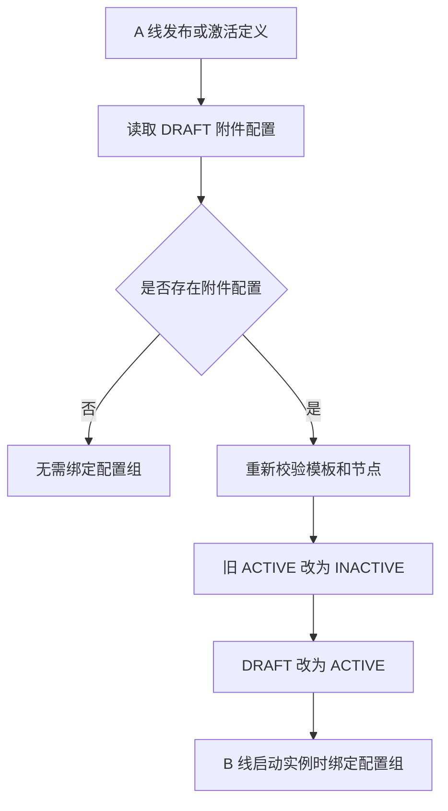

#### 4.5.4 与 A 线的扩展生命周期

A 线负责流程定义主数据，C 线负责表单字段和附件配置扩展数据。两者必须通过事务内扩展生命周期接口协作，不能让流程图保存成功而扩展数据失败。

```java
public interface DefinitionExtensionLifecycle {
    void copyExtensions(String sourceDefinitionId, String targetDefinitionId);
    void deleteDraftExtensions(String definitionId);
}
```

协作要求：

1. `saveGraph`：A 线保存节点和连线时，同一事务调用 C 线保存表单字段和附件配置；
2. `getDefinition`：A 线查询定义详情时，聚合返回 `formFields` 和附件配置；
3. `copyDefinition`：复制草稿或版本时，C 线复制表单字段和附件配置，生成新的主键和新的草稿配置组；
4. `deleteDefinition`：删除草稿定义时，C 线删除对应表单字段和草稿附件配置；
5. `publish/activate`：A 线发布或激活定义时，C 线激活附件配置组；
6. 缓存失效：表单字段或附件配置变化后，必须让定义详情缓存失效。

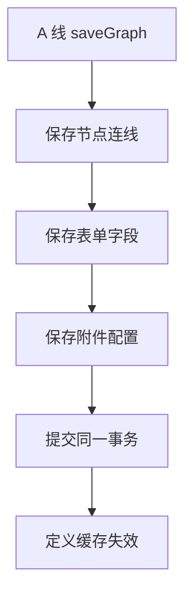

### 4.6 M1 验收点

- DDL、Entity、Repository 和 DTO 覆盖 `process_form_field`、附件模板和流程定义附件配置三类数据；
- `saveGraph` 能在同一事务内保存节点、连线、表单字段和附件配置，任一校验失败时全部回滚；
- 入金申请表单字段可随定义保存、查询、复制和删除，`fieldCode` 唯一性、类型映射和 JSON 校验有测试覆盖；
- 银行回单附件模板可创建版本，基准规则为 `pdf/jpg/png` 且单文件不超过 `10MB`；
- 草稿流程定义可引用启用状态的附件模板，配置必填、数量限制和适用节点；
- 已发布、已激活或已归档定义不可直接修改表单字段和附件配置；
- 发布或激活定义时，草稿附件配置组可切换为 `ACTIVE`，旧 `ACTIVE` 配置组变为 `INACTIVE`；
- 复制定义时表单字段和附件配置一并复制，复制结果使用新的主键和新的草稿配置组；
- 删除草稿定义时，对应表单字段和草稿附件配置被清理，已生效模板版本不被误删；
- `ProcessDefinitionDetailDTO` 返回节点、连线、表单字段和附件配置，供发布校验、Agent 和运行期读取；
- 新实例只绑定启动时的 `ACTIVE` 附件配置组，后续配置变更不影响历史实例；
- M1 不保存用户填写值、不保存实际附件文件、不调用 `FileStorageProvider`，这些运行期能力留到 M4。

## 5. 幂等、审批意见、流程轨迹与回调（M2）

### 5.1 操作幂等记录

C 线负责提供统一幂等记录模型和测试基线，B/A 的修改动作复用同一约束。

`process_operation_record` 核心字段：

| 字段 | 说明 |
| --- | --- |
| `operationId` | 调用方生成的全局唯一幂等号 |
| `requestHash` | 规范化请求内容哈希 |
| `operationStatus` | `PROCESSING/SUCCESS/FAILED` |
| `resultJson` | 首次成功结果快照 |
| `errorCode` | 已落库失败错误码 |
| `processingExpiresAt` | 处理中租约截止时间 |
| `expiresAt` | 幂等记录保留截止时间 |

验收用例必须覆盖：

1. 相同 `operationId + requestHash` 的成功重试返回首次结果；
2. 相同 `operationId` 携带不同请求返回 `FLOW_OPERATION_ID_CONFLICT`；
3. `PROCESSING` 未过期返回处理中；
4. `PROCESSING` 租约过期允许同一请求接管；
5. 事务回滚时不留下成功状态。

统一幂等处理的判定流程如下，A/B/C 的修改动作均复用此流程：

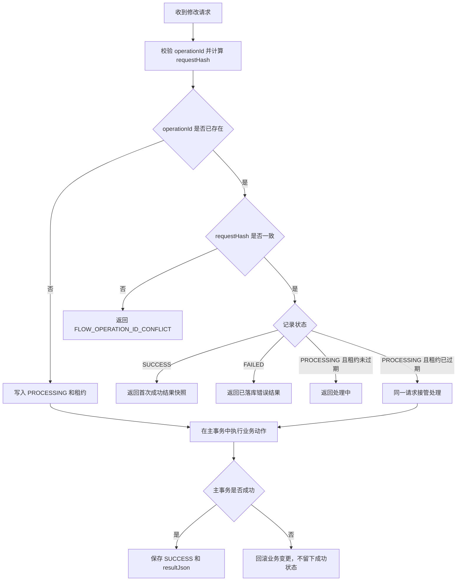

### 5.2 审批意见和流程轨迹

审批意见来自 `process_history_task.comment_text`，特殊动作可读取 `extra_json`。C 的查询层负责把历史任务转成面向前端的轨迹和意见列表。

`queryComments(instanceId)` 返回：

| 字段 | 来源 |
| --- | --- |
| `instanceId` | 历史任务 |
| `taskId/historyTaskId` | 活动任务或历史任务 |
| `nodeCode/nodeName` | 节点快照 |
| `actionType` | 历史动作 |
| `operator` | 实际办理人 |
| `delegateFrom` | 委托来源 |
| `comment` | 审批意见 |
| `createdAt` | 完成时间 |

轨迹排序按 `startedAt, completedAt, historyTaskId` 稳定排序。并行任务需要保留 `taskGroupId` 和 `branchKey`，便于前端展示分支。

### 5.3 回调日志写入和投递

运行时动作由 B/A 创建 `WorkflowEvent`，C 负责落库、查询和投递治理。

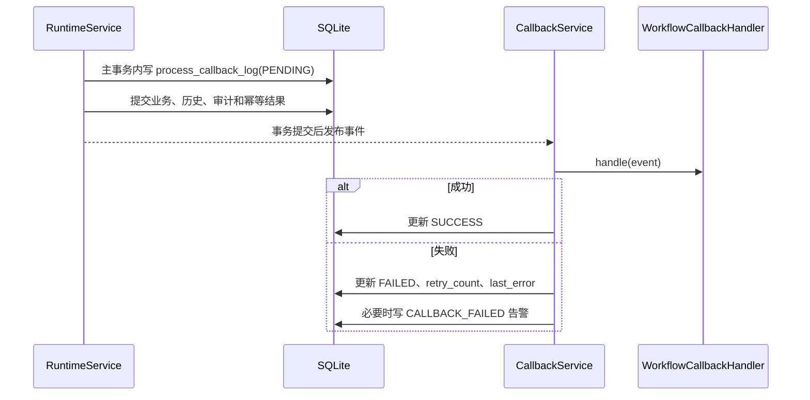

实现要求：

- `eventId` 唯一，重复插入必须被视为幂等重放；
- `payloadJson` 保存完整 `WorkflowEvent`；
- 回调失败不能抛回主流程；
- 查询回调日志支持实例、事件类型、状态和分页过滤；
- 第一阶段使用数据库日志 + Mock 消息推送，HTTP 投递只保留扩展点。

### 5.4 运行状态验证

C 的集成测试需要验证运行状态对查询和回调的影响：

- 活动任务变更后待办列表同步变化；
- 历史任务写入后已办和意见可查；
- 实例办结后活动任务为空；
- 回调载荷包含本次归档任务和新建任务；
- 并发请求只产生一组历史、后续任务和回调。

## 6. 查询能力与 Starter 自动装配（M3）

### 6.1 查询接口

| 功能 | Service | REST |
| --- | --- | --- |
| 待办查询 | `queryTodoTasks` | `GET /api/platform/tasks/todo` |
| 已办查询 | `queryCompletedTasks` | `GET /api/platform/tasks/completed` |
| 我发起的 | `queryStartedInstances` | `GET /api/platform/instances/started` |
| 活动任务 | `queryActiveTasks` | `GET /api/platform/instances/{instanceId}/active-tasks` |
| 历史任务 | `queryHistoryTasks` | `GET /api/platform/instances/{instanceId}/history-tasks` |
| 审批意见 | `queryComments` | `GET /api/platform/instances/{instanceId}/comments` |
| 已阅记录 | `queryReadRecords` | `GET /api/platform/read-records` |
| 审计日志 | `queryAuditLogs` | `GET /api/platform/admin/audit-logs` |
| 回调日志 | `queryCallbackLogs` | `GET /api/platform/admin/callback-logs` |

所有分页接口必须使用 `PageResult<T>`，并校验 `pageNo >= 1`、`pageSize` 在合理范围内。

### 6.2 待办查询

待办来源：

1. `assignee_user_id = currentUser` 的已认领或指定任务；
2. `candidate_user_ids` 包含 currentUser 的待认领任务；
3. `DelegateProvider` 返回的委托关系对应的代办任务。

返回要求：

- 区分本人任务和委托代办任务；
- 返回 `taskVersion`，用于后续任务级动作的 `expectedTaskVersion`；
- 支持按流程编码、流程名称、标题、发起人、时间范围、节点、状态过滤；
- 默认按 `createdAt DESC` 或到期时间优先排序，排序规则必须稳定。

待办列表需要聚合本人、候选和委托三类来源，再统一过滤和分页：

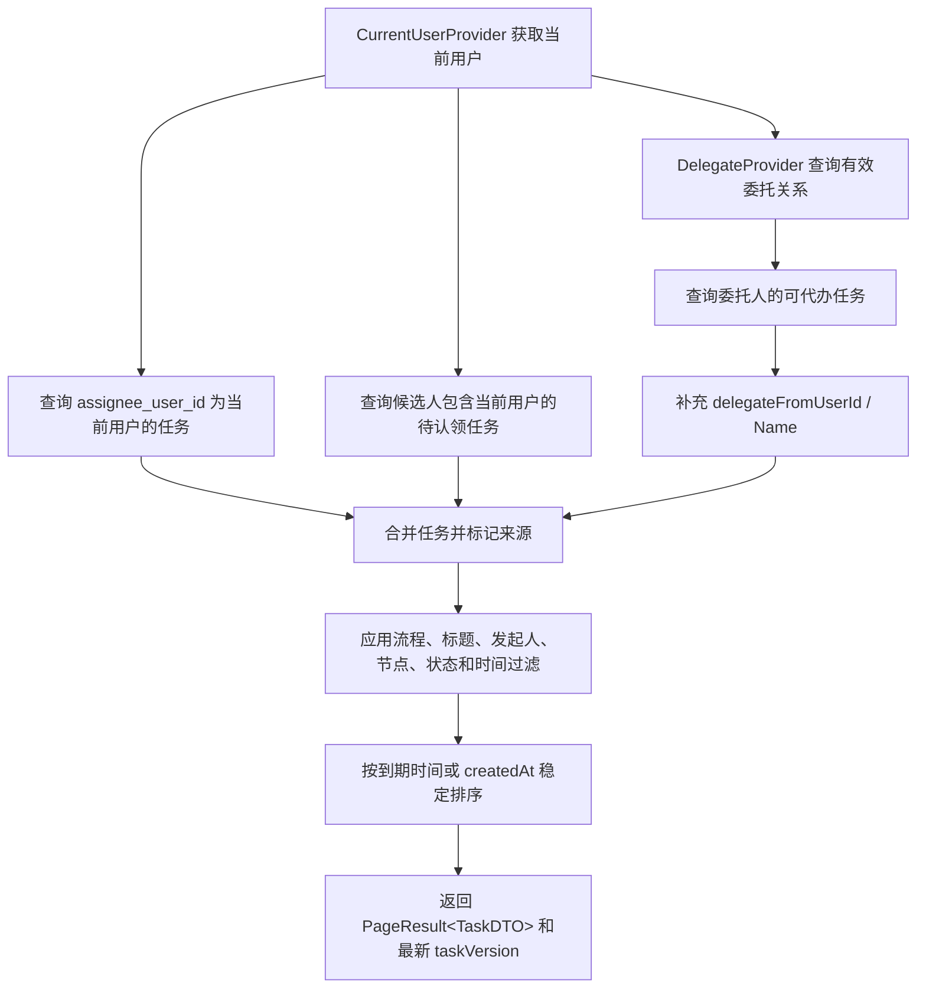

### 6.3 已办、我发起和实例详情查询

已办查询读取 `process_history_task`，必须展示操作人、动作、意见、完成时间、节点、委托来源和任务组信息。

我发起查询读取 `process_instance`，支持按：

- `processCode`；
- `instanceTitle`；
- `businessKey`；
- `instanceStatus`；
- 发起时间范围；
- 当前节点。

实例详情由 B 的 `ProcessRuntimeService.getInstance` 提供基础数据，C 补齐活动任务、历史轨迹、评论、附件和已阅状态的查询聚合。

### 6.4 Starter 自动装配

`platform-starter` 必须自动装配与独立 REST 应用相同的 Service 实现。

要求：

1. Service Bean 使用 `@ConditionalOnMissingBean`，允许宿主覆盖；
2. SPI Mock 使用条件装配，仅本地或未提供生产 Bean 时启用；
3. 配置项集中在 `PlatformProperties`；
4. Starter 不重复实现业务逻辑，只装配 `platform-core` 能力；
5. 独立 REST 应用和 Starter 消费方必须通过同一组集成测试。

### 6.5 M3 验收点

- 能查询待办、已办、我发起三类基础列表；
- 流程结束后可查完整轨迹和审批意见；
- 待办可区分本人任务与委托代办；
- 管理端可查实例、活动任务、历史任务、审计日志和回调日志；
- Starter 消费方可注入并调用 C 线 Service；
- 独立 REST 应用和 Starter 使用同一套 Service。

## 7. 文件存储、附件元数据和消息 Mock（M4）

### 7.1 附件保存流程

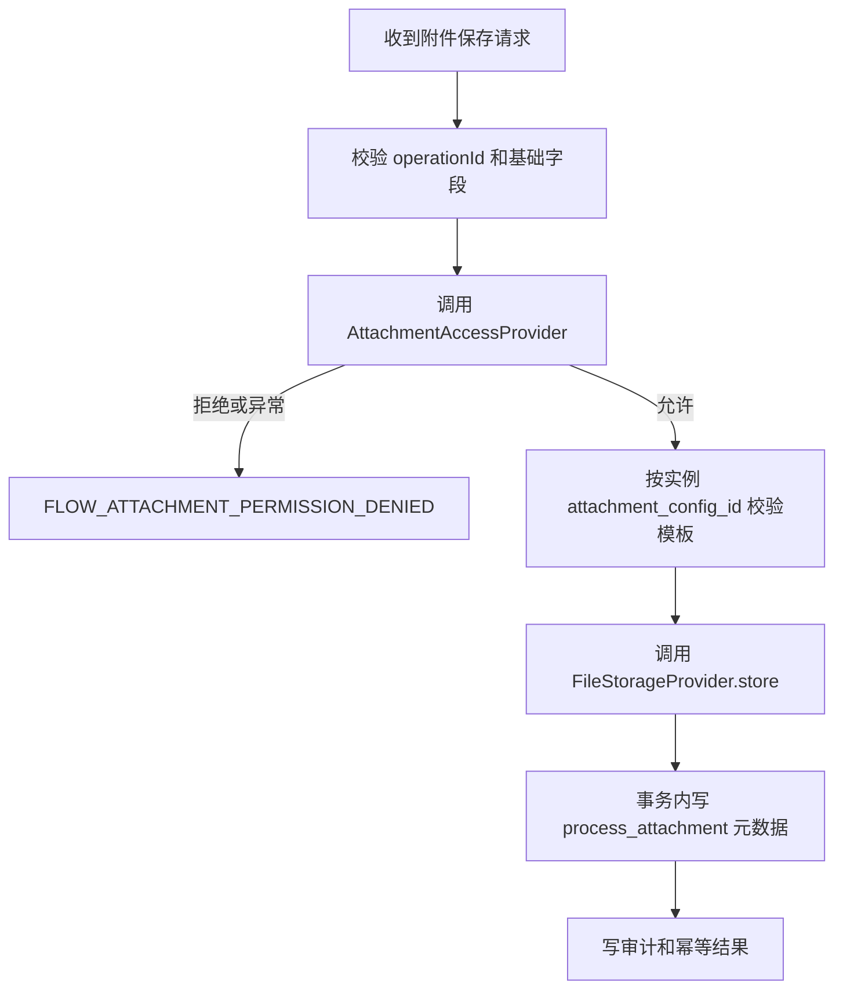

保存实例附件和任务附件均走同一套流程。任务附件必须校验任务属于该实例，且当前用户具备访问权限。

### 7.2 附件校验

`checkRequiredAttachments(CheckAttachmentRequest request)` 用于任务办理前校验当前节点要求的附件。

校验规则：

- 根据 `process_instance.attachment_config_id` 读取配置；
- 只校验适用于当前节点的附件；
- `required=true` 时已上传数量必须满足 `minCount`；
- 数量不能超过 `maxCount`；
- 扩展名、MIME 类型和大小必须符合模板版本；
- 已软删除附件不计入数量。

入金申请的申请节点必须存在银行回单附件，格式限制 `pdf/jpg/png`，大小不超过 `10MB`。

### 7.3 附件查询、下载和删除

| 功能 | 要求 |
| --- | --- |
| 查询 | 调用授权 SPI；默认排除 deleted；支持按实例、任务、附件编码过滤 |
| 下载 | 调用授权 SPI；读取元数据后调用 `FileStorageProvider.load` |
| 删除 | 调用授权 SPI；事务内软删除元数据；提交后可异步删除文件内容 |

数据库事务提交后删除文件失败时，不回滚元数据，只写告警或日志，后续由清理任务处理。

### 7.4 消息推送 Mock

`MessagePublisher` 用于：

- 手动催办；
- 自动超时提醒；
- 回调通知 Mock；
- 异常告警提示。

Mock 实现应记录发送请求，便于测试断言目标用户、标题、内容和 payload。

### 7.5 M4 验收点

- 文件内容通过 `FileStorageProvider` 保存，平台只保存元数据；
- 附件授权允许、拒绝、异常三类场景均有测试；
- 实例附件和任务附件均可保存、查询、下载和删除；
- 必填附件缺失时任务办理被拦截；
- 消息推送 Mock 可被提醒、回调和告警复用。

## 8. 委托代办、认领、已阅、审计和提醒（M5）

### 8.1 委托代办

`DelegateProvider.findDelegates(principalUserId, at)` 返回当前用户代理哪些委托人的任务。待办查询时：

1. 查询本人任务；
2. 查询当前用户代理的委托人任务；
3. 对委托任务标记 `delegateFromUserId` 和 `delegateFromUserName`；
4. 办理时由 B 写历史任务，C 查询层展示实际办理人与委托来源。

委托关系本身由宿主系统决定，平台第一阶段只提供 Mock。

### 8.2 认领和取消认领

认领和取消认领由 B 的运行时 Service 修改任务状态，C 负责：

- 待办查询展示 `ACTIVE/CLAIMED` 差异；
- 查询结果返回最新 `taskVersion`；
- 补充认领/取消认领的审计日志；
- 回归测试并发认领时只有一个请求成功。

认领类动作必须使用 `id + task_status + expectedTaskVersion` 条件更新。

### 8.3 已阅记录

已阅接口建议由查询详情或显式标记动作触发。

规则：

- 同一实例同一用户重复标记已阅应幂等；
- 查询已阅记录支持实例、用户、时间范围和分页；
- 删除实例时已阅记录随实例删除；
- 审计日志默认可记录首次已阅动作。

### 8.4 审计日志

审计日志用于追踪平台动作，不承载具体业务逻辑。

| 字段 | 说明 |
| --- | --- |
| `targetType` | `DEFINITION/INSTANCE/TASK/ATTACHMENT` |
| `targetId` | 目标 ID |
| `actionType` | 动作类型 |
| `operationId` | 幂等号 |
| `operatorId` | 操作人 |
| `detailJson` | 结构化详情 |
| `createdAt` | 创建时间 |

查询要求：

- 管理端分页；
- 支持目标类型、目标 ID、实例、动作、操作人、时间范围过滤；
- 删除定义或实例后审计日志默认保留，并标记目标已删除。

### 8.5 手动催办和自动提醒

`remindTask(RemindTaskRequest request)` 负责手动催办：

1. 校验任务存在且未完成；
2. 解析提醒目标人；
3. 写 `process_reminder_record(PENDING)`；
4. 调用 `MessagePublisher`；
5. 更新 `SENT/FAILED` 和错误信息；
6. 写审计和幂等结果。

自动提醒由 `scanTimeoutTasks` 扫描 `due_at <= now` 的活动任务，并按节点提醒配置生成提醒或告警。

### 8.6 M5 验收点

- 待办能展示委托代办；
- 认领和取消认领并发下只允许合法状态转换；
- 实例详情可标记和查询已阅；
- 管理员可分页查询审计日志；
- 手动催办能写提醒记录并调用消息 Mock；
- 自动提醒不会对同一任务重复无限发送。

## 9. 并行汇聚、管理员修复、超时和告警（M6）

### 9.1 并行汇聚

并行汇聚依赖 `process_task_group`：

- `group_type = PARALLEL_GATEWAY`；
- `total_count` 是分支数；
- `completed_count` 是已到达汇聚网关的分支数；
- `branch_state_json` 记录每个 `branchKey` 的 `RUNNING/ARRIVED/CANCELED`；
- `lock_version` 防止多个分支同时到达时重复推进。

C 的职责：

1. 提供任务组和分支状态查询展示；
2. 为并行汇聚补充审计和回调字段；
3. 提供并发验收用例：重复分支到达不重复计数，最后一个分支只推进一次；
4. 管理端能看到等待中的分支和已到达分支。

实际推进逻辑由共享运行时 Service 完成，不在查询层重复实现。

并行分支到达汇聚点时，需要通过任务组版本控制确保只推进一次：

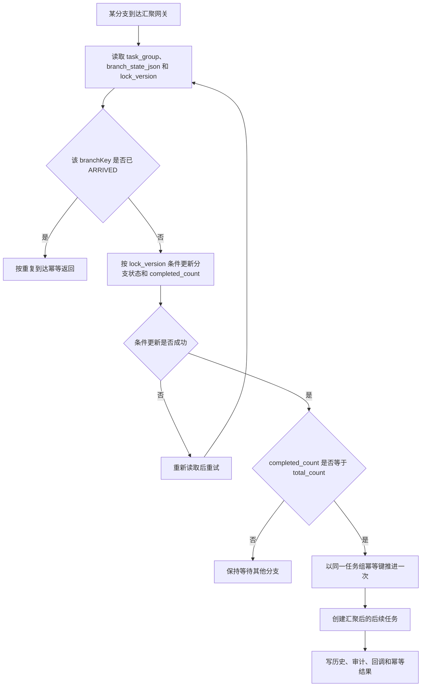

### 9.2 管理员修复

管理员修复包括跳转、强制办结、异常告警处理、必要的状态排查查询。

C 负责：

- 管理员查询实例、任务、历史、审计、回调和告警；
- 跳转和强制办结后补齐审计、回调和查询展示；
- 告警处理记录 `handledBy`、`handledAt` 和处理意见；
- 不直接绕过 B/A 的状态机修改流程状态。

### 9.3 超时扫描

`scanTimeoutTasks(TimeoutScanRequest request)`：

| 入参 | 说明 |
| --- | --- |
| `now` | 扫描基准时间，测试可传固定时间 |
| `limit` | 单次扫描上限 |
| `operatorUserId` | 扫描触发人或系统用户 |
| `dryRun` | 可选，仅查询不发送 |

流程：

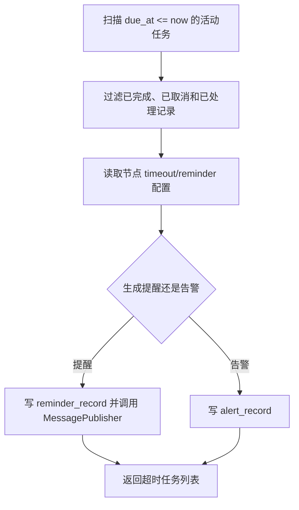

必须避免同一任务在同一提醒窗口内重复发送。可通过提醒记录、任务 ID、提醒类型和时间窗口做幂等判断。

### 9.4 异常告警

告警类型：

| 类型 | 说明 |
| --- | --- |
| `TASK_TIMEOUT` | 任务超时 |
| `CALLBACK_FAILED` | 回调失败 |
| `ACTION_EXCEPTION` | 流程动作异常 |

告警状态：

- `OPEN`：待处理；
- `HANDLED`：已处理；
- `IGNORED`：已忽略。

`handleAlert` 必须校验告警存在且未关闭，更新状态和处理信息，并写审计。

### 9.5 M6 验收点

- 并行分支重复到达不得重复增加计数；
- 最后一个分支只能创建一次汇聚后的任务；
- 管理端可查并行任务组和分支状态；
- 超时任务能生成提醒或告警；
- 回调失败能生成告警；
- 告警可处理或忽略，并保留审计记录。

## 10. 跨工作线接口

```java
public interface DefinitionExtensionLifecycle {
    void copyExtensions(String sourceDefinitionId, String targetDefinitionId);
    void deleteDraftExtensions(String definitionId);
}

public interface DefinitionCacheInvalidator {
    void invalidate(String definitionId);
}

public interface CallbackOutboxWriter {
    void append(WorkflowEvent event);
}

public interface AuditLogWriter {
    void append(AuditLogDTO auditLog);
}
```

| 接口 | 调用方 | 说明 |
| --- | --- | --- |
| `copyExtensions` | A | 复制定义时复制表单和附件配置 |
| `deleteDraftExtensions` | A | 删除定义时清理扩展数据 |
| `DefinitionCacheInvalidator.invalidate` | C/A | 表单、附件或定义变更后清缓存 |
| `CallbackOutboxWriter.append` | B/A | 主事务内写回调日志 |
| `AuditLogWriter.append` | A/B/C | 主事务内写审计日志 |

协作规则：

- A 保存定义结构后，C 的表单和附件配置必须与定义事务一致；
- B 新增运行时动作时，必须同步 C 补查询字段、审计和回调；
- C 新增附件或查询字段时，必须同步 A/B 调整 DTO 和快照；
- 回调、审计、历史和幂等结果必须与主动作同事务提交；
- DTO、枚举和 SPI 只能保留一份公共定义。

## 11. 错误处理

优先使用 v4 基线错误码：

| 错误码 | 场景 |
| --- | --- |
| `FLOW_OPERATION_ID_REQUIRED` | 修改请求缺少幂等号 |
| `FLOW_OPERATION_ID_CONFLICT` | 同一幂等号对应不同请求 |
| `FLOW_TASK_CONCURRENT_MODIFIED` | 活动任务乐观锁冲突 |
| `FLOW_TASK_GROUP_CONCURRENT_MODIFIED` | 任务组乐观锁冲突 |
| `FLOW_ATTACHMENT_REQUIRED` | 必填附件缺失 |
| `FLOW_ATTACHMENT_TYPE_NOT_ALLOWED` | 附件格式不允许 |
| `FLOW_ATTACHMENT_TOO_LARGE` | 附件过大 |
| `FLOW_ATTACHMENT_PERMISSION_DENIED` | 附件访问被拒绝 |
| `FLOW_CALLBACK_FAILED` | 回调失败 |
| `FLOW_INVALID_ACTION` | 当前状态不允许操作 |

实现级异常不得泄露数据库或文件系统细节。SPI 异常应转换为平台错误，并写入审计、回调日志或告警中可排查的摘要信息。

## 12. 建议实施顺序与完成标准

建议顺序：

1. 冻结 C 线 DTO、SPI、Service 接口和契约测试；
2. 实现幂等记录模型和测试基线；
3. 实现表单字段、附件模板和定义附件配置持久化；
4. 实现回调事件模型、回调日志和 Mock 投递；
5. 实现待办、已办、我发起、活动任务、历史任务和意见查询；
6. 完成 Starter 自动装配和独立 REST 查询接口；
7. 实现文件存储、附件授权、附件元数据和必填校验；
8. 实现委托代办查询、已阅、审计日志和提醒；
9. 实现超时扫描、异常告警和告警处理；
10. 与 A/B 联调并补齐并行汇聚、删除、跳转、强制办结后的查询和回调验收。

最终完成标准：

- Java 8、Spring Boot 2.7.18 下编译通过；
- Starter 消费方和独立 REST 应用共用同一套 Service；
- 所有分页查询返回 `PageResult<T>`；
- 待办、已办、我发起、轨迹、意见、附件、审计和回调均可查询；
- 附件通过 SPI 保存文件内容，平台只保存元数据；
- 回调失败不影响主流程，并能记录失败和告警；
- 幂等、并发、删除、附件权限、超时提醒和告警处理都有测试；
- 入金申请串行流程可完成发起、附件校验、审批、查询、回调和审计闭环；
- 平台核心不包含具体业务判断。

